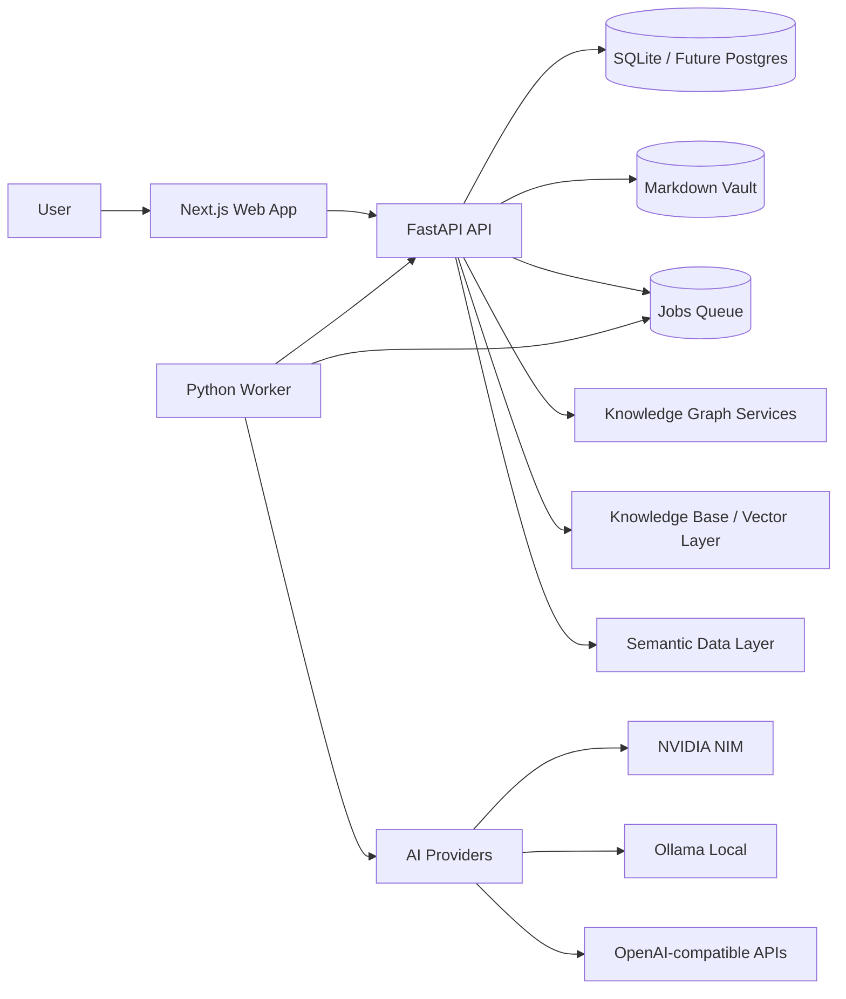
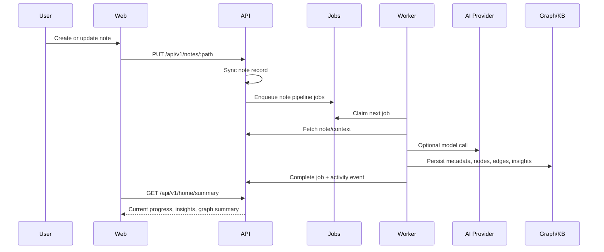
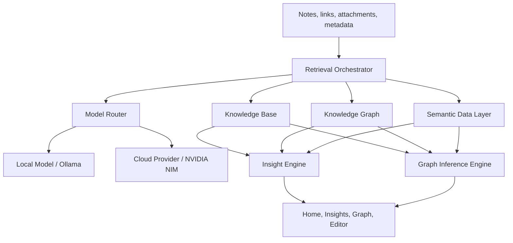
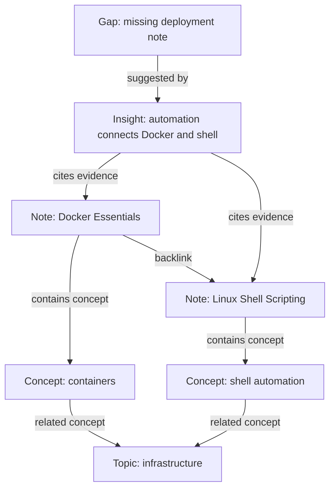
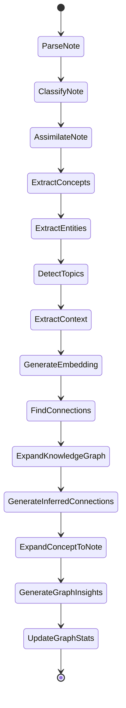
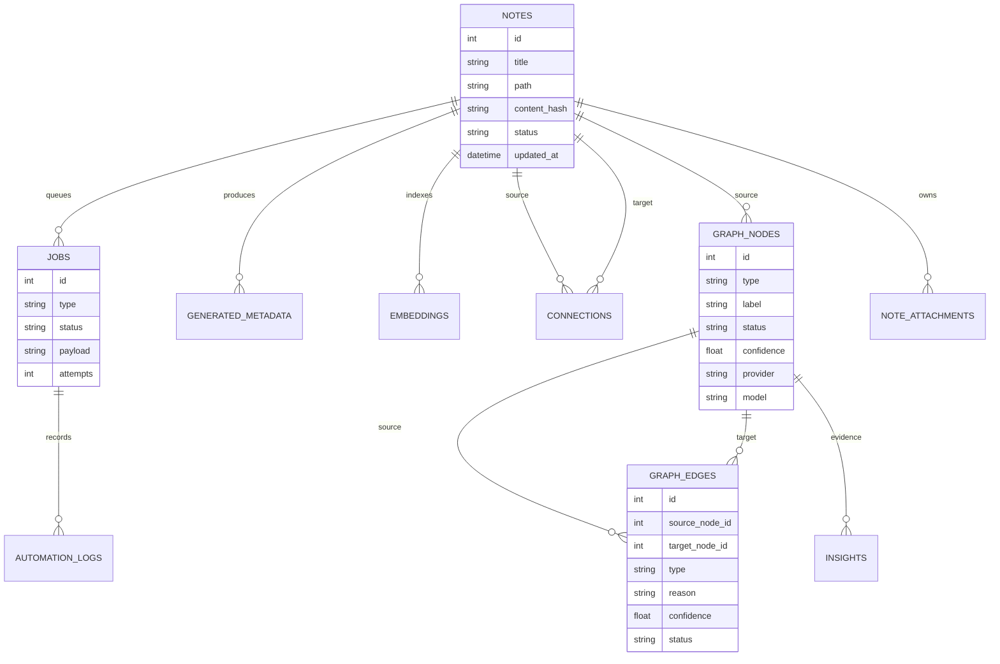

# BerryBrain


**A free, open source, local-first second brain for Markdown notes, knowledge graphs, and explainable AI-assisted learning.**

BerryBrain turns notes into connected knowledge. It watches a Markdown vault, parses note structure, extracts concepts, expands a knowledge graph, creates explainable connections, and surfaces insights that help the user study, assimilate, and discover gaps.

There is no central BerryBrain account, SaaS tenant, billing gate, demo mode, or hosted management panel. You self-host the stack and create one local owner account for your own instance.

---


---

## Table of Contents

- [What BerryBrain Is](#what-berrybrain-is)
- [Core Capabilities](#core-capabilities)
- [Architecture](#architecture)
- [Cognitive Layer](#cognitive-layer)
- [Knowledge Graph](#knowledge-graph)
- [Autopilot Pipeline](#autopilot-pipeline)
- [Data Model](#data-model)
- [API Surface](#api-surface)
- [Repository Structure](#repository-structure)
- [Getting Started](#getting-started)
- [Configuration](#configuration)
- [Self-Hosting](#self-hosting)
- [Deploying at /berrybrain](#deploying-at-berrybrain)
- [Engineering Practices](#engineering-practices)
- [Security and Privacy](#security-and-privacy)
- [Roadmap](#roadmap)
- [Troubleshooting](#troubleshooting)

---

## What BerryBrain Is

BerryBrain is not just a Markdown editor with AI bolted on. The product goal is to behave like a **real second brain**:

- capture notes without friction;
- assimilate concepts from real note content;
- detect relationships between notes, concepts, topics, entities, gaps, and insights;
- maintain a dynamic knowledge graph;
- answer questions using evidence from the user's vault;
- expose what the system did, why it did it, and what evidence supports each conclusion.

The system is designed around one rule:

> Important knowledge artifacts must be explainable, persisted, traceable, and reversible.

---

## Core Capabilities

| Area | Capability |
| --- | --- |
| Markdown Vault | Real `.md` files, wiki links, frontmatter, folder organization, vault scan, file watcher |
| Editor | Editor-first workflow, autosave, preview/split mode, backlinks, attachments |
| Autopilot | Async job queue for parsing, classification, assimilation, embeddings, graph expansion, insights |
| Knowledge Graph | Notes, concepts, topics, entities, contexts, gaps, insights, and explainable edges |
| Cognitive Layer | Knowledge Base + Knowledge Graph + Semantic Data Layer + Model Router |
| AI Providers | NVIDIA NIM/cloud, OpenAI-compatible providers, DeepSeek-compatible providers, Ollama/local |
| Insights | Knowledge gaps, central concepts, recurring ideas, weak concepts, connections, study suggestions |
| Graph Inference | Ask questions about the graph with evidence-backed answers |
| Activity and Monitor | Human-readable activity timeline plus technical job diagnostics |
| Settings | Theme, editor, provider/model configuration, graph/cognitive settings, attachment limits |
| Privacy Direction | Local-first storage, explicit cloud provider configuration, future LGPD/GDPR workflows |

---

## Architecture

BerryBrain is split into three primary applications:

- **Web**: Next.js + React UI.
- **API**: FastAPI service, persistence, routes, graph/cognitive services.
- **Worker**: Python async worker that claims jobs and performs background processing.



### Runtime Contract

The frontend never calls AI providers directly. All cognitive operations flow through API services and queued jobs:



---

## Cognitive Layer

BerryBrain's long-term architecture is a **Cognitive Layer** made of four cooperating systems.



### Knowledge Base

Purpose: semantic retrieval over unstructured knowledge.

Current direction:

- Markdown note indexing;
- chunking;
- embeddings;
- semantic retrieval;
- future Qdrant/Chroma support.

Future expansion:

- OCR text from images;
- PDF extraction;
- audio/video transcription;
- document parsing;
- attachment evidence.

See [OCR and Attachment Processing Plan](docs/planning/ocr.md).

### Knowledge Graph

Purpose: represent relationships and explain why knowledge is connected.

Graph nodes can represent:

- note;
- concept;
- topic;
- entity;
- context;
- gap;
- insight;
- attachment;
- source/reference;
- future study path/cluster.

Graph edges must have:

- source and target;
- type;
- reason;
- evidence;
- confidence;
- provider/model when generated by AI;
- status (`suggested`, `confirmed`, `ignored`, etc.).

### Semantic Data Layer

Purpose: answer questions about structured system state.

Examples:

- How many jobs are pending?
- Which notes are not assimilated?
- Which graph nodes have no context?
- Which providers are failing?
- Which insights need attention?

This layer prevents system diagnostics from leaking into knowledge insights. Job failures belong in Monitor/Activity, not in graph insights.

### Model Router

Purpose: centralize provider selection and traceability.

The router should record:

- provider;
- model;
- prompt version;
- status;
- duration;
- error;
- generated artifact;
- source evidence.

---

## Knowledge Graph

The graph is the core representation of BerryBrain's second brain.



### Node Types

| Type | Meaning |
| --- | --- |
| `note` | A Markdown file in the vault |
| `concept` | A semantic concept extracted from notes |
| `topico` / `topic` | A topic detected from content or metadata |
| `entidade` / `entity` | A named entity, tool, person, project, place, or technology |
| `contexto` / `context` | A broader context connecting multiple notes |
| `lacuna` / `gap` | A detected missing piece of knowledge |
| `insight` | A knowledge insight with evidence and action |
| `attachment` | Future node for processed files such as PDFs, images, audio, video |

### Edge Types

| Type | Meaning |
| --- | --- |
| `backlink` | A wiki link between notes |
| `shared_concept` | Notes or nodes share a concept |
| `semantic_similarity` | Similarity from embeddings/model inference |
| `insight_suggested` | An insight cites or suggests a relationship |
| `attachment_related` | Future edge from processed attachment to note/concept/insight |
| `prerequisite` | One topic should be understood before another |
| `example_of` | One note/example illustrates a concept |
| `application_of` | A note applies a broader concept |
| `contrast` | Two ideas differ in a meaningful way |
| `duplicate` | Possible redundant notes/content |

### Graph Interaction Rules

- Single click: open graph details panel.
- Double click note node: open the source note.
- Insight nodes can be shown/hidden in Brain View.
- Suggested nodes/connections can be confirmed or ignored.
- AI enrichment must update evidence, context, model/provider, and activity.
- Web validation is only allowed when research/external enrichment is enabled.

---

## Autopilot Pipeline

The note pipeline turns file changes into cognitive artifacts.



### Job Design

Jobs are persisted and claimed by the worker. This makes the system resilient to provider failures and API restarts.

| Job Family | Purpose |
| --- | --- |
| Parse/classify | Understand the Markdown note shape |
| Assimilation | Extract knowledge from note content |
| Embedding | Build semantic search vectors |
| Connection finding | Create explainable links between notes |
| Graph expansion | Create/update nodes and edges |
| Insight generation | Produce useful knowledge insights |
| Graph quality | Stats, cleanup, duplicate detection, enrichment |
| Future attachment processing | OCR, PDF parsing, transcription, attachment graph expansion |

---

## Data Model

High-level entity relationship diagram:



### Assimilation Metric

Home assimilation is not a simple note status flag. A note is considered assimilated when durable cognitive output exists for the current note version, such as:

- generated metadata;
- embedding;
- connected graph note;
- completed cognitive pipeline job.

This avoids showing `0%` when the graph already contains real knowledge artifacts.

---

## API Surface

The API is versioned under `/api/v1`.

| Endpoint | Purpose |
| --- | --- |
| `GET /api/v1/home/summary` | Home state: status, progress, stats, insights, graph summary |
| `GET /api/v1/notes` | List notes in the vault |
| `POST /api/v1/notes` | Create a note |
| `GET /api/v1/notes/{path}` | Read a note |
| `PUT /api/v1/notes/{path}` | Update a note and queue processing |
| `POST /api/v1/notes/{path}/reprocess` | Re-run note pipeline |
| `GET /api/v1/notes/{path}/attachments` | List note attachments |
| `POST /api/v1/notes/{path}/attachments` | Upload an attachment |
| `GET /api/v1/graph` | Graph nodes, edges, and stats |
| `GET /api/v1/graph/summary` | Lightweight graph summary |
| `POST /api/v1/graph/expand` | Expand/rebuild graph artifacts |
| `POST /api/v1/graph/infer` | Ask the graph with evidence |
| `GET /api/v1/insights` | List knowledge insights |
| `POST /api/v1/insights/from-inference` | Save a graph inference as insight |
| `GET /api/v1/jobs` | List job queue state |
| `GET /api/v1/jobs/pipeline-progress` | Per-note pipeline progress |
| `GET /api/v1/activity` | Human activity timeline |
| `GET /api/v1/settings` | Read settings |
| `PUT /api/v1/settings/{key}` | Update a setting |
| `GET /health` | API health |

---

## Repository Structure

```text
berrybrain/
  apps/
    api/
      src/berrybrain_api/        FastAPI app, routers, models, graph/cognitive services
      tests/                     API and service tests
    web/
      src/                       Next.js app, components, contexts, UI
      public/                    Runtime public assets
    worker/
      src/berrybrain_worker/     Async worker and provider execution
      tests/                     Worker integration tests
  docs/
    planning/                    Planning documents and future work specs
      assets/                    Planning images and screenshots
  prompts/                       Versioned AI prompts
  vault/                         Local Markdown vault
  docker-compose.yml             Local orchestration
```

---

## Getting Started

### Prerequisites

- Docker + Docker Compose
- Optional: NVIDIA NIM/OpenAI-compatible API key
- Optional: Ollama for local models

### Run Locally

```bash
git clone https://github.com/imsouza/berrybrain.git
cd berrybrain
cp .env.example .env
docker compose up -d
```

Then open `http://localhost:3000/setup` and create the local owner account. Public signup is intentionally disabled.

| Service | URL |
| --- | --- |
| Web | `http://localhost:3000` |
| API | `http://localhost:8000` |
| Health | `http://localhost:8000/health` |

### Common Commands

```bash
# Start services
docker compose up -d

# Stop services
docker compose down

# View API logs
docker logs berrybrain-api-1 --tail 120

# View worker logs
docker logs berrybrain-worker-1 --tail 120

# Run API tests locally
PYTHONDONTWRITEBYTECODE=1 PYTHONPATH=apps/api/src python -m unittest discover apps/api/tests

# Frontend typecheck without writing tsbuildinfo
cd apps/web && ./node_modules/.bin/tsc --noEmit --incremental false
```

---

## Configuration

Configuration lives in `.env`, Settings UI, and persisted settings.

### AI Providers

| Provider | Use |
| --- | --- |
| NVIDIA NIM | Cloud reasoning, graph inference, high-quality insights |
| Ollama | Local-first inference where available |
| OpenAI-compatible API | Alternative cloud model route |
| DeepSeek-compatible API | Reasoning and analysis route |

Recommended current cloud model:

```text
qwen/qwen3.5-397b-a17b
```

### Attachment Limits

The editor supports attaching files to notes, with limits configured in Settings:

- image MB limit;
- video MB limit;
- audio MB limit;
- other MB limit.

Current state: attachments are stored and linked to notes. Future state: attachments become cognitive sources through OCR/transcription. See [OCR Roadmap](#ocr-and-attachment-roadmap).

---

## Self-Hosting

BerryBrain runs as three Docker services (`web`, `api`, `worker`) defined in `docker-compose.yml`. The same stack works for local dev and production; only the configuration differs.

### 1. Prepare the environment

```bash
cp .env.example .env
```

Edit `.env` and set at minimum:

| Variable | Why it matters |
| --- | --- |
| `BERRYBRAIN_SESSION_SECRET` | HMAC pepper for sessions **and** password hashing. Use a long random value. Changing it later invalidates existing password hashes (re-seed the owner account). |
| `BERRYBRAIN_API_TOKEN` | Bearer token for service-to-service automation. Generate a random value. |
| `BERRYBRAIN_ADMIN_EMAIL` | Legacy environment name for the single local owner email. |
| `BERRYBRAIN_DONATION_URL` | Optional donation link shown/documented by the operator; no payment processing is built in. |
| `BERRYBRAIN_PUBLIC_APP_URL` | Public base URL of the web app (used in emails/links). |
| `BERRYBRAIN_CORS_ORIGINS` | Comma-separated allowed web origins. |
| `SMTP_*` | Optional legacy email delivery settings. Not required for default self-hosted setup. |

Generate secrets, for example:

```bash
python -c "import secrets; print(secrets.token_hex(32))"
```

### 2. Start the stack

```bash
docker compose up -d
```

Web serves on `http://localhost:3000`, API on `http://localhost:8000`.

### 3. Create the local owner account

Open `http://localhost:3000/setup` and create the local owner password. This creates the only account for this self-hosted instance.

For headless recovery, the owner account can still be created/updated by `scripts/seed_admin.py` inside the api container. Pass the password through `SEED_ADMIN_PASSWORD` (never as a CLI argument in shared environments):

```bash
docker compose exec -e SEED_ADMIN_PASSWORD='your-strong-password' api \
  python scripts/seed_admin.py
```

Because `BERRYBRAIN_SESSION_SECRET` is used as a password-hash pepper, re-run this seed whenever you change the secret.

### 4. HTTPS / reverse proxy (required for any public exposure)

Never expose the plain HTTP ports directly. Terminate TLS with a proxy (Caddy, nginx, or Cloudflare Tunnel) and set:

```ini
BERRYBRAIN_SESSION_SECURE_COOKIE=true
BERRYBRAIN_TRUST_X_FORWARDED_FOR=true   # only if your proxy sets X-Forwarded-For
BERRYBRAIN_PUBLIC_APP_URL=https://your.domain
BERRYBRAIN_CORS_ORIGINS=https://your.domain
```

If you serve the app under a path prefix, set the public web env values before building the web app. The API should remain behind the same reverse proxy origin.

---

## Deploying at /berrybrain

The landing page and app can be served at:

```text
https://optlabs.com.br/berrybrain
```

Use these web environment values:

```ini
NEXT_PUBLIC_BERRYBRAIN_API_URL=/berrybrain
NEXT_PUBLIC_BERRYBRAIN_BASE_PATH=/berrybrain
NEXT_PUBLIC_BERRYBRAIN_ASSET_PREFIX=/berrybrain
BERRYBRAIN_PUBLIC_APP_URL=https://optlabs.com.br/berrybrain
BERRYBRAIN_CORS_ORIGINS=https://optlabs.com.br
BERRYBRAIN_ALLOWED_HOSTS=localhost,127.0.0.1,testserver,optlabs.com.br
```

Recommended reverse-proxy behavior:

- route `/berrybrain` and `/berrybrain/*` to the Next.js web service;
- route `/berrybrain/api/*` to the API or through the web rewrite, depending on the proxy topology;
- do not expose `:8000` publicly;
- enable secure cookies in production with `BERRYBRAIN_SESSION_SECURE_COOKIE=true`.

### 5. Cloudflare Tunnel example

With `cloudflared` installed, point a public hostname at the web container (port 3000). Example ingress:

```yaml
tunnel: your-tunnel
ingress:
  - hostname: your.domain
    path: /berrybrain*
    service: http://127.0.0.1:3000
  - hostname: your.domain
    service: http://localhost:80
  - service: http_status:404
```

### Updating

```bash
git pull
docker compose pull
docker compose up -d --build
docker compose exec -e SEED_ADMIN_PASSWORD='your-strong-password' api python scripts/seed_admin.py
```

---

## Engineering Practices

### Design Principles

- **Local-first**: user knowledge lives in local files and local database by default.
- **Explainable**: graph edges and insights need reasons/evidence.
- **Asynchronous**: expensive work is queued and processed by the worker.
- **Traceable**: AI-generated artifacts record provider/model/prompt version where possible.
- **Reversible**: suggested nodes/connections can be confirmed or ignored.
- **Human UI, technical monitor**: knowledge insights stay human; job diagnostics stay in Monitor/Activity.

### Quality Gates

Before merging significant changes:

- API unit/integration tests pass.
- Worker integration tests pass when worker behavior changes.
- Frontend typecheck/build pass when dependencies are installed.
- No hardcoded secrets.
- No raw JSON or internal job names in primary knowledge UI.
- No flashcard surface; study suggestions should be insight/review oriented, not legacy flashcard UI.

### Error Handling

Provider failures should:

- fail jobs with clear reason;
- update Monitor/Activity;
- not create fake insights;
- not silently corrupt graph state;
- allow retry/reprocess.

---

## Security and Privacy

BerryBrain ships with a hardened, fail-closed security model. The API enforces authentication on every route (Bearer token or session cookie), dangerous actions require the authenticated local owner, and secrets stay server-side.

### Implemented controls

- Argon2id password hashing (PBKDF2 fallback) with the session secret as pepper.
- Session and CSRF cookies signed with HMAC; `SameSite=Lax`.
- First-run local owner setup, session login/logout, and owner provisioning.
- Progressive rate limiting and account lockout on repeated failures.
- Authenticated owner gate on maintenance, settings danger, backups, system reset, and legacy maintenance endpoints.
- Fail-closed auth middleware: missing/invalid credentials are denied, not allowed.
- Path-traversal protection on backup IDs.
- Secrets (API keys) are masked in client responses.

### Operational safety

- Keep API keys and tokens out of git; `.env` is gitignored.
- Treat any token pasted into chat/logs as compromised and rotate it.
- Generate a unique `BERRYBRAIN_SESSION_SECRET` and `BERRYBRAIN_API_TOKEN` per deployment.
- Serve only over HTTPS; enable `BERRYBRAIN_SESSION_SECURE_COOKIE`.
- Re-run setup/owner seed after changing `BERRYBRAIN_SESSION_SECRET`.

The formal security/auth/public site plan is tracked in [Security, Auth, and Public Site Plan](docs/planning/sec.md).

---

## Roadmap

### Version Direction

| Version | Status | Focus |
| --- | --- | --- |
| `1.0.x` | Current | Local vault, editor, jobs, graph, insights, activity, settings |
| `1.1.x` | In progress/planned | Cognitive quality, graph action cleanup, stronger inference, better Home observability |
| `1.2.x` | Planned | Attachment OCR/transcription and attachment graph nodes |
| `1.3.x` | Planned | Self-hosting hardening, backup/export polish, attachment ingestion |
| `2.0.x` | Future | Optional multi-user collaboration, optional Postgres/Neo4j, advanced sync |

### OCR and Attachment Roadmap

Tracked in [docs/planning/ocr.md](docs/planning/ocr.md).

Planned capabilities:

- `PROCESS_ATTACHMENT` job;
- PDF text extraction;
- OCR for images/scanned PDFs;
- audio transcription;
- video audio extraction/transcription;
- attachment extraction records;
- attachment chunks in Knowledge Base;
- `attachment` graph nodes;
- attachment-backed insights and graph answers.

### Security and Self-Hosting Roadmap

BerryBrain is free and open source. The default deployment is self-hosted: no central BerryBrain account, no SaaS billing, and no required cloud service. Donations may be linked by the operator, but payment processing is not part of the core app.

Implemented security capabilities:

- public marketing site;
- first-run local owner setup;
- session login/logout;
- single local account management;
- authenticated owner controls;
- rate limiting and abuse protection;
- privacy, security, LGPD/GDPR pages.

---

## Troubleshooting

### API is unhealthy

```bash
docker logs berrybrain-api-1 --tail 120
curl http://localhost:8000/health
```

### Worker is not processing

Check:

- worker container is running;
- jobs are pending;
- provider/model settings are valid;
- API is reachable from worker;
- provider key is configured if using cloud.

```bash
docker ps | grep berrybrain
curl http://localhost:8000/api/v1/jobs?limit=10
docker logs berrybrain-worker-1 --tail 120
```

### Graph looks empty

Check:

- notes exist in the vault;
- graph expansion jobs completed;
- filters are not hiding node types;
- insight nodes are not hidden if you expect to see insight nodes;
- ignored nodes are filtered by default.

```bash
curl http://localhost:8000/api/v1/graph
curl http://localhost:8000/api/v1/graph/summary
```

### Home stats look wrong

The Home uses durable cognitive signals, not only raw note status. If assimilation looks stale:

- reprocess the note;
- check job failures in Monitor;
- verify graph nodes/edges exist;
- inspect `/api/v1/home/summary`.

### Frontend typecheck fails

Ensure dependencies are installed:

```bash
npm --prefix apps/web install
npm --prefix apps/web run typecheck
```

---

## Documentation Index

| Document | Purpose |
| --- | --- |
| [OCR and Attachment Processing Plan](docs/planning/ocr.md) | Future multimodal attachment processing |
| [Security, Auth, and Public Site Plan](docs/planning/sec.md) | Self-hosted security/auth/public site work |
| [Graph Planning](docs/planning/planing-grafos.md) | Graph maturity and improvement planning |
| [Second Brain Plan](docs/planning/planing-100-segundo-cerebro.md) | 100% second brain maturation plan |
| [Maturation Plan](docs/planning/maturacao.md) | Broader system maturity work |

---

## License

MIT © BerryBrain
