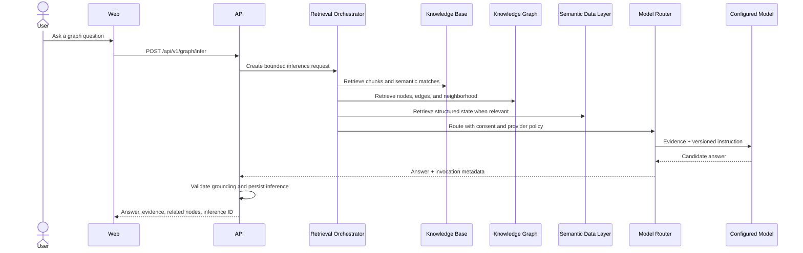
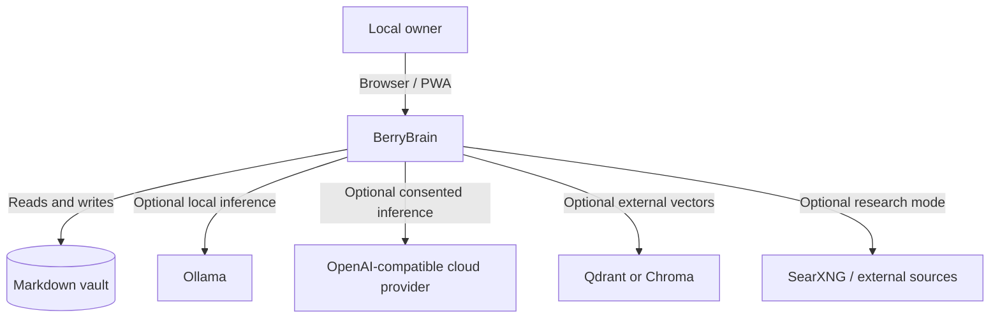
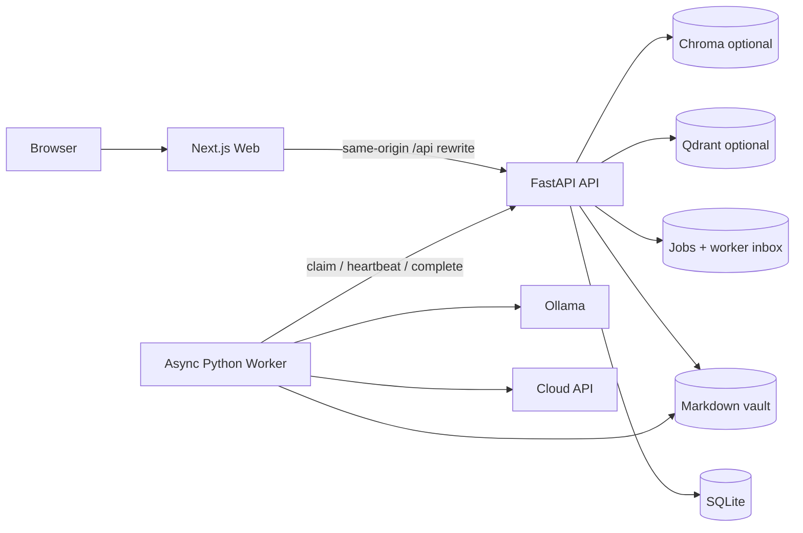
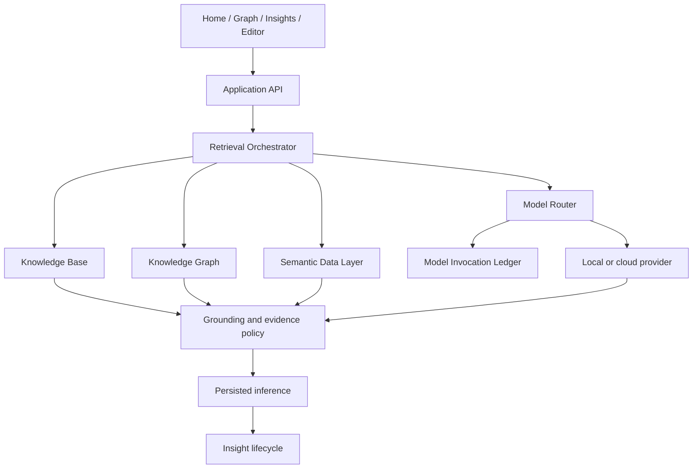
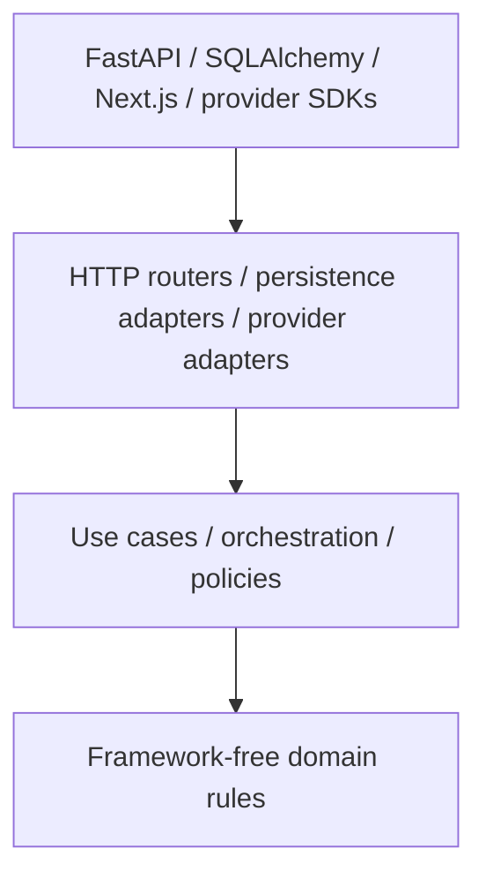
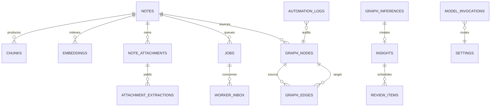
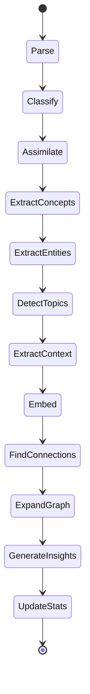

# BerryBrain


**A local-first, evidence-oriented second brain for Markdown, semantic retrieval, knowledge graphs, and explainable AI.**

BerryBrain watches a real Markdown vault and turns its contents into searchable chunks,
concepts, explainable connections, graph nodes, grounded insights, review prompts, and
auditable answers. Notes remain the source of truth. AI output is treated as a suggestion
until evidence, provenance, and lifecycle state are persisted.

BerryBrain is self-hosted and designed for one local owner. It has no central SaaS account,
billing system, telemetry requirement, or hosted management plane.


[](https://ko-fi.com/berrybrain)

> [!IMPORTANT]
> BerryBrain is source-available under a non-commercial license. It is not OSI-approved
> open-source software. Personal, educational, research, and internal non-commercial use
> are allowed. Commercial use requires written permission.

## Contents

- [What BerryBrain actually is](#what-berrybrain-actually-is)
- [Is it RAG, GraphRAG, or fine-tuning?](#is-it-rag-graphrag-or-fine-tuning)
- [How the cognitive loop works](#how-the-cognitive-loop-works)
- [Capabilities](#capabilities)
- [Architecture](#architecture)
- [Software engineering](#software-engineering)
- [Knowledge model](#knowledge-model)
- [Autopilot and reliability](#autopilot-and-reliability)
- [AI providers and privacy](#ai-providers-and-privacy)
- [Install](#install)
- [Configuration](#configuration)
- [Attachments, OCR, and transcription](#attachments-ocr-and-transcription)
- [Using BerryBrain](#using-berrybrain)
- [API](#api)
- [Operations and recovery](#operations-and-recovery)
- [Security](#security)
- [Quality and maturity](#quality-and-maturity)
- [Repository structure](#repository-structure)
- [Roadmap](#roadmap)
- [Troubleshooting](#troubleshooting)
- [License and support](#license-and-support)

## What BerryBrain actually is

BerryBrain is a **personal knowledge system** composed of four cooperating layers:

1. A **Knowledge Base** indexes notes and extracted attachment text as chunks and embeddings.
2. A **Knowledge Graph** stores notes, concepts, topics, entities, contexts, gaps, insights,
   attachments, and explainable relationships.
3. A **Semantic Data Layer** exposes structured facts about jobs, processing, graph health,
   reviews, settings, and system state.
4. A **Cognitive Layer** retrieves evidence from those stores, routes optional model calls,
   validates outputs, and persists useful results with provenance.

This makes BerryBrain more than a Markdown editor and more constrained than a general
chatbot. It is designed to answer:

- What did I study?
- Which concepts recur across my notes?
- Why are these notes connected?
- Which claims have evidence?
- What is missing, weak, isolated, or contradictory?
- What should I review or turn into a permanent note?
- What did the automation process, and what failed?

The central invariant is:

> A knowledge claim must have real source evidence, provenance, confidence, status, and a
> reversible lifecycle. Operational diagnostics must never masquerade as knowledge.

### What it is not

BerryBrain is not:

- a model trained on your notes;
- a fine-tuning platform;
- a vector-search demo with a chat box;
- an autonomous authority that silently rewrites your vault;
- a multi-tenant SaaS;
- a replacement for backups or source control;
- guaranteed to make every model answer correct.

## Is it RAG, GraphRAG, or fine-tuning?

The short answer: **BerryBrain is a hybrid retrieval-augmented knowledge application. It
uses RAG and graph-assisted retrieval, but it does not fine-tune models.**

| Technique | BerryBrain | Meaning |
| --- | --- | --- |
| Retrieval-Augmented Generation (RAG) | Yes | Relevant note chunks and attachment evidence are retrieved before a model answer is requested. |
| Hybrid retrieval | Yes | Lexical, chunk, embedding, graph, and structured-data evidence can be combined. |
| Graph-assisted RAG | Yes | Graph neighborhoods, typed edges, concepts, and evidence can participate in retrieval and inference. |
| Knowledge Graph | Yes | Nodes and edges are persisted independently from the model response. |
| Fine-tuning | No | BerryBrain does not modify model weights or train a private model on the vault. |
| Training pipeline | No | There is no gradient training, LoRA adapter creation, or model checkpoint production. |
| Prompting only | No | Prompts are one part; retrieval, persistence, validation, jobs, graph state, and provenance are separate systems. |

### Why no fine-tuning?

Fine-tuning changes model behavior, but it is a poor default for frequently changing personal
knowledge. New notes would require new training, deletion is difficult to prove, citations are
weak, and model weights do not naturally expose source provenance. BerryBrain keeps knowledge
outside the model so it can be updated, deleted, inspected, backed up, and cited immediately.

### What happens during Ask



If evidence is insufficient, BerryBrain must say so. Provider errors remain diagnostics and
cannot be saved as knowledge insights.

## How the cognitive loop works

```mermaid
flowchart LR
  Capture[Markdown note or attachment] --> Detect[Vault watcher / Scan vault]
  Detect --> Queue[Durable job outbox]
  Queue --> Parse[Parse and classify]
  Parse --> Index[Chunk and embed]
  Index --> Extract[Concepts, entities, topics, context]
  Extract --> Connect[Explainable connections]
  Connect --> Graph[Canonical graph projection]
  Graph --> Insight[Grounded insight generation]
  Insight --> Review[User confirms, ignores, applies, or reviews]
  Review --> Feedback[Persisted outcomes]
  Feedback --> Graph
```



Each note version has a content hash. Jobs are idempotent and ordered so a stale pipeline
cannot overwrite a newer note. Generated artifacts can be retired when their source changes.

## Capabilities

| Area | Current behavior |
| --- | --- |
| Vault | Real `.md` files, folders, wiki links, frontmatter, watcher, manual scan, atomic save |
| Editor | Quick capture, Markdown editing, preview/split, note actions, attachments, autosave recovery |
| Knowledge Base | Deterministic chunking, embeddings, lexical and semantic retrieval, optional Qdrant/Chroma |
| Knowledge Graph | Typed nodes and edges, canonical identity, evidence, confidence, provenance, lifecycle actions |
| Graph inference | Questions grounded in retrieved notes/graph data, persisted inference IDs, Save as insight |
| Insights | Knowledge gaps, recurring/central concepts, connections, contradictions, study opportunities |
| Reviews | Evidence-backed review prompts and adaptive scheduling; no legacy flashcard UI |
| Attachments | PDF, text, DOCX, image OCR, audio/video transcription, source locations |
| Autopilot | Durable queue, dependencies, retries, leases, cancellation, dead letter, stale recovery |
| Monitor | Worker state, jobs, Queue SLO, model invocation ledger, failures, cognitive maturity |
| Security | One-time owner setup, signed sessions, CSRF, rate limits, lockout, encrypted provider keys |
| Portability | Markdown vault, checksummed backup, staged restore, GraphML and JSONL exports |

## Architecture

### C4 system context



### Container architecture



The default Compose topology starts `web`, `api`, and `worker`. `searxng` is optional under
the `web-validation` profile. The Worker is mandatory for background cognitive processing.

### Cognitive components



### Deployment boundary

Expose the Web service through HTTPS. Keep the raw API and Worker private. Browser calls use
the Web same-origin proxy, reducing CORS and cookie complexity. Public deployments must set
exact allowed hosts/origins and secure cookies.

## Software engineering

BerryBrain is being migrated by vertical slice toward Clean Architecture. Existing legacy
modules remain, so architecture maturity is measured rather than claimed complete.

### Dependency direction



Domain policies already isolated include graph inference decisions, model routing, and Queue
SLO evaluation. Architecture tests prevent migrated rules from importing FastAPI, SQLAlchemy,
or browser-owned evidence.

### Engineering principles

- **Single source of truth:** Markdown owns note content; the database indexes and derives.
- **Explicit boundaries:** knowledge, diagnostics, provider execution, and UI state are separate.
- **Evidence over assertion:** generated knowledge needs source evidence and provenance.
- **Idempotency:** retries must not duplicate graph state or knowledge artifacts.
- **Fail closed:** missing auth, invalid consent, bad evidence, and future schemas stop safely.
- **Transactional consistency:** job transitions, claim-scoped inbox messages, and graph events commit together where required.
- **Observability without content leakage:** invocation metrics omit prompts, notes, keys, and model output.
- **Reversibility:** suggestions can be confirmed, ignored, archived, reprocessed, merged, split, or undone.
- **Measured maturity:** tests and benchmarks define claims; feature presence alone does not.

### Reliability patterns

| Pattern | Purpose |
| --- | --- |
| Durable outbox | Note/API mutations enqueue work before background execution. |
| Claim token | A stale Worker cannot complete a job claimed by a newer Worker. |
| Exactly-once inbox | Duplicate terminal messages are consumed idempotently. |
| Lease and heartbeat | Stuck or crashed work can be detected and recovered. |
| Cooperative cancellation | Queued and running jobs can terminate without being marked successful. |
| Retry and dead letter | Transient failures retry; exhausted failures stay actionable. |
| Provider circuit breaker | Repeated provider failures pause calls until cooldown. |
| Queue SLO | Pending age, stale running work, and dead letters become actionable Monitor state. |
| Versioned schema | Startup blocks unsupported future schemas and applies additive migrations. |
| Atomic restore | Database and vault swap together or roll back together. |

### Requirements and decisions

- [Requirements traceability](planning/requirements-traceability.md)
- [Clean Architecture and refactoring plan](planning/clean-architecture-refactor.md)
- [Second-brain maturity scorecard](planning/second-brain-maturity-v2.md)
- [Operations runbook](OPERATIONS.md)

## Knowledge model

### Node types

`note`, `concept`, `entity`, `topic`, `context`, `source`, `attachment`, `insight`,
`gap`, `review_question`, `study_path`, and `cluster`.

### Edge types

`explicit_link`, `semantic_relation`, `prerequisite`, `example_of`, `contrasts_with`,
`duplicates`, `applies_to`, `derived_from`, `mentions`, `supports`, and `contradicts`.

Every active AI-generated edge must include source and target, type, reason, evidence,
confidence, provider, model, prompt version, status, and timestamps. Unsupported or stale
relations are not treated as confirmed knowledge.

### Simplified entity model



### Lifecycle states

Suggested graph artifacts require explicit confirmation unless an Autopilot threshold allows
auto-confirmation. Common states are `suggested`, `confirmed`, `ignored`, `archived`, `stale`,
and `error`. Insight actions are type-aware: an insight is applied or ignored; a connection is
confirmed or ignored; a note node opens the source note.

## Autopilot and reliability

The note pipeline is durable and asynchronous:



Monitor exposes per-note stage progress, active jobs, cancellation, failures, recent model
reliability, and queue health. Activity translates technical events into readable outcomes.

## AI providers and privacy

BerryBrain supports:

- Ollama/local models;
- NVIDIA NIM;
- OpenAI-compatible cloud endpoints;
- other compatible providers configured with URL, key, and model.

Provider setup is required during onboarding because the cognitive pipeline needs a selected
execution route. Local mode requires a reachable Ollama model. Cloud mode requires explicit
remote-content consent, URL, API key, and model.

Provider keys are encrypted in the local database and masked in API responses. The encryption
root is derived from `BERRYBRAIN_SESSION_SECRET`. Rotating that secret invalidates sessions,
password verification material, and encrypted provider keys; reset the owner password and
enter provider keys again.

Every cognitive invocation records capability, provider, model, prompt version, status,
attempts, latency, sanitized error, and correlation ID. It deliberately does not retain the
prompt, note content, retrieved passages, API key, or model output in the invocation ledger.

## Install

### Requirements

| Profile | CPU | RAM | Free SSD | Intended use |
| --- | ---: | ---: | ---: | --- |
| Minimum cloud | 2 x86-64/ARM64 cores | 4 GB | 10 GB | Small vault and cloud inference |
| Recommended cloud | 4 cores | 8 GB | 20+ GB | Daily use and attachments |
| Recommended local | 6+ cores | 16 GB | 30+ GB | Quantized 7B–8B Ollama models |
| Larger local models | 8+ cores plus supported GPU | 32+ GB/VRAM as required | 60+ GB | Larger context and throughput |

Required software: Docker Engine, Docker Compose v2, a modern browser, and either Ollama with
an installed model or an OpenAI-compatible cloud provider. Public deployment and PWA install
outside `localhost` require HTTPS.

### Quick start

```bash
git clone https://github.com/imsouza/berrybrain.git
cd berrybrain
cp .env.example .env
```

Replace the placeholder secrets before startup:

```bash
python -c "import secrets; print(secrets.token_hex(32))"
```

Set separate random values for `BERRYBRAIN_SESSION_SECRET` and `BERRYBRAIN_API_TOKEN`, then:

```bash
docker compose up -d
docker compose ps
```

Default Compose URL: `http://localhost:3000/berrybrain`.

The API health endpoint is `http://localhost:8000/health`. Keep port `8000` private in public
deployments.

### First run

1. Open the landing page and choose **Setup**.
2. Create the single local owner. The alias defaults to `admin`; there is no default password.
3. Complete or skip the product tour.
4. Configure Local or Cloud AI. Provider setup cannot be skipped.
5. Open `/berrybrain/brain` and create or import notes.

Public signup is disabled. The product UI is single-owner; it is not a multi-tenant account
system.

## Configuration

Configuration comes from `.env` for deployment/security and Settings for runtime behavior.

| Variable | Purpose |
| --- | --- |
| `BERRYBRAIN_SESSION_SECRET` | Session/password pepper and provider-key encryption root |
| `BERRYBRAIN_API_TOKEN` | API/Worker service authentication |
| `BERRYBRAIN_HOST_VAULT_PATH` | Host directory mounted as the Markdown vault |
| `BERRYBRAIN_DATABASE_URL` | SQLAlchemy database URL; SQLite is the default |
| `BERRYBRAIN_OWNER_USERNAME` | Local owner alias; defaults to `admin` |
| `BERRYBRAIN_ADMIN_EMAIL` | Legacy env name for the local owner email |
| `BERRYBRAIN_ALLOWED_HOSTS` | Exact hosts accepted by the API |
| `BERRYBRAIN_CORS_ORIGINS` | Exact allowed browser origins |
| `BERRYBRAIN_PUBLIC_APP_URL` | Public canonical URL |
| `BERRYBRAIN_SESSION_SECURE_COOKIE` | Must be `true` behind production HTTPS |
| `NEXT_PUBLIC_BERRYBRAIN_BASE_PATH` | Web path prefix; Compose defaults to `/berrybrain` |
| `NEXT_PUBLIC_BERRYBRAIN_ASSET_PREFIX` | Static asset prefix matching the base path |
| `SMTP_*` | Optional email OTP/password-recovery delivery |

Never commit `.env`, vault content, runtime databases, backups, API keys, or diagnostics
exports. `.env.example` contains placeholders only.

## Attachments, OCR, and transcription

Attachments are source material, not passive files:

- PDF: page-aware extraction through `pypdf`; scanned PDFs can wait for OCR.
- DOCX: XML text extraction.
- Images: local Tesseract OCR with language and confidence metadata.
- Audio/video: local Faster Whisper transcription with timestamps.
- Plain text: bounded direct extraction.

Extraction runs in a constrained subprocess with bounded time, memory, CPU, output, and file
size. Successful output becomes chunks and traceable graph evidence.

### OCR languages

The OCR setting is passed to Tesseract `-l`. A language works only when its `traineddata`
package exists inside the API image. The default image includes `eng` and `osd`; changing the
setting to `por` does not download Portuguese automatically.

Example Dockerfile addition:

```dockerfile
RUN apt-get update \
    && apt-get install -y --no-install-recommends \
       tesseract-ocr-por tesseract-ocr-spa \
    && rm -rf /var/lib/apt/lists/*
```

Then rebuild and verify:

```bash
docker compose build api
docker compose up -d api
docker compose exec api tesseract --list-langs
```

Use `por+eng` only when both language packs are installed.

## Using BerryBrain

### Notes

- Quick capture accepts up to 2,000 characters before creating the note.
- Notes are real Markdown files in the configured vault.
- `[[Wiki links]]` create explicit relationships.
- Scan vault imports external changes.
- Single click on a graph node opens details; double click on a note opens the editor.

### Graph

- Brain View is the default visual layout.
- Layout controls change visual organization without changing graph data.
- Insight nodes can be shown or hidden.
- Suggested nodes and edges can be confirmed or ignored.
- Enrich with AI updates context/evidence through the configured provider.
- Validate with web appears only when external research mode is enabled.

### Insights

Knowledge Insights concern concepts, context, claims, connections, gaps, contradictions, and
learning actions. System Diagnostics concern providers, queue, jobs, and failures. Diagnostics
belong in Monitor/Activity and are blocked from the knowledge-insight surface.

### Reviews

BerryBrain uses evidence-backed review items and adaptive scheduling. The old flashcard UI has
been removed. Review generation must cite current, non-stale source evidence.

## API

The REST API is versioned under `/api/v1`. Important surfaces:

| Endpoint | Purpose |
| --- | --- |
| `GET /health` | API and schema compatibility |
| `GET /api/v1/home/summary` | Home status, progress, stats, insights, graph summary |
| `GET/POST/PUT/DELETE /api/v1/notes` | Note and attachment lifecycle |
| `GET /api/v1/graph` | Canonical graph projection |
| `POST /api/v1/graph/infer` | Evidence-grounded graph question |
| `POST /api/v1/insights/from-inference` | Persist a grounded inference as insight |
| `GET /api/v1/cognitive/maturity` | Structural and longitudinal maturity evidence |
| `GET /api/v1/jobs/health` | Counts, Queue SLO, stale work, dead letters |
| `GET /api/v1/jobs/pipeline-progress` | Per-note stage progress |
| `POST /api/v1/jobs/{id}/cancel` | Cooperative cancellation |
| `GET /api/v1/monitor/stats` | Operational and provider diagnostics |
| `POST /api/v1/backup` | Checksummed backup |
| `POST /api/v1/backup/{id}/restore` | Verified staged restore |

Session-authenticated mutations require CSRF protection. Worker calls use service tokens and
claim tokens. Do not expose the API directly to the public internet.

## Operations and recovery

Use the tested [Operations Runbook](OPERATIONS.md). Do not perform a blind `git pull` against
a stateful instance.

```bash
# Status and logs
docker compose ps
docker compose logs --tail=120 api worker web

# Start or rebuild
docker compose up -d
docker compose up -d --build
```

### Password recovery without SMTP

```bash
read -s SEED_ADMIN_PASSWORD
export SEED_ADMIN_PASSWORD
docker compose exec -e SEED_ADMIN_PASSWORD api python /app/scripts/seed_admin.py
unset SEED_ADMIN_PASSWORD
```

### Remove owner but preserve knowledge and Settings

```bash
docker compose exec -e DELETE_OWNER_CONFIRM=DELETE_LOCAL_OWNER api \
  python /app/scripts/delete_owner.py
```

### Data deletion

- **Erase all data and keep settings:** removes notes and derived knowledge while preserving
  Settings/provider configuration.
- **Factory reset:** removes owner, Settings, provider keys, notes, jobs, graph, and insights.

Always create and verify a backup before destructive maintenance.

## Security

Implemented controls include:

- one-shot, concurrency-safe owner setup;
- Argon2id password hashing with PBKDF2 fallback;
- signed session and CSRF cookies;
- `SameSite=Lax`, optional secure cookies, and session revocation;
- progressive authentication rate limiting and account lockout;
- fail-closed API authentication;
- encrypted provider keys with masked API responses;
- request body limits and path traversal protection;
- attachment MIME validation and extractor sandbox limits;
- prompt-injection trust policy for retrieved user content;
- secret scanning, dependency checks, CodeQL, container scanning, SBOM, and image signing;
- sanitized provider diagnostics that omit private knowledge.

For public exposure, terminate TLS at a trusted reverse proxy, enable secure cookies, set
exact allowed hosts/origins, keep the API private, and rotate every placeholder secret.

Security contact: `contato@optlabs.com.br`. Do not include secrets or private notes in issues.

## Quality and maturity

BerryBrain is a functional second brain, but the project does not claim 100% maturity merely
because features exist.

Current local release evidence (22 July 2026):

- API: 276 tests pass, plus 51 subtests.
- Worker: 37 tests pass.
- Browser: 26 production Playwright tests pass.
- Branch coverage: 81%; critical-module coverage gate passes.
- Ruff, formatting, progressive MyPy, ESLint, TypeScript, and production build pass.
- Cognitive release gate passes for grounding, provenance, diagnostic isolation, retrieval,
  idempotency, stale cleanup, insight fixtures, and graph projection.
- Semantic benchmark: 100 notes, Recall@10 100%, MRR 100%, stale evidence 0.
- Graph benchmark: 5,000 nodes, 20,000 edges, p95 <= 2.5 s, payload <= 16 MiB.
- UI budgets: automated WCAG A/AA, focus/reduced motion, LCP/CLS/JS, and <=200 ms INP candidate.

Evidence-based scorecards currently report cognitive maturity **86/100** and engineering
maturity **84/100**. Remaining gates include real 30-day usefulness outcomes, manual screen
reader evidence, historical restore fixtures/external disaster recovery, and further legacy
boundary isolation. See [Second-Brain Maturity V2](planning/second-brain-maturity-v2.md).

Run the deterministic release gate:

```bash
cd apps/api
PYTHONPATH=src python -m benchmarks.maturity_release_gate
```

## Repository structure

```text
berrybrain/
├── apps/
│   ├── api/                  FastAPI, persistence, cognitive services, benchmarks
│   ├── web/                  Next.js landing, Docs, PWA, and authenticated workspace
│   └── worker/               Async job execution and provider integration
├── planning/                 Requirements, architecture, and maturity evidence
├── prompts/                  Versioned cognitive prompts
├── scripts/                  Governance and operational helpers
├── vault/                    Local Markdown mount; ignored by Git
├── docker-compose.yml        Default self-hosted topology
├── docker-compose.prod.yml   Production-oriented overrides
├── OPERATIONS.md             Upgrade, backup, rollback, and incident runbook
└── CHANGELOG.md              Release history
```

CI is split into backend, Worker, Web, security, container, CodeQL, and tagged release
workflows. Tagged releases build AMD64/ARM64 images, generate SPDX SBOMs, and sign image
digests with GitHub OIDC.

## Roadmap

| Area | Next evidence required |
| --- | --- |
| Cognitive outcomes | >=70% useful/acted-on insights over a real rolling 30-day window |
| Architecture | Repository/UoW ports for remaining graph, vault, retrieval, and provider contexts |
| Retrieval | More independent real-vault profiles and reranking evaluations |
| Accessibility | Manual screen-reader and contrast audit |
| Recovery | Historical release restore matrix and external clean-machine disaster drill |
| Attachments | More OCR packs, formats, transcription models, and public quality fixtures |
| Scale | Optional Postgres/Neo4j only when measured limits justify added operations |

## Troubleshooting

### Worker is not processing

```bash
docker compose ps
docker compose logs --tail=120 worker api
```

Check provider configuration, remote-content consent, pending/dead-letter jobs, Queue SLO,
API reachability, and Worker heartbeat in Monitor.

### Ask returns an error

Verify the selected provider URL, key, model, consent, and model endpoint compatibility. A
`401` is a provider credential error. Provider failure is intentionally not converted into an
answer or insight.

### Graph is empty

Ensure notes are in the mounted vault, run **Scan vault**, inspect pipeline stages, remove UI
filters, and verify graph expansion completed. Reprocessing is asynchronous.

### OCR language fails

Run `docker compose exec api tesseract --list-langs`. The configured language code must be
installed in the API image.

### Static assets fail under `/berrybrain`

Set matching base path and asset prefix before building Web, then verify the reverse proxy
preserves `/berrybrain` and `/berrybrain/api` routing.

## License and support

BerryBrain is source-available under the
[BerryBrain Source-Available Non-Commercial License](LICENSE).

Allowed: personal, educational, research, and internal non-commercial use, modification, and
self-hosting. Commercial hosting, resale, paid distribution, commercial integrations, and
monetized derivative services require written permission from the copyright owner.

- Issues: [github.com/imsouza/berrybrain/issues](https://github.com/imsouza/berrybrain/issues)
- Support/security: `contato@optlabs.com.br`
- Donate: [ko-fi.com/berrybrain](https://ko-fi.com/berrybrain)
