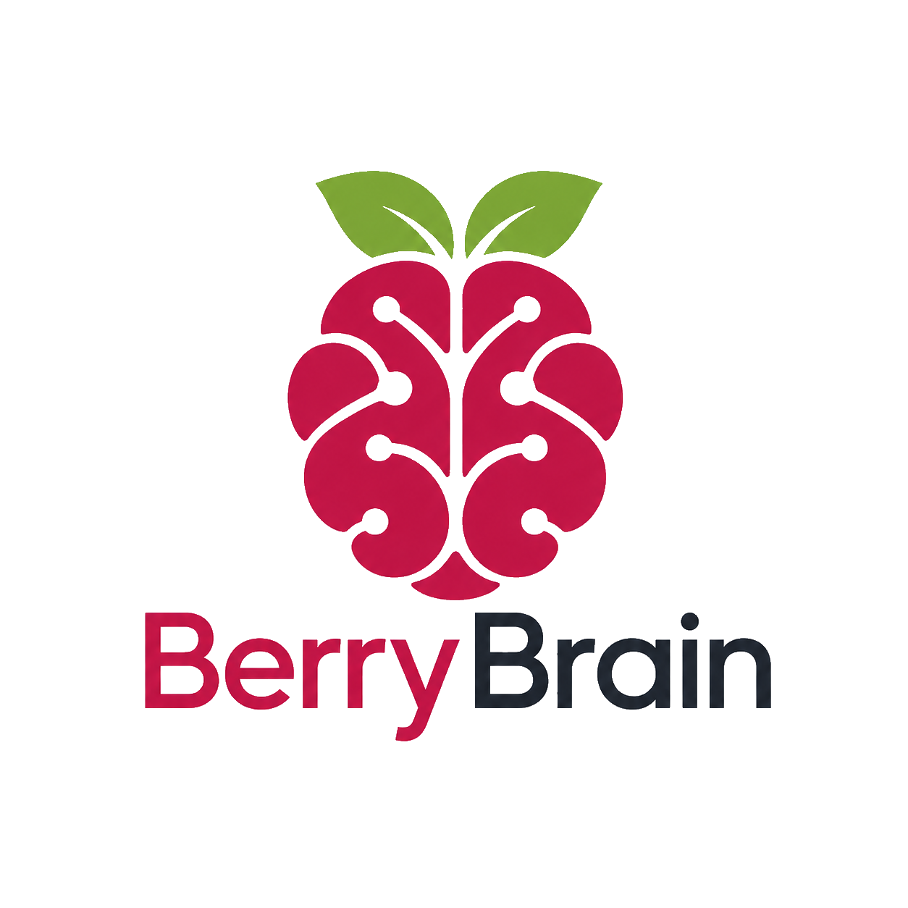
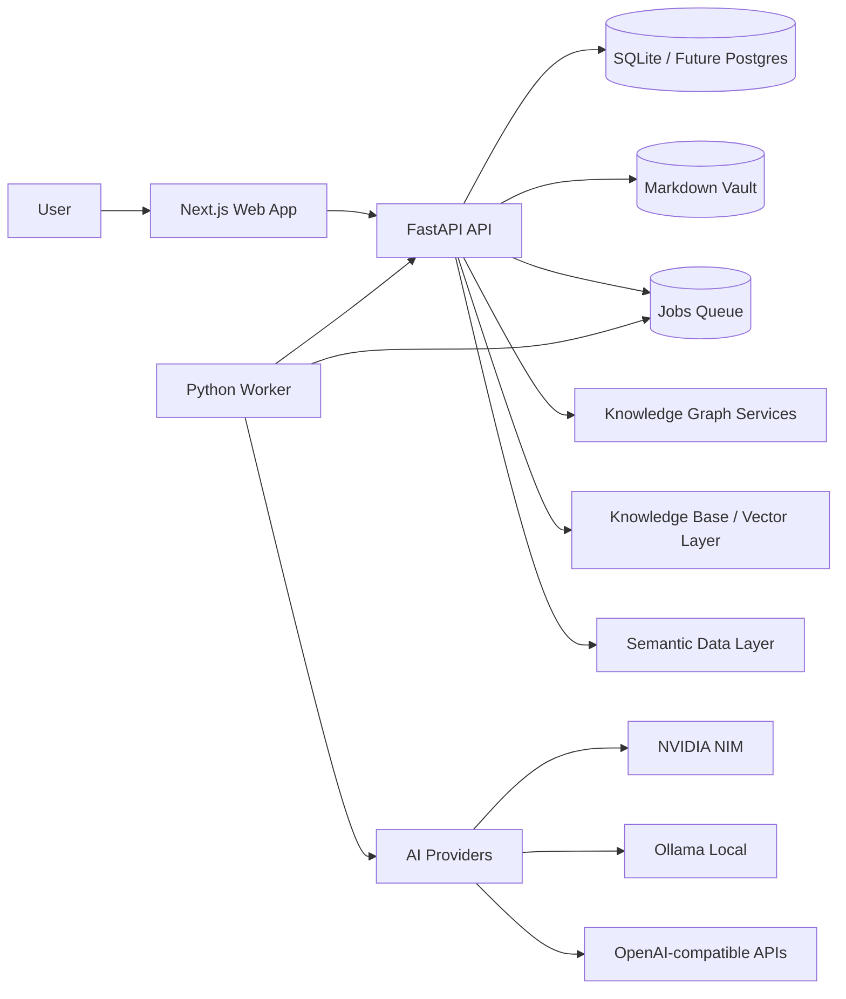
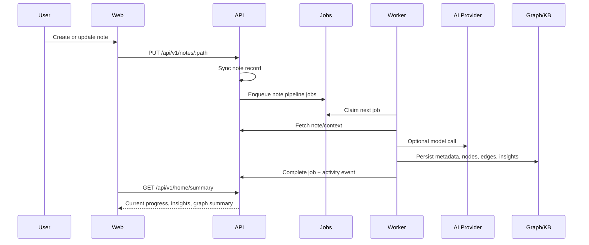
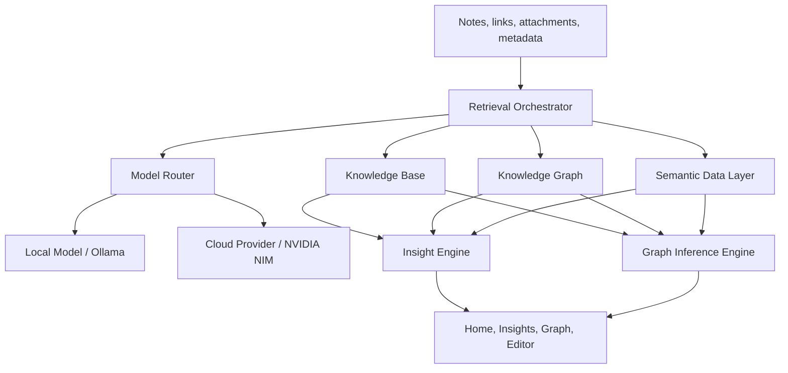
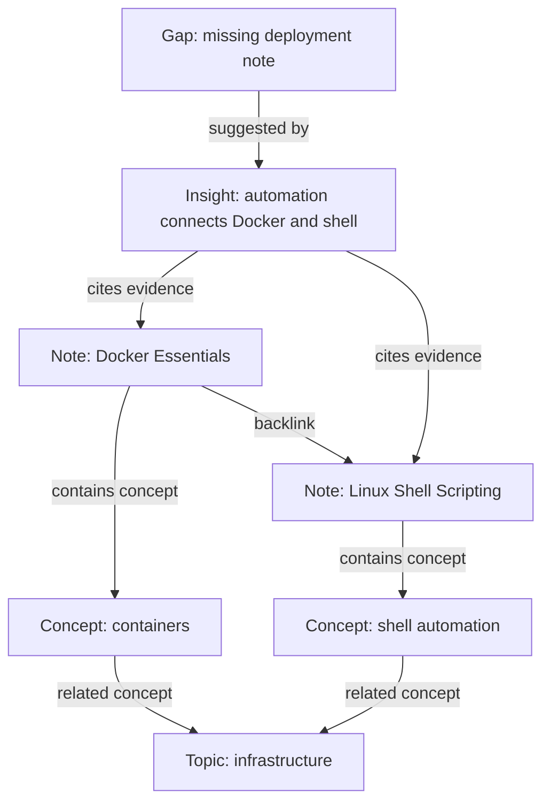
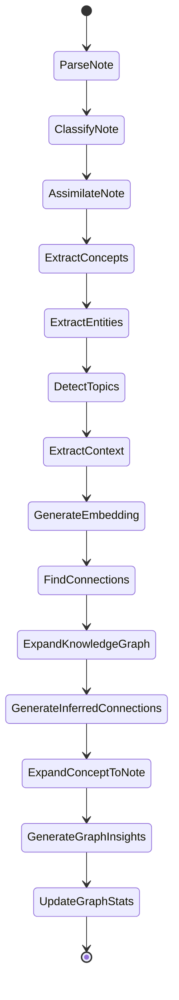
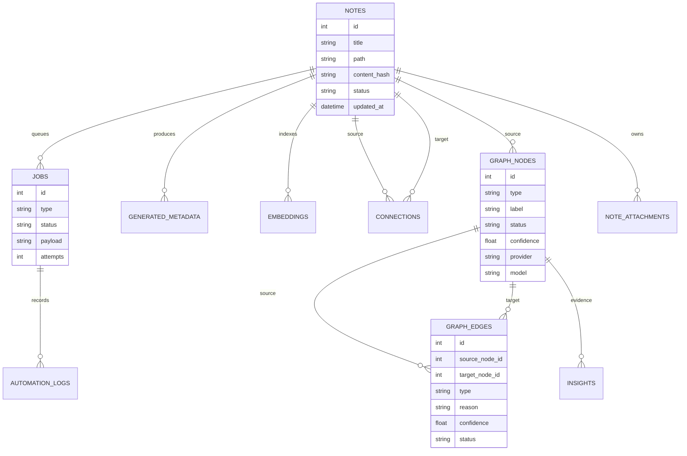

# BerryBrain



**A free, source-available, local-first second brain for Markdown notes, knowledge graphs, and explainable AI-assisted learning.**

BerryBrain turns notes into connected knowledge. It watches a Markdown vault, parses note structure, extracts concepts, expands a knowledge graph, creates explainable connections, and surfaces insights that help the user study, assimilate, and discover gaps.

There is no central BerryBrain account, SaaS tenant, billing gate, demo mode, or hosted management panel. You self-host the stack and create one local owner account for your own instance.

---


[](https://ko-fi.com/berrybrain)

---

## Table of Contents

- [What BerryBrain Is](#what-berrybrain-is)
- [Core Capabilities](#core-capabilities)
- [Current Maturity](#current-maturity)
- [Architecture](#architecture)
- [Cognitive Layer](#cognitive-layer)
- [Knowledge Graph](#knowledge-graph)
- [Autopilot Pipeline](#autopilot-pipeline)
- [Data Model](#data-model)
- [API Surface](#api-surface)
- [Repository Structure](#repository-structure)
- [Getting Started](#getting-started)
- [System Requirements](#system-requirements)
- [Configuration](#configuration)
- [Self-Hosting](#self-hosting)
- [PWA](#pwa)
- [Account Recovery and Deletion](#account-recovery-and-deletion)
- [Deploying at /berrybrain](#deploying-at-berrybrain)
- [Engineering Practices](#engineering-practices)
- [Security and Privacy](#security-and-privacy)
- [Roadmap](#roadmap)
- [Troubleshooting](#troubleshooting)

---

## What BerryBrain Is

BerryBrain is not just a Markdown editor with AI bolted on. The product goal is to behave like a **real second brain**:

- capture notes without friction;
- assimilate concepts from real note content;
- detect relationships between notes, concepts, topics, entities, gaps, and insights;
- maintain a dynamic knowledge graph;
- answer questions using evidence from the user's vault;
- expose what the system did, why it did it, and what evidence supports each conclusion.

The system is designed around one rule:

> Important knowledge artifacts must be explainable, persisted, traceable, and reversible.

---

## Core Capabilities

| Area | Capability |
| --- | --- |
| Markdown Vault | Real `.md` files, wiki links, frontmatter, folder organization, vault scan, file watcher |
| Editor | Editor-first workflow, autosave, preview/split mode, backlinks, attachments |
| Autopilot | Async job queue for parsing, classification, assimilation, embeddings, graph expansion, insights |
| Knowledge Graph | Notes, concepts, topics, entities, contexts, gaps, insights, and explainable edges |
| Cognitive Layer | Knowledge Base + Knowledge Graph + Semantic Data Layer + Model Router |
| AI Providers | NVIDIA NIM/cloud, OpenAI-compatible providers, DeepSeek-compatible providers, Ollama/local |
| Insights | Knowledge gaps, central concepts, recurring ideas, weak concepts, connections, study suggestions |
| Graph Inference | Ask questions about the graph with evidence-backed answers |
| Activity and Monitor | Human-readable activity timeline plus technical job diagnostics |
| Settings | Theme, editor, provider/model configuration, graph/cognitive settings, attachment limits |
| Owner Access | One-time local setup, configurable username alias, strong password, session/CSRF protection, rate limits and lockout |
| Privacy and security | Local-first storage, explicit cloud providers, owner-only setup, CSRF, rate limits, lockout, backup/export controls |

---

## Current Maturity

The current worktree implements the complete local product foundation. Release governance remains separate and must not be confused with feature completeness.

| Foundation | Current state |
| --- | --- |
| Markdown lifecycle | Real files, watcher/scan, optimistic concurrency, autosave recovery, version-aware processing |
| Job engine | Structured runs/dependencies, idempotency, leases, heartbeat, backoff, dead-letter, stale recovery |
| Semantic memory | Chunked indexing, hybrid lexical/vector/graph retrieval, optional Qdrant or Chroma |
| Knowledge graph | Canonical typed nodes/edges, source evidence, confidence, lifecycle actions, provenance |
| Insights and review | Knowledge-only insight policy, evidence-backed actions, persisted review scheduling |
| Cognitive attachments | PDF/document extraction, image OCR, audio/video transcription, attachment chunks and graph evidence |
| Data safety | Manifest/checksum backup, validated restore, versioned schema migrations, readable export |
| Owner security | Local single-owner setup, configurable `admin` alias, no default password, Argon2id, signed sessions, CSRF, rate limiting, lockout, audit events |
| Delivery evidence | 156 API tests, 34 Worker tests, 13 production-browser checks, protected CI gates, container scans, SBOM workflow |

Release evidence is tracked in [`AUDIT.md`](AUDIT.md) and the public [`v1.0.0` release](https://github.com/imsouza/berrybrain/releases/tag/v1.0.0). Protected `main`, required checks/review, clean-stack validation, 12 consecutive green container runs, multi-architecture images, OIDC signatures, and SPDX SBOM attestations are complete.

---

## Architecture

BerryBrain is split into three primary applications:

- **Web**: Next.js + React UI.
- **API**: FastAPI service, persistence, routes, graph/cognitive services.
- **Worker**: Python async worker that claims jobs and performs background processing.



### Runtime Contract

The frontend never calls AI providers directly. All cognitive operations flow through API services and queued jobs:



---

## Cognitive Layer

BerryBrain's long-term architecture is a **Cognitive Layer** made of four cooperating systems.



### Knowledge Base

Purpose: semantic retrieval over unstructured knowledge.

Implemented foundation:

- Markdown note indexing;
- chunking;
- embeddings;
- hybrid lexical, graph, chunk, and vector retrieval;
- optional Qdrant or Chroma synchronization and retrieval.

Attachment knowledge sources:

- Tesseract OCR for supported images;
- page-aware PDF extraction;
- local Faster Whisper audio/video transcription;
- plain-text and DOCX extraction;
- attachment chunks, graph nodes, edges, and traceable evidence.

### Knowledge Graph

Purpose: represent relationships and explain why knowledge is connected.

Graph nodes can represent:

- note;
- concept;
- topic;
- entity;
- context;
- gap;
- insight;
- attachment;
- source/reference;
- study path/cluster when produced by the cognitive pipeline.

Graph edges must have:

- source and target;
- type;
- reason;
- evidence;
- confidence;
- provider/model when generated by AI;
- status (`suggested`, `confirmed`, `ignored`, etc.).

### Semantic Data Layer

Purpose: answer questions about structured system state.

Examples:

- How many jobs are pending?
- Which notes are not assimilated?
- Which graph nodes have no context?
- Which providers are failing?
- Which insights need attention?

This layer prevents system diagnostics from leaking into knowledge insights. Job failures belong in Monitor/Activity, not in graph insights.

### Model Router

Purpose: centralize provider selection and traceability.

The router should record:

- provider;
- model;
- prompt version;
- status;
- duration;
- error;
- generated artifact;
- source evidence.

---

## Knowledge Graph

The graph is the core representation of BerryBrain's second brain.



### Node Types

| Type | Meaning |
| --- | --- |
| `note` | A Markdown file in the vault |
| `concept` | A semantic concept extracted from notes |
| `topico` / `topic` | A topic detected from content or metadata |
| `entidade` / `entity` | A named entity, tool, person, project, place, or technology |
| `contexto` / `context` | A broader context connecting multiple notes |
| `lacuna` / `gap` | A detected missing piece of knowledge |
| `insight` | A knowledge insight with evidence and action |
| `attachment` | Processed PDF, image, audio, video, text, or document source |

### Edge Types

| Type | Meaning |
| --- | --- |
| `backlink` | A wiki link between notes |
| `shared_concept` | Notes or nodes share a concept |
| `semantic_similarity` | Similarity from embeddings/model inference |
| `insight_suggested` | An insight cites or suggests a relationship |
| `attachment_related` | Evidence-backed edge from an attachment to its note or derived knowledge |
| `prerequisite` | One topic should be understood before another |
| `example_of` | One note/example illustrates a concept |
| `application_of` | A note applies a broader concept |
| `contrast` | Two ideas differ in a meaningful way |
| `duplicate` | Possible redundant notes/content |

### Graph Interaction Rules

- Single click: open graph details panel.
- Double click note node: open the source note.
- Insight nodes can be shown/hidden in Brain View.
- Suggested nodes/connections can be confirmed or ignored.
- AI enrichment must update evidence, context, model/provider, and activity.
- Web validation is only allowed when research/external enrichment is enabled.

---

## Autopilot Pipeline

The note pipeline turns file changes into cognitive artifacts.



### Job Design

Jobs are persisted and claimed by the worker. This makes the system resilient to provider failures and API restarts.

| Job Family | Purpose |
| --- | --- |
| Parse/classify | Understand the Markdown note shape |
| Assimilation | Extract knowledge from note content |
| Embedding | Build semantic search vectors |
| Connection finding | Create explainable links between notes |
| Graph expansion | Create/update nodes and edges |
| Insight generation | Produce useful knowledge insights |
| Graph quality | Stats, cleanup, duplicate detection, enrichment |
| Attachment processing | OCR, PDF parsing, transcription, attachment graph expansion |

---

## Data Model

High-level entity relationship diagram:



### Assimilation Metric

Home assimilation is not a simple note status flag. A note is considered assimilated when durable cognitive output exists for the current note version, such as:

- generated metadata;
- embedding;
- connected graph note;
- completed cognitive pipeline job.

This avoids showing `0%` when the graph already contains real knowledge artifacts.

---

## API Surface

The API is versioned under `/api/v1`.

| Endpoint | Purpose |
| --- | --- |
| `GET /api/v1/home/summary` | Home state: status, progress, stats, insights, graph summary |
| `GET /api/v1/notes` | List notes in the vault |
| `POST /api/v1/notes` | Create a note |
| `GET /api/v1/notes/{path}` | Read a note |
| `PUT /api/v1/notes/{path}` | Update a note and queue processing |
| `POST /api/v1/notes/{path}/reprocess` | Re-run note pipeline |
| `GET /api/v1/notes/{path}/attachments` | List note attachments |
| `POST /api/v1/notes/{path}/attachments` | Upload an attachment |
| `GET /api/v1/graph` | Graph nodes, edges, and stats |
| `GET /api/v1/graph/summary` | Lightweight graph summary |
| `POST /api/v1/graph/expand` | Expand/rebuild graph artifacts |
| `POST /api/v1/graph/infer` | Ask the graph with evidence |
| `GET /api/v1/insights` | List knowledge insights |
| `POST /api/v1/insights/from-inference` | Save a graph inference as insight |
| `GET /api/v1/jobs` | List job queue state |
| `GET /api/v1/jobs/pipeline-progress` | Per-note pipeline progress |
| `GET /api/v1/activity` | Human activity timeline |
| `GET /api/v1/settings` | Read settings |
| `PUT /api/v1/settings/{key}` | Update a setting |
| `GET /health` | API health |

---

## Repository Structure

```text
berrybrain/
  apps/
    api/
      src/berrybrain_api/        FastAPI app, routers, models, graph/cognitive services
      tests/                     API and service tests
    web/
      src/                       Next.js app, components, contexts, UI
      public/                    Runtime public assets
    worker/
      src/berrybrain_worker/     Async worker and provider execution
      tests/                     Worker integration tests
  prompts/                       Versioned AI prompts
  vault/                         Local Markdown vault
  docker-compose.yml             Local orchestration
```

---

## Getting Started

### Prerequisites

- 64-bit Linux host or Linux VM
- Recent Docker Engine and Docker Compose v2
- Ollama with an installed model, or an OpenAI-compatible cloud provider

### Run Locally

```bash
git clone https://github.com/imsouza/berrybrain.git
cd berrybrain
cp .env.example .env
docker compose up -d
```

This starts Web, API, and Worker. Open `http://localhost:3000`; an unconfigured instance exposes **Setup**, while a configured instance exposes **Open BerryBrain** or **Logout** for the active owner session.

| Service | URL |
| --- | --- |
| Web | `http://localhost:3000` |
| API | `http://localhost:8000` |
| Health | `http://localhost:8000/health` |

### Common Commands

```bash
# Start Web, API, and Worker
docker compose up -d

# Stop services
docker compose down

# View API logs
docker logs berrybrain-api-1 --tail 120

# View worker logs
docker logs berrybrain-worker-1 --tail 120

# Run API tests locally
PYTHONDONTWRITEBYTECODE=1 PYTHONPATH=apps/api/src:apps/api python -m unittest discover apps/api/tests

# Frontend typecheck without writing tsbuildinfo
cd apps/web && ./node_modules/.bin/tsc --noEmit --incremental false
```

---

## System Requirements

These are practical deployment baselines, not model-quality benchmarks. Actual storage and
memory depend on vault size, attachments, backups, embedding dimensions, and the local model.

| Profile | CPU | Memory | Free SSD | Intended use |
| --- | ---: | ---: | ---: | --- |
| Minimum, cloud AI | 2 x86-64/ARM64 cores | 4 GB | 10 GB | Small vault and cloud inference |
| Recommended, cloud AI | 4 cores | 8 GB | 20+ GB | Daily use and concurrent services |
| Recommended, local AI | 6+ cores | 16 GB | 30+ GB | Quantized 7B–8B Ollama models |
| Larger local models | 8+ cores and supported GPU | 32+ GB RAM/VRAM as required | 60+ GB | Larger contexts and throughput |

Use a current Chromium, Firefox, or Safari browser. Public deployments require HTTPS and a
same-origin reverse proxy. PWA installation outside `localhost` also requires HTTPS. The
local-AI figures do not include every model: verify the artifact's RAM/VRAM and disk needs
before pulling it.

---

## Configuration

Configuration lives in `.env`, Settings UI, and persisted settings.

### AI Providers

| Provider | Use |
| --- | --- |
| NVIDIA NIM | Cloud reasoning, graph inference, high-quality insights |
| Ollama | Local-first inference where available |
| OpenAI-compatible API | Alternative cloud model route |
| DeepSeek-compatible API | Reasoning and analysis route |

Provider configuration is mandatory on first use. The tour may be skipped, but onboarding
cannot finish until the owner explicitly selects Local with an installed Ollama model, or
Cloud with a provider URL, API key, and model. Provider keys are stored in the local database
and are not persisted in browser `localStorage`. Docker deployments reach a host Ollama
instance through `http://host.docker.internal:11434` by default; both API and Worker include
the Linux `host-gateway` mapping.

### Attachment Limits

The editor supports attaching files to notes, with limits configured in Settings:

- image MB limit;
- video MB limit;
- audio MB limit;
- other MB limit.

Attachments are persisted, queued, extracted, indexed as chunks, and represented as evidence-backed graph nodes. PDF/document parsing, Tesseract OCR, and local Faster Whisper transcription run in a constrained extractor process with configurable timeout and file-size limits.

### OCR Languages

`BERRYBRAIN_ATTACHMENT_OCR_LANGUAGE` is passed to Tesseract's `-l` option. Changing the code
does not download a language automatically: the matching Tesseract `traineddata` package must
already exist in the API image. The default image bundles English (`eng`) and orientation
detection (`osd`) only.

For Debian-based images, add the required packages to `apps/api/Dockerfile`, rebuild the API,
and then select their Tesseract codes in Settings. Example for Portuguese and Spanish:

```dockerfile
RUN apt-get update \
    && apt-get install -y --no-install-recommends \
       tesseract-ocr tesseract-ocr-por tesseract-ocr-spa \
    && rm -rf /var/lib/apt/lists/*
```

```bash
docker compose build api
docker compose up -d api
docker compose exec api tesseract --list-langs
```

Use Tesseract codes such as `eng`, `por`, `spa`, `deu`, or `fra`. Multiple installed
languages can be combined, for example `por+eng`. An unknown code or a code whose package is
absent causes the OCR job to fail; this rule applies to every language.

---

## Self-Hosting

BerryBrain runs as three Docker services (`web`, `api`, `worker`) defined in `docker-compose.yml`. The Worker is part of the default `docker compose up -d` path because cognitive processing depends on background jobs. The same stack works for local dev and production; only the configuration differs.

### 1. Prepare the environment

```bash
cp .env.example .env
```

Edit `.env` and set at minimum:

| Variable | Why it matters |
| --- | --- |
| `BERRYBRAIN_SESSION_SECRET` | HMAC pepper for sessions **and** password hashing. Use a long random value. Changing it later invalidates existing password hashes (re-seed the owner account). |
| `BERRYBRAIN_API_TOKEN` | Bearer token for service-to-service automation. Generate a random value. |
| `BERRYBRAIN_ADMIN_EMAIL` | Legacy environment name for the single local owner email. |
| `BERRYBRAIN_OWNER_USERNAME` | Login alias for the local owner. Defaults to `admin`; set it before startup to change it. |
| `BERRYBRAIN_INTERNAL_API_URL` | Server-side API origin used by the web proxy. Defaults to `http://api:8000`; use `http://127.0.0.1:8000` when running Web outside Docker. |
| `BERRYBRAIN_ENV_FILE` | Optional Compose environment file path. Defaults to `.env`; useful for isolated smoke tests or multiple self-hosted instances. |
| `BERRYBRAIN_DONATION_URL` | Optional donation link shown/documented by the operator; no payment processing is built in. |
| `BERRYBRAIN_PUBLIC_APP_URL` | Public base URL of the web app (used in emails/links). |
| `BERRYBRAIN_CORS_ORIGINS` | Comma-separated allowed web origins. |
| `SMTP_*` | Optional legacy email delivery settings. Not required for default self-hosted setup. |

Generate secrets, for example:

```bash
python -c "import secrets; print(secrets.token_hex(32))"
```

### 2. Start the stack

```bash
docker compose up -d
```

Web serves on `http://localhost:3000`, API on `http://localhost:8000`, and the Worker starts in the background to process vault scans, embeddings, graph expansion, and insights.

### 3. Create the local owner account

Open `http://localhost:3000`, choose **Setup**, then complete the one-time owner setup. The default username alias is `admin`, but **there is no default password**: the owner must create a strong password of at least 12 characters. Change the alias with `BERRYBRAIN_OWNER_USERNAME` before startup. On the first workspace load, BerryBrain shows the guided tour and then requires Local or Cloud AI configuration.

For headless recovery, the owner account can be created or updated by the script copied into the API image. Pass the password through stdin/environment rather than a CLI argument:

```bash
read -s SEED_ADMIN_PASSWORD
export SEED_ADMIN_PASSWORD
docker compose exec -e SEED_ADMIN_PASSWORD api python /app/scripts/seed_admin.py
unset SEED_ADMIN_PASSWORD
```

Because `BERRYBRAIN_SESSION_SECRET` is used as a password-hash pepper, re-run this seed whenever you change the secret.

### 4. HTTPS / reverse proxy (required for any public exposure)

Never expose the plain HTTP ports directly. Terminate TLS with a proxy (Caddy, nginx, or Cloudflare Tunnel) and set:

```ini
BERRYBRAIN_SESSION_SECURE_COOKIE=true
BERRYBRAIN_TRUST_X_FORWARDED_FOR=true   # only if your proxy sets X-Forwarded-For
BERRYBRAIN_PUBLIC_APP_URL=https://your.domain
BERRYBRAIN_CORS_ORIGINS=https://your.domain
```

If you serve the app under a path prefix, set the public web env values before building the web app. The API should remain behind the same reverse proxy origin.

---

## Deploying at /berrybrain

The landing page and app can be served at:

```text
https://optlabs.com.br/berrybrain
```

Use these web environment values:

```ini
NEXT_PUBLIC_BERRYBRAIN_API_URL=/berrybrain
NEXT_PUBLIC_BERRYBRAIN_BASE_PATH=/berrybrain
NEXT_PUBLIC_BERRYBRAIN_ASSET_PREFIX=/berrybrain
BERRYBRAIN_PUBLIC_APP_URL=https://optlabs.com.br/berrybrain
BERRYBRAIN_CORS_ORIGINS=https://optlabs.com.br
BERRYBRAIN_ALLOWED_HOSTS=localhost,127.0.0.1,testserver,api,optlabs.com.br
```

Recommended reverse-proxy behavior:

- route `/berrybrain` and `/berrybrain/*` to the Next.js web service;
- route `/berrybrain/api/*` to the API or through the web rewrite, depending on the proxy topology;
- do not expose `:8000` publicly;
- enable secure cookies in production with `BERRYBRAIN_SESSION_SECURE_COOKIE=true`.

### 5. Cloudflare Tunnel example

With `cloudflared` installed, point a public hostname at the web container (port 3000). Example ingress:

```yaml
tunnel: your-tunnel
ingress:
  - hostname: your.domain
    path: /berrybrain*
    service: http://127.0.0.1:3000
  - hostname: your.domain
    service: http://localhost:80
  - service: http_status:404
```

### Updating

```bash
git pull
docker compose pull
docker compose up -d --build
```

---

## PWA

BerryBrain is installable as a Progressive Web App and starts directly at `/brain`. Install
it from a supported browser while using HTTPS or `localhost`.

The Service Worker caches public static assets only. It does **not** cache API responses,
authenticated HTML navigation, or note contents. If the self-hosted server is unavailable,
the PWA displays a neutral offline page instead of stale private content. Editing, retrieval,
and cognitive processing require connectivity to the self-hosted server.

---

## Account Recovery and Deletion

### Forgot password

Use **Forgot password** on Login when SMTP is configured. Without SMTP, reset the local owner
password using the non-interactive host command documented above. This replaces the password
hash, clears lockout state, and disables 2FA unless `--enable-2fa` is passed.

### Remove only the owner account

The local operator can remove the owner while preserving vault files, cognitive data, and
Settings. All owner sessions are revoked and one-time Setup becomes available again:

```bash
docker compose exec -e DELETE_OWNER_CONFIRM=DELETE_LOCAL_OWNER api \
  python /app/scripts/delete_owner.py
```

### Delete knowledge while keeping Settings

Use **Settings → Danger zone → Erase all data and keep settings**. This removes notes and
derived knowledge but preserves appearance and provider configuration.

### Factory reset

Back up anything needed, then remove the complete local runtime state:

```bash
docker compose down
rm -rf data/* vault/*
mkdir -p data vault
docker compose up -d
```

This removes the owner, settings, API keys stored in the database, notes, jobs, graph, and
insights. Provider secrets deliberately placed in `.env` must be removed there separately.
Never commit `.env`, `data/`, `vault/`, backups, or diagnostics exports.

---

## Engineering Practices

### Design Principles

- **Local-first**: user knowledge lives in local files and local database by default.
- **Explainable**: graph edges and insights need reasons/evidence.
- **Asynchronous**: expensive work is queued and processed by the worker.
- **Traceable**: AI-generated artifacts record provider/model/prompt version where possible.
- **Reversible**: suggested nodes/connections can be confirmed or ignored.
- **Human UI, technical monitor**: knowledge insights stay human; job diagnostics stay in Monitor/Activity.

### Quality Gates

Before merging significant changes:

- API unit/integration tests pass.
- Worker integration tests pass when worker behavior changes.
- Frontend typecheck/build pass when dependencies are installed.
- No hardcoded secrets.
- No raw JSON or internal job names in primary knowledge UI.

### Repository Governance

The repository includes `CODEOWNERS`, a structured epic form, CI workflows, and an idempotent governance bootstrap script. After authenticating GitHub CLI as the repository owner, run:

```bash
./scripts/bootstrap-github-governance.sh
```

The script creates the release epics and protects `main` with required CI checks, one approving code-owner review, stale-review dismissal, conversation resolution, and force-push/deletion protection. It never accepts or stores a token in the repository; authentication remains managed by the GitHub CLI or its environment.
- No flashcard surface; study suggestions should be insight/review oriented, not legacy flashcard UI.

Latest local verification evidence (13 July 2026):

- 156 API tests pass with a 60% total coverage gate and critical-module ratchets;
- 34 Worker tests pass, including disposable-database integration coverage;
- 13 production-browser Playwright checks pass against an isolated authenticated stack, including landing-to-login owner entry with no default password;
- API, Worker, and Web images pass the local zero-fixable-HIGH/CRITICAL Trivy gate;
- SPDX SBOM generation is wired into CI and signed release publication is defined in `.github/workflows/release.yml`.

### Error Handling

Provider failures should:

- fail jobs with clear reason;
- update Monitor/Activity;
- not create fake insights;
- not silently corrupt graph state;
- allow retry/reprocess.

---

## Security and Privacy

BerryBrain ships with a hardened, fail-closed security model. The API enforces authentication on every route (Bearer token or session cookie), dangerous actions require the authenticated local owner, and secrets stay server-side.

### Implemented controls

- Argon2id password hashing (PBKDF2 fallback) with the session secret as pepper.
- Session and CSRF cookies signed with HMAC; `SameSite=Lax`.
- First-run local owner setup with configurable username alias, session login/logout, and owner provisioning.
- Progressive rate limiting and account lockout on repeated failures.
- Authenticated owner gate on maintenance, settings danger, backups, system reset, and legacy maintenance endpoints.
- Fail-closed auth middleware: missing/invalid credentials are denied, not allowed.
- Path-traversal protection on backup IDs.
- Secrets (API keys) are masked in client responses.

### Operational safety

- Keep API keys and tokens out of git; `.env` is gitignored.
- Treat any token pasted into chat/logs as compromised and rotate it.
- Generate a unique `BERRYBRAIN_SESSION_SECRET` and `BERRYBRAIN_API_TOKEN` per deployment.
- Serve only over HTTPS; enable `BERRYBRAIN_SESSION_SECURE_COOKIE`.
- Re-run setup/owner seed after changing `BERRYBRAIN_SESSION_SECRET`.

## Roadmap

### Version Direction

| Version | Status | Focus |
| --- | --- | --- |
| `1.0.x` | Stable | Local vault, resilient jobs, hybrid retrieval, graph, insights, reviews, cognitive attachments, activity, settings |
| `1.1.x` | Planned | Evaluation datasets, stronger reranking/inference, graph quality tuning, broader accessibility |
| `1.2.x` | Planned | Additional attachment formats, OCR languages, transcription models, extraction observability |
| `1.3.x` | Planned | Optional external vector-store operations and backup/export polish |
| `2.0.x` | Future | Optional multi-user collaboration, optional Postgres/Neo4j, advanced sync |

### Attachment Processing Status

Implemented capabilities:

- `PROCESS_ATTACHMENT` job;
- PDF text extraction;
- OCR for images/scanned PDFs;
- audio transcription;
- audio/video transcription through the bundled local Faster Whisper model;
- attachment extraction records;
- attachment chunks in Knowledge Base;
- `attachment` graph nodes;
- attachment-backed insights and graph answers.

Remaining maturity work includes bundling more OCR language packs by default, broader real-world fixtures, larger transcription model choices, and public quality benchmarks. Any Tesseract language can be added by installing its matching `traineddata` package as documented above.

### Security and Self-Hosting Roadmap

BerryBrain is free for personal, educational, research, and internal non-commercial self-hosting. The source is available for inspection and contribution, but commercial use, resale, SaaS hosting, paid distribution, and monetized derivative services require explicit written permission from the owner.

Implemented security capabilities:

- public marketing site;
- first-run local owner setup;
- session login/logout;
- single local account management;
- authenticated owner controls;
- rate limiting and abuse protection;
- privacy, security, LGPD/GDPR pages.

---

## Troubleshooting

### API is unhealthy

```bash
docker logs berrybrain-api-1 --tail 120
curl http://localhost:8000/health
```

### Worker is not processing

Check:

- worker container is running;
- jobs are pending;
- provider/model settings are valid;
- API is reachable from worker;
- provider key is configured if using cloud.

```bash
docker ps | grep berrybrain
curl http://localhost:8000/api/v1/jobs?limit=10
docker logs berrybrain-worker-1 --tail 120
```

### Graph looks empty

Check:

- notes exist in the vault;
- graph expansion jobs completed;
- filters are not hiding node types;
- insight nodes are not hidden if you expect to see insight nodes;
- ignored nodes are filtered by default.

```bash
curl http://localhost:8000/api/v1/graph
curl http://localhost:8000/api/v1/graph/summary
```

### Home stats look wrong

The Home uses durable cognitive signals, not only raw note status. If assimilation looks stale:

- reprocess the note;
- check job failures in Monitor;
- verify graph nodes/edges exist;
- inspect `/api/v1/home/summary`.

### Frontend typecheck fails

Ensure dependencies are installed:

```bash
npm --prefix apps/web install
npm --prefix apps/web run typecheck
```

---

## License

BerryBrain is source-available under a non-commercial license.

You may use, study, modify, and self-host BerryBrain for personal, educational, research, or internal non-commercial purposes.

You may not sell, resell, sublicense, offer as a paid hosted service, include in a commercial product, monetize derivative services, or otherwise commercialize BerryBrain without explicit written permission from the copyright owner.

Commercial rights are reserved exclusively by the owner, imsouza, unless a separate written commercial license is granted.
