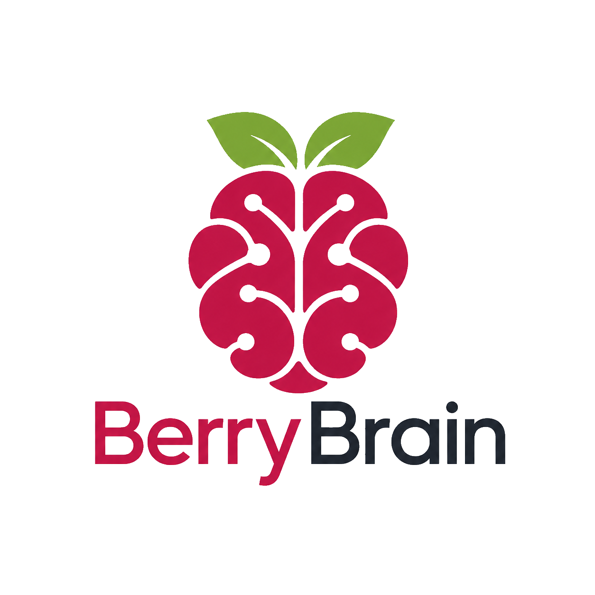
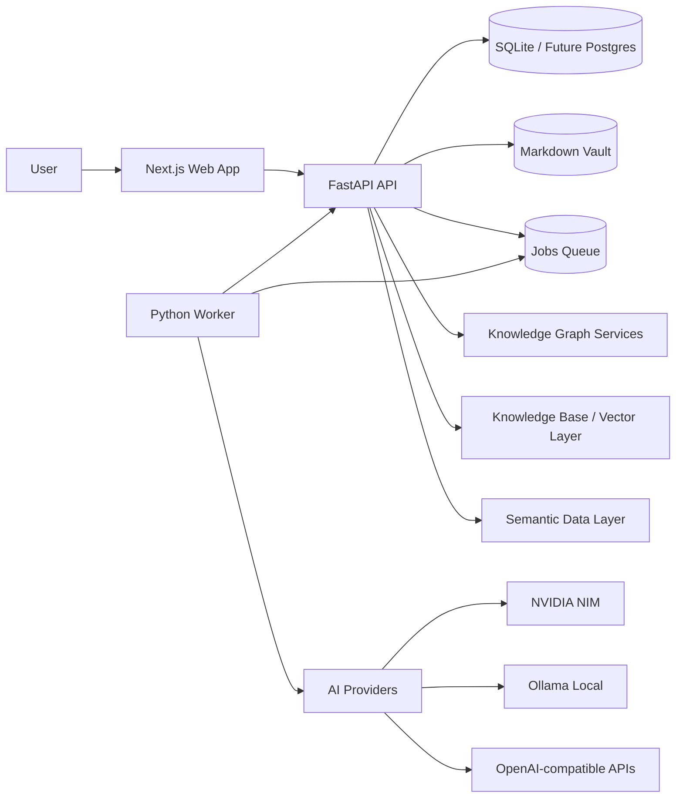
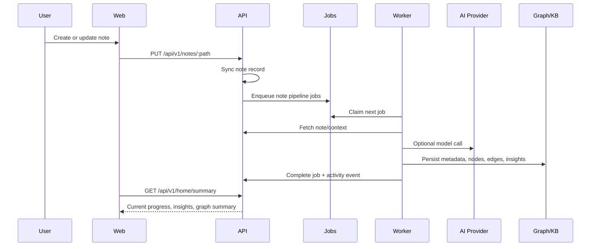
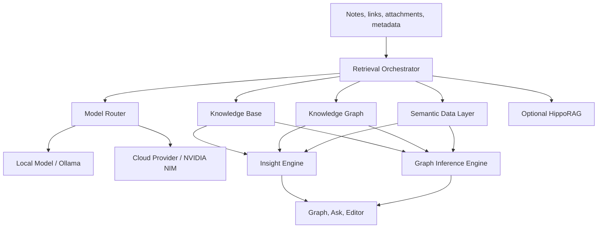
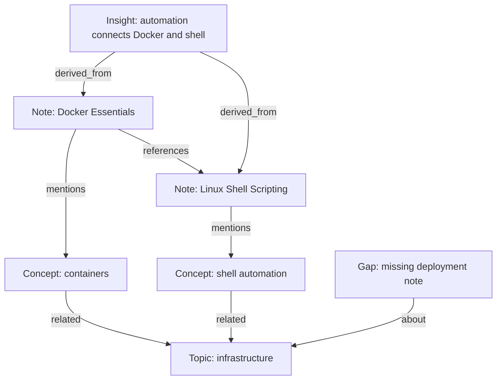
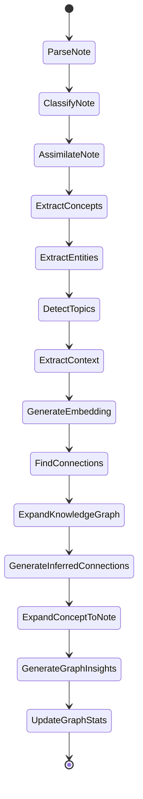
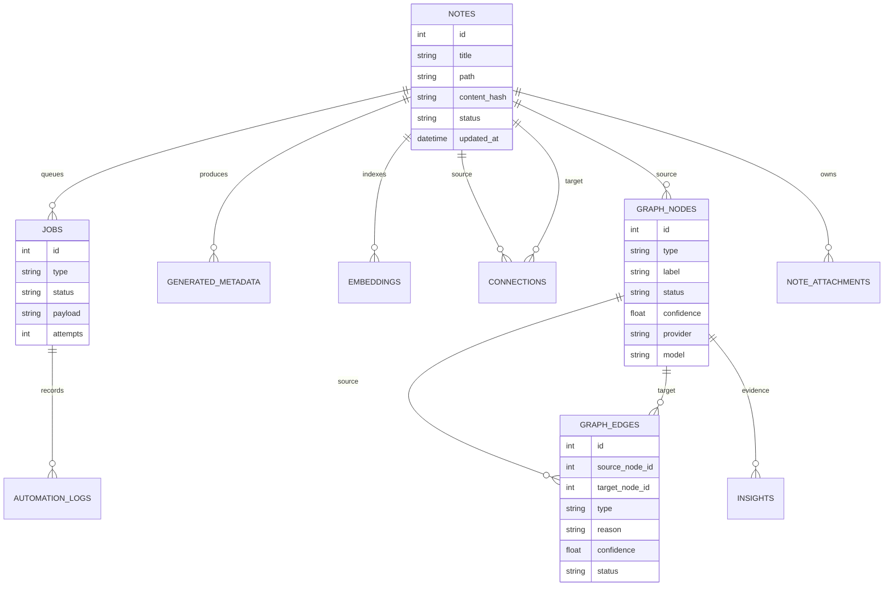

# BerryBrain



**A free, source-available, local-first second brain for Markdown notes, knowledge graphs, and explainable AI-assisted learning.**

BerryBrain turns notes into connected knowledge. It watches a Markdown vault, parses note structure, extracts concepts, expands a knowledge graph, creates explainable connections, and surfaces insights that help the user study, assimilate, and discover gaps.

There is no central BerryBrain account, SaaS tenant, billing gate, demo mode, or hosted management panel. You self-host the stack and create one local owner account for your own instance.

---


[](https://ko-fi.com/berrybrain)

---

## Table of Contents

- [What BerryBrain Is](#what-berrybrain-is)
- [Core Capabilities](#core-capabilities)
- [What's New in 1.4.5](#whats-new-in-145)
- [Current Maturity](#current-maturity)
- [Evaluation and Benchmarking](#evaluation-and-benchmarking)
- [Architecture](#architecture)
- [Cognitive Layer](#cognitive-layer)
- [Knowledge Graph](#knowledge-graph)
- [Autopilot Pipeline](#autopilot-pipeline)
- [Data Model](#data-model)
- [API Surface](#api-surface)
- [Repository Structure](#repository-structure)
- [Getting Started](#getting-started)
- [System Requirements](#system-requirements)
- [Configuration](#configuration)
- [Self-Hosting](#self-hosting)
- [PWA](#pwa)
- [Account Recovery and Deletion](#account-recovery-and-deletion)
- [Deploying at /berrybrain](#deploying-at-berrybrain)
- [Engineering Practices](#engineering-practices)
- [Engineering Plans](#engineering-plans)
- [Security and Privacy](#security-and-privacy)
- [Roadmap](#roadmap)
- [Troubleshooting](#troubleshooting)

---

## What BerryBrain Is

BerryBrain is not just a Markdown editor with AI bolted on. The product goal is to behave like a **real second brain**:

- capture notes without friction;
- assimilate concepts from real note content;
- detect relationships between notes, concepts, topics, entities, gaps, and insights;
- maintain a dynamic knowledge graph;
- answer questions using evidence from the user's vault;
- expose what the system did, why it did it, and what evidence supports each conclusion.

The system is designed around one rule:

> Important knowledge artifacts must be explainable, persisted, traceable, and reversible.

---

## Core Capabilities

| Area | Capability |
| --- | --- |
| Markdown Vault | Real `.md` files, wiki links, frontmatter, folder organization, vault scan, file watcher |
| Editor | Editor-first workflow, autosave, preview/split mode, backlinks, attachments |
| Autopilot | Async job queue for parsing, classification, assimilation, embeddings, graph expansion, insights |
| Knowledge Graph | Notes, concepts, topics, entities, contexts, gaps, insights, and explainable edges |
| Cognitive Layer | Knowledge Base + Knowledge Graph + Semantic Data Layer + HippoRAG Sidecar |
| AI Providers | NVIDIA NIM, OpenAI, OpenRouter, Groq, DeepSeek, custom OpenAI-compatible APIs, and Ollama/local |
| Model Routing | Capability-based routing (Generation, Embedding, Judge, HippoRAG) with Fallback Chains |
| RAG Judge | Deterministic, single-model, and committee evaluator with calibrated quality gates |
| Insights | Knowledge gaps, central concepts, recurring ideas, weak concepts, connections, study suggestions |
| Graph Inference | Ask questions about the graph with RRF (Reciprocal Rank Fusion) evidence-backed answers |
| Ask Flow | Persistent, grounded multi-turn sessions with evidence, isolation, and cancellation |
| Research gaps | Explicit graph-wide research with URL safety, untrusted evidence, progress, and confirmation before promotion |
| Semantic Graph | Typed geometry, context clusters, ontology validation, quarantine, progressive loading, and canvas LOD |
| Activity and Monitor | Human-readable activity timeline plus technical job diagnostics |
| Settings | Theme, editor, provider/model configuration, graph/cognitive settings, attachment limits |
| Owner Access | One-time local setup, configurable username alias, strong password, session/CSRF protection |
| Privacy and security | Local-first storage, explicit cloud providers, encrypted/masked AI keys, owner-only setup, CSRF, rate limits, lockout |

---

## What's New in 1.4.5

- **Immediate graph visibility**: saving or importing a note materializes its canonical note node
  in the same database transaction. Concepts, entities, topics, edges, insights, clusters, and
  embeddings continue asynchronously with a history-derived ETA and explicit degraded state.
- **Complete note lifecycle**: meaningful edits detach stale note provenance before recalculation;
  whitespace-only edits preserve semantic artifacts; renames and moves retain stable note and graph
  identity; deletion removes note-owned records, recalculates shared confidence, removes orphans,
  and queues graph, insight, cluster, statistics, and HippoRAG maintenance.
- **Strict provider execution**: Cloud and Local are mutually exclusive execution branches. Activity
  records the resolved provider and model as a generic AI call instead of labelling cloud work as
  Ollama. NVIDIA NIM query/passage embeddings use the required asymmetric input contract.
- **Graph workspace**: navigation groups view, layout, filters, knowledge actions, Research Gaps,
  and legend. The obsolete node drawer is removed; node clicks zoom into the dedicated detail page.
- **Markdown editor**: controlled undo/redo, find/replace, headings, lists, tasks, indentation,
  tables, links, attachments, keyboard commands, wrapping/focus controls, and live document metrics.
- **Home operations**: equal-height capture/autopilot surfaces and a denser processing, connection,
  activity, graph-health, and attention hierarchy using the documented BerryBrain design tokens.
- **Grounded Ask suggestions**: a populated question queue and topic cloud are derived from live
  graph nodes when evidence exists; empty graphs still produce no fabricated suggestions.

### Included from 1.4.4

- Executed five-path retrieval ablations with query-level observations, qrels, paired bootstrap
  intervals, and immutable checksummed evidence bundles.
- Added independent BM25, dense, and hybrid baseline runners that require real corpora, qrels, and
  embeddings instead of substituting outcomes.
- Added HTTP, worker queue, on-disk graph, browser, and instrumentation-overhead benchmarks plus
  S/M/L/XL workload profiles.
- Added bounded API latency/error telemetry, correlation propagation, and `Server-Timing` without
  recording prompts, note content, secrets, or user-controlled labels.
- Replaced static maturity percentages with evidence-based Maturity V3 and mandatory integrity caps.
- Added thesis methodology, protocol, datasets, reproducibility, limitations, generated tables,
  chart specifications, and documentation-consistency checks.
- Reduced authenticated workspace startup from two sequential authorization requests to one normal
  request, retaining fail-closed fallback behavior.

### Included from 1.4.3

- **Dedicated Ask workspace**: Home and Graph open a full Ask screen with voice input,
  grounded answers, persistent Flow turns, and Home/Graph return paths.
- **AI-assisted graph suggestions**: the question carousel and topic cloud render immediately from
  active nodes, typed relationships, and clusters. AI refreshes the queue in the background; its
  output is validated against live node IDs and exact labels before caching. Empty graphs stay empty.
- **Continuous agent monitoring**: worker heartbeats idempotently schedule due enrichment,
  insight and gap discovery, missing Judge evaluation, and semantic clustering. Enrichment jobs
  carry evidence fingerprints, skip stale duplicates, and cool down after provider failures.
- **Graph-first insights**: proposed insights are graph nodes with accept/reject actions; the
  separate Insights and Review Today screens were removed.
- **Node deletion and notifications**: deleting non-note nodes recalculates graph topology, while
  insight proposals and terminal job failures create persistent English notifications.

### Included from 1.4.2

- **Reliable voice Ask**: the microphone starts recognition from the user gesture, renders a
  live waveform from Web Audio, and reports permission, device, network, and speech failures.
- **Bounded readable labels**: graph nodes adapt to their text, wrap to three lines, truncate at
  58 characters, and preserve ontology geometry without becoming unbounded.
- **Intentional graph interaction**: drag pins without opening; click animates the camera into
  the node before opening its full page; the hover summary stays close and exposes useful context.
- **Correct return routes**: **Back to Home** opens Brain home while **Back to graph** restores the
  complete graph view with the workspace shell intact.
- **Complete confidence contract**: concepts, note connections, nodes, edges, insights, cluster
  assignments, and graph inferences expose Jeffreys-smoothed point estimates with calculated
  95% Wilson intervals. Missing evidence is unavailable, and migrated records are recalculated
  idempotently.
- **No fabricated production knowledge**: deterministic fallbacks derive their score from source
  occurrences, AI edges always reach Judge, and production self-check payloads are removed.

- **Ontology contract**: nodes map to SKOS, PROV-O, schema.org, RDF, OWL, and Dublin Core;
  edges enforce canonical names, direction, symmetry, domain, and range.
- **Semantic quality gate**: generic metadata labels, sentences posing as concepts, invalid
  endpoint combinations, and ambiguous generated artifacts enter quarantine outside graph/RAG.
- **Calculated confidence**: graph nodes, edges, insights, and cluster assignments persist a
  Jeffreys-smoothed point estimate, 95% Wilson interval, sample size, factors, method, and
  timestamp. No evidence means unavailable, not an invented default. Users cannot edit confidence.
- **Context clustering**: deterministic medoids and silhouette selection replace transitive
  threshold merging. Pending semantic nodes receive provisional cluster colors.
- **Readable graph**: one full label per node, exclusive geometry by ontology type, Berry-red
  note roots, rectangular highlighted insights, directed arrows, and a relationship-role legend.
- **Node workspace**: click zooms into the node, then opens `/graph/nodes/:id` in the existing
  shell with evidence, provenance, typed relationships, read-only confidence, editing, validation,
  semantic retry, and graph-state restoration.
- **Ask and insights**: voice prompts work on Home and Graph Ask; Flow answers can become insights;
  every note-change pipeline generates insights after graph inference, while continuous monitoring
  adds a configurable periodic pass (24 hours by default).
- **Vault workflow**: New note always opens the editor. Notes and folders support sidebar
  drag-and-drop ordering plus inline management.
- **Ontology-aware RAG**: graph retrieval uses type, direction, canonical property, aliases,
  quarantine status, and the lower confidence bound. HippoRAG stores canonical triples and
  retains them across rebuilds.

---

## Current Maturity

BerryBrain v1.4.5 is locally validated for ontology-aware graph/RAG behavior, calculated
confidence intervals, semantic quarantine, context clustering, full-page node editing,
voice Ask, persistent Ask Flow, global research, progressive rendering, and operational recovery.

| Foundation | Current state |
| --- | --- |
| Markdown lifecycle | Real files, watcher/scan, optimistic concurrency, autosave recovery, version-aware processing |
| Job engine | Structured runs/dependencies, idempotency, leases, heartbeat, backoff, dead-letter, stale recovery |
| Semantic memory | Chunked indexing, hybrid lexical/vector/graph retrieval, optional Qdrant or Chroma |
| Knowledge graph | Validated ontology types/roles, source evidence, confidence intervals, quarantine, lifecycle actions, provenance |
| Graph scale | Bounded pages and deltas, deterministic extreme-scale layout, canvas LOD, medoid context clusters, provisional and vault colors |
| Grounded interaction | Ask refusal without evidence, persistent Flow, cancellable turns, and explicit graph gap research |
| Insight proposals | Knowledge-only insight policy, evidence-backed graph nodes, explicit accept/reject actions |
| Cognitive attachments | PDF/document extraction, image OCR, audio/video transcription, attachment chunks and graph evidence |
| Data safety | Manifest/checksum backup, validated restore, versioned schema migrations, readable export |
| Owner security | Local single-owner setup, configurable `admin` alias, local/dev default owner, Argon2id, signed sessions, CSRF, rate limiting, lockout, audit events |
| Delivery evidence | API, Worker, browser E2E, web build, security, architecture, benchmark, calibration, and dependency audit gates |

Maturity is no longer represented by a static percentage. Maturity V3 awards Levels 0-5 per
capability from current artifacts, rejects stale or missing evidence, and prevents synthetic CI
fixtures from awarding independent or field-validation levels. The latest exploratory S profile
passed its composed engineering gate but remains `incomplete-evidence` because public external
datasets, independent comparison, and approved participant/field evidence are not yet available.

See [Maturity Model V3](docs/maturity-model.md), [latest benchmark results](docs/benchmark-results.md),
and [limitations](docs/limitations.md).

---

## Evaluation and Benchmarking

BerryBrain uses four comparison layers: internal A0-A6/G0-G3 ablations, independent technical
baselines, historical regression, and task-level user evaluation. Retrieval reports query-level
Recall@10, MRR, NDCG@10, rejection and faithfulness; runtime reports HTTP, queue, graph/database,
browser, memory, and error distributions. Paired effects include deterministic bootstrap confidence
intervals. Every measured runner emits revision/environment metadata, raw observations, summaries,
and SHA-256 checksums.

Latest executed exploratory S profile, generated 12 August 2026 at 19:13 UTC:

| Retrieval configuration | Recall@10 | MRR | NDCG@10 | p95 latency |
| --- | ---: | ---: | ---: | ---: |
| Lexical only | 0.050 | 0.017 | 0.025 | 11.01 ms |
| Dense only | 0.500 | 0.500 | 0.500 | 9.70 ms |
| Standard hybrid | 0.500 | 0.500 | 0.500 | 18.27 ms |
| Graph lexical | 0.500 | 0.250 | 0.315 | 21.99 ms |
| Graph hybrid | 1.000 | 0.750 | 0.815 | 30.84 ms |

| Runtime workload | Measured result |
| --- | ---: |
| HTTP, 100 requests at concurrency 10 | 67.98 req/s; p50/p95/p99 138.02/248.62/293.22 ms; 0 errors |
| Worker, 100 jobs | 12.48 jobs/s drain; p95 7,693.75 ms; 0 duplicate claims |
| On-disk graph, 500 nodes and 1,000 edges | p50/p95 175.46/306.76 ms; 541,592 B payload |
| Fault injection | 3/3 contained; 3/3 preserved prior state; maximum 9.26 ms containment |
| Judge calibration | Weighted kappa 0.9801; false acceptance/rejection 0.000/0.000 |

The composed gate passed with zero failed gates. These numbers are real local executions from the
machine-readable artifacts, classified as exploratory because the revision was dirty and external
datasets, independent replication, and approved participant/field evidence remain unavailable.

Release-candidate browser regression, executed 13 August 2026 against the local production image:

| Browser workload | Measured result |
| --- | ---: |
| 10,000-node progressive graph | cold first visual 2,566.49 ms; warm 536.42 ms; complete 6,344.58 ms |
| 10,000-node graph interaction | p95 35.30 ms; 23.10 MB used JS heap |
| Public route navigation | 12 routes; maximum wall time 1,544.13 ms (`/docs`) |
| Authenticated route navigation | 6 routes; maximum wall time 2,335.46 ms (`/notifications`) |
| Lazy workspace panels | Settings 244.74 ms; Graph 565.03 ms |

This smoke run is regression evidence from one machine and dirty worktree, not a capacity or
cross-system superiority claim.

```bash
cd apps/api
PYTHONPATH=src:. python -m benchmarks.retrieval_quality_benchmark --evidence-root ../../reports/evidence
PYTHONPATH=src:. python -m benchmarks.full_evaluation --repository-root ../.. --output-root ../../reports/evaluation --profile S

cd ../web
BENCHMARK_BASE_URL=http://127.0.0.1:3000 npm run benchmark:browser
```

The controlled retrieval fixture is causal regression evidence, not a BEIR, HotpotQA, MuSiQue, or
HippoRAG comparative claim. External runners require real qrels and embeddings and fail when those
assets are missing. Human-study results require ethics/LGPD approval and real participants; the
repository never substitutes fabricated labels.

Evaluation references:

- [Methodology](docs/evaluation-methodology.md)
- [Benchmark protocol](docs/benchmark-protocol.md)
- [Dataset registry](docs/datasets.md)
- [Reproducibility](docs/reproducibility.md)
- [Thesis protocol](docs/thesis-research-protocol.md)
- [v1.4.4 execution plan](docs/planning/v1-4-4-performance-maturity-thesis-benchmark-plan.md)

---

## Architecture

BerryBrain is split into three core applications and one optional internal sidecar:

- **Web**: Next.js + React UI.
- **API**: FastAPI service, persistence, routes, graph/cognitive services.
- **Worker**: Python async worker that claims jobs and performs background processing.
- **HippoRAG**: internal multi-hop index/retrieval sidecar enabled by the `cognitive-advanced` profile.


```mermaid
flowchart LR
  User[User] --> Web[Next.js Web App]
  Web --> API[FastAPI API]
  API --> DB[(SQLite / Future Postgres)]
  API --> Vault[(Markdown Vault)]
  API --> Jobs[(Jobs Queue)]
  Worker[Python Worker] --> Jobs
  Worker --> API
  Worker --> Providers[AI Providers]
  Providers --> NIM[NVIDIA NIM]
  Providers --> Ollama[Ollama Local]
  Providers --> Other[OpenAI-compatible APIs]
  API --> Graph[Knowledge Graph Services]
  API --> KB[Knowledge Base / Vector Layer]
  API --> SDL[Semantic Data Layer]
```

### Runtime Contract

The frontend never calls AI providers directly. Cognitive operations flow through API services and queued jobs. Graph questions are persisted before they can become insights, so the browser is never the authority for evidence:


```mermaid
sequenceDiagram
  participant U as User
  participant W as Web
  participant A as API
  participant Q as Jobs
  participant WK as Worker
  participant AI as AI Provider
  participant G as Graph/KB

  U->>W: Create or update note
  W->>A: PUT /api/v1/notes/:path
  A->>A: Sync note record
  A->>Q: Enqueue note pipeline jobs
  WK->>Q: Claim next job
  WK->>A: Fetch note/context
  WK->>AI: Optional model call
  WK->>G: Persist metadata, nodes, edges, insights
  WK->>A: Complete job + activity event
  W->>A: GET /api/v1/home/summary
  A-->>W: Current progress, insights, graph summary
```

---

## Cognitive Layer

BerryBrain's long-term architecture is a **Cognitive Layer** made of four cooperating systems.


```mermaid
flowchart TB
  Input[Notes, links, attachments, metadata] --> Orchestrator[Retrieval Orchestrator]
  Orchestrator --> KB[Knowledge Base]
  Orchestrator --> KG[Knowledge Graph]
  Orchestrator --> SDL[Semantic Data Layer]
  Orchestrator --> Router[Model Router]
  Orchestrator --> Hippo[Optional HippoRAG]
  Router --> Local[Local Model / Ollama]
  Router --> Cloud[Cloud Provider / NVIDIA NIM]
  KB --> Insight[Insight Engine]
  KG --> Insight
  SDL --> Insight
  KB --> Infer[Graph Inference Engine]
  KG --> Infer
  SDL --> Infer
  Insight --> UI[Graph, Ask, Editor]
  Infer --> UI
```

### Knowledge Base

Purpose: semantic retrieval over unstructured knowledge.

Implemented foundation:

- Markdown note indexing;
- chunking;
- embeddings;
- hybrid lexical, graph, chunk, and vector retrieval;
- optional Qdrant or Chroma synchronization and retrieval.

Attachment knowledge sources:

- Tesseract OCR for supported images;
- page-aware PDF extraction;
- local Faster Whisper audio/video transcription;
- plain-text and DOCX extraction;
- attachment chunks, graph nodes, edges, and traceable evidence.

### Knowledge Graph

Purpose: represent relationships and explain why knowledge is connected.

Graph nodes can represent:

- note;
- concept;
- topic;
- entity;
- context;
- gap;
- insight;
- attachment;
- source/reference;
- study path/cluster when produced by the cognitive pipeline.

Graph edges must have:

- source and target;
- type;
- reason;
- evidence;
- calculated confidence interval or an explicit unavailable state;
- provider/model when generated by AI;
- status (`suggested`, `confirmed`, `ignored`, etc.).

### Semantic Data Layer

Purpose: answer questions about structured system state.

Examples:

- How many jobs are pending?
- Which notes are not assimilated?
- Which graph nodes have no context?
- Which providers are failing?
- Which insights need attention?

This layer prevents system diagnostics from leaking into knowledge insights. Job failures belong in Monitor/Activity, not in graph insights.

### Model Router

Purpose: centralize provider selection and traceability.

The router should record:

- provider;
- model;
- prompt version;
- status;
- duration;
- error;
- generated artifact;
- source evidence.

The active configuration is exclusive: **Cloud XOR Local**. Generation, embeddings, Judge,
and HippoRAG use explicit model slots. Provider presets resolve their base URL automatically;
custom OpenAI-compatible endpoints remain supported. The Judge uses the configured Judge slot,
not an automatic hidden ensemble. Committee mode is explicit and requires separate judges.

---

## Knowledge Graph

The graph is the core representation of BerryBrain's second brain.


```mermaid
graph TD
  N1[Note: Docker Essentials] -->|references| N2[Note: Linux Shell Scripting]
  N1 -->|mentions| C1[Concept: containers]
  N2 -->|mentions| C2[Concept: shell automation]
  C1 -->|related| C3[Topic: infrastructure]
  C2 -->|related| C3
  I1[Insight: automation connects Docker and shell] -->|derived_from| N1
  I1 -->|derived_from| N2
  G1[Gap: missing deployment note] -->|about| C3
```

### Node Types

| Type | Meaning |
| --- | --- |
| `note` | A Markdown file in the vault |
| `concept` | A semantic concept extracted from notes |
| `topic` | A broad subject grouping concepts and notes (`skos:ConceptScheme`) |
| `entity` | An identifiable person, organization, product, place, project, or standard |
| `context` | A situational, temporal, domain, or project scope |
| `gap` | An explicit unanswered question or missing piece of knowledge |
| `insight` | A knowledge insight with evidence and action |
| `attachment` | Processed PDF, image, audio, video, text, or document source |

### Edge Types

| Type | Meaning |
| --- | --- |
| `mentions` | A note explicitly identifies a concept, entity, topic, or context |
| `references` | A note cites another note, source, or attachment |
| `derived_from` | An insight, gap, path, or attachment has traceable provenance |
| `supports` / `contradicts` | Evidence supports or challenges knowledge |
| `broader` / `narrower` | Directed SKOS hierarchy between concepts/topics |
| `instance_of` | An entity instantiates a concept |
| `part_of` | Knowledge is a component of other knowledge |
| `prerequisite_for` | One concept, topic, or learning document is required first |
| `example_of` | One note/example illustrates a concept |
| `applies_to` | A concept or insight applies to another knowledge artifact |
| `contrasts_with` / `same_as` / `related` | Symmetric contrast, identity, or semantic relation |
| `attached_to` | An attachment belongs to a note |
| `contextualizes` | A source, context, or note adds context to knowledge |

The ontology is operational, not decorative metadata. Domain/range rules reject invalid triples;
direction distinguishes prerequisites, derivation, hierarchy, support, and contradiction; Ask can
resolve structural questions; graph-aware RAG can traverse relevant relationships; and HippoRAG
receives stable canonical triples for multihop retrieval. Quarantined names or relationships never
enter these retrieval paths until reviewed.

### Graph Interaction Rules

- Single click: animate a zoom-in, then open the full node page with ontology, calculated
  confidence, evidence, provenance, directed relationships, validation, and edit actions.
- Double click note node: open the source note.
- Insight nodes can be shown/hidden in Brain View.
- Suggested nodes/connections can be confirmed or ignored.
- AI enrichment must update evidence, context, model/provider, and activity.
- Web validation is only allowed when research/external enrichment is enabled.

Context is represented by semantic color. Every ontology type has its own geometry; note roots
remain Berry red and insights use a highlighted rectangle. Related nodes keep stable medoid
cluster colors, same-name entities can split by context, pending analysis receives a provisional
cluster color, and vault nodes use reserved namespaces.

Large graphs use bounded API pages, version deltas, canvas level-of-detail, and selected-node
preservation. At 8,000 nodes and above, a deterministic progressive layout avoids force-simulation
CPU contention; active camera gestures transform the current bitmap before a crisp idle redraw.
The release browser gate covers 10,000 nodes and 40,000 edges.

Graph expansion is idempotent: unchanged semantic nodes preserve their IDs and artifact versions.
Metadata rows containing multiple topics or entities produce distinct canonical nodes. Enrichment
and Judge work for deleted or version-stale artifacts becomes `superseded` instead of consuming
retries or entering the dead-letter queue.

---

## Autopilot Pipeline

The note pipeline turns file changes into cognitive artifacts.


```mermaid
stateDiagram-v2
  [*] --> ParseNote
  ParseNote --> ClassifyNote
  ClassifyNote --> AssimilateNote
  AssimilateNote --> ExtractConcepts
  ExtractConcepts --> ExtractEntities
  ExtractEntities --> DetectTopics
  DetectTopics --> ExtractContext
  ExtractContext --> GenerateEmbedding
  GenerateEmbedding --> FindConnections
  FindConnections --> ExpandKnowledgeGraph
  ExpandKnowledgeGraph --> GenerateInferredConnections
  GenerateInferredConnections --> ExpandConceptToNote
  ExpandConceptToNote --> GenerateGraphInsights
  GenerateGraphInsights --> UpdateGraphStats
  UpdateGraphStats --> [*]
```

### Job Design

Jobs are persisted and claimed by the worker. This makes the system resilient to provider failures and API restarts.

Each note-bound job carries a stable note ID, content hash, payload schema version, stage, and
idempotency identity. Renames refresh the queued path only when the hash still matches; changed
or removed sources are superseded instead of producing false provider errors.

| Job Family | Purpose |
| --- | --- |
| Parse/classify | Understand the Markdown note shape |
| Assimilation | Extract knowledge from note content |
| Embedding | Build semantic search vectors |
| Connection finding | Create explainable links between notes |
| Graph expansion | Create/update nodes and edges |
| Insight generation | Produce useful knowledge insights |
| Graph quality | Stats, cleanup, duplicate detection, enrichment |
| Attachment processing | OCR, PDF parsing, transcription, attachment graph expansion |
| Semantic enrichment | Versioned node analysis, clustering, stable colors, and graph quality |
| Research and validation | Graph gap research, Judge evaluation, HippoRAG synchronization |

---

## Data Model

High-level entity relationship diagram:


```mermaid
erDiagram
  NOTES ||--o{ JOBS : queues
  NOTES ||--o{ GENERATED_METADATA : produces
  NOTES ||--o{ EMBEDDINGS : indexes
  NOTES ||--o{ CONNECTIONS : source
  NOTES ||--o{ CONNECTIONS : target
  NOTES ||--o{ GRAPH_NODES : source
  GRAPH_NODES ||--o{ GRAPH_EDGES : source
  GRAPH_NODES ||--o{ GRAPH_EDGES : target
  GRAPH_NODES ||--o{ INSIGHTS : evidence
  NOTES ||--o{ NOTE_ATTACHMENTS : owns
  JOBS ||--o{ AUTOMATION_LOGS : records

  NOTES {
    int id
    string title
    string path
    string content_hash
    string status
    datetime updated_at
  }

  GRAPH_NODES {
    int id
    string type
    string label
    string status
    float confidence
    string provider
    string model
  }

  GRAPH_EDGES {
    int id
    int source_node_id
    int target_node_id
    string type
    string reason
    float confidence
    string status
  }

  JOBS {
    int id
    string type
    string status
    string payload
    int attempts
  }
```

### Assimilation Metric

Home assimilation is not a simple note status flag. A note is considered assimilated when durable cognitive output exists for the current note version, such as:

- generated metadata;
- embedding;
- connected graph note;
- completed cognitive pipeline job.

This avoids showing `0%` when the graph already contains real knowledge artifacts.

---

## API Surface

The API is versioned under `/api/v1`.

| Endpoint | Purpose |
| --- | --- |
| `GET /api/v1/home/summary` | Home state: status, progress, stats, insights, graph summary |
| `GET /api/v1/notes` | List notes in the vault |
| `POST /api/v1/notes` | Create a note |
| `GET /api/v1/notes/{path}` | Read a note |
| `PUT /api/v1/notes/{path}` | Update a note and queue processing |
| `POST /api/v1/notes/{path}/reprocess` | Re-run note pipeline |
| `GET /api/v1/notes/{path}/attachments` | List note attachments |
| `POST /api/v1/notes/{path}/attachments` | Upload an attachment |
| `GET /api/v1/graph` | Graph nodes, edges, and stats |
| `GET /api/v1/graph/nodes`, `/edges`, `/delta` | Progressive graph pages and version delta |
| `GET /api/v1/graph/clusters`, `/palette` | Semantic clusters and explainable color assignments |
| `GET /api/v1/graph/summary` | Lightweight graph summary |
| `POST /api/v1/graph/expand` | Expand/rebuild graph artifacts |
| `POST /api/v1/graph/infer` | Ask the graph with evidence |
| `POST /api/v1/graph/research-runs` | Start a graph-wide gap research run |
| `GET /api/v1/ask/suggestions` | Get immediate graph-grounded questions and start a validated AI refresh |
| `POST /api/v1/ask/sessions` | Start a persistent grounded Ask Flow |
| `POST /api/v1/ask/sessions/{id}/turns` | Continue a Flow with another grounded turn |
| `GET /api/v1/ai/providers` | Provider presets and capabilities |
| `PUT /api/v1/ai/configuration` | Persist validated Cloud XOR Local configuration |
| `GET /api/v1/insights` | List knowledge insights |
| `POST /api/v1/insights/from-inference` | Save a graph inference as insight |
| `GET /api/v1/jobs` | List job queue state |
| `GET /api/v1/jobs/pipeline-progress` | Per-note pipeline progress |
| `GET /api/v1/activity` | Human activity timeline |
| `GET /api/v1/settings` | Read settings |
| `PUT /api/v1/settings/{key}` | Update a setting |
| `GET /health` | API health |

---

## Repository Structure

```text
berrybrain/
  apps/
    api/
      src/berrybrain_api/        FastAPI app, routers, models, graph/cognitive services
      tests/                     API and service tests
    web/
      src/                       Next.js app, components, contexts, UI
      public/                    Runtime public assets
    worker/
      src/berrybrain_worker/     Async worker and provider execution
      tests/                     Worker integration tests
  prompts/                       Versioned AI prompts
  vault/                         Local Markdown vault
  docker-compose.yml             Local orchestration
```

---

## Getting Started

### Prerequisites

- 64-bit Linux host or Linux VM
- Recent Docker Engine and Docker Compose v2
- Ollama with an installed model, or an OpenAI-compatible cloud provider

### Run Locally

```bash
git clone https://github.com/imsouza/berrybrain.git
cd berrybrain
cp .env.example .env
docker compose up -d
```

This starts Web, API, and Worker. Open `http://localhost:3000`; an unconfigured instance exposes **Setup**, while a configured instance exposes **Open BerryBrain** or **Logout** for the active owner session.

| Service | URL |
| --- | --- |
| Web | `http://localhost:3000` |
| API | `http://localhost:8000` |
| Health | `http://localhost:8000/health` |

### Common Commands

```bash
# Start Web, API, and Worker
docker compose up -d

# Stop services
docker compose down

# View API logs
docker logs berrybrain-api-1 --tail 120

# View worker logs
docker logs berrybrain-worker-1 --tail 120

# Run API tests
PYTHONDONTWRITEBYTECODE=1 PYTHONPATH=apps/api/src:apps/hipporag:scripts apps/api/.venv/bin/python -m pytest apps/api/tests

# Run Worker tests
PYTHONDONTWRITEBYTECODE=1 PYTHONPATH=apps/worker/src:apps/api/src:scripts apps/worker/.venv/bin/python -m pytest apps/worker/tests

# Web lint, typecheck, and production build
npm --prefix apps/web run lint
npm --prefix apps/web run typecheck
npm --prefix apps/web run build

# API-backed browser E2E
E2E_BASE_URL=http://localhost:3000/berrybrain npm --prefix apps/web run test:e2e

# Release-candidate evidence reports
./scripts/benchmarks/retrieval-benchmark.sh
./scripts/benchmarks/judge-calibration-report.sh
./scripts/security/security-audit.sh
./scripts/lint/architecture-fitness.sh
./scripts/lint/python-mypy-progressive.sh
./scripts/lint/python-ruff-focused.sh
```

---

## System Requirements

These are practical deployment baselines, not model-quality benchmarks. Actual storage and
memory depend on vault size, attachments, backups, embedding dimensions, and the local model.

| Profile | CPU | Memory | Free SSD | Intended use |
| --- | ---: | ---: | ---: | --- |
| Minimum, cloud AI | 2 x86-64/ARM64 cores | 4 GB | 10 GB | Small vault and cloud inference |
| Recommended, cloud AI | 4 cores | 8 GB | 20+ GB | Daily use and concurrent services |
| Recommended, local AI | 6+ cores | 16 GB | 30+ GB | Quantized 7B–8B Ollama models |
| Larger local models | 8+ cores and supported GPU | 32+ GB RAM/VRAM as required | 60+ GB | Larger contexts and throughput |

Use a current Chromium, Firefox, or Safari browser. Public deployments require HTTPS and a
same-origin reverse proxy. PWA installation outside `localhost` also requires HTTPS. The
local-AI figures do not include every model: verify the artifact's RAM/VRAM and disk needs
before pulling it.

---

## Configuration

Configuration lives in `.env`, Settings UI, and persisted settings.

### AI Providers

| Provider | Use |
| --- | --- |
| NVIDIA NIM | Cloud reasoning, graph inference, high-quality insights |
| OpenAI | General OpenAI-compatible cloud route |
| OpenRouter | Multi-provider OpenAI-compatible cloud route |
| Groq | Low-latency OpenAI-compatible cloud route |
| DeepSeek | Reasoning and analysis route |
| Ollama | Local-first inference where available |
| Custom OpenAI-compatible API | Any compatible provider with a reachable base URL |

Provider configuration is mandatory on first use. The tour may be skipped, but onboarding
cannot finish until the owner explicitly selects Local with an installed Ollama model, or
Cloud with a provider URL, API key, and model. The AI setup dropdown fills the known provider
URL automatically; custom providers can still be typed manually. Model loading accepts common
string lists, OpenAI-style `data[].id`, and `id/name/model` object shapes before rendering the
model selector.

Provider keys are stored server-side, encrypted at rest, masked in client responses, and are
not persisted in browser `localStorage`. Docker deployments reach a host Ollama instance
through `http://host.docker.internal:11434` by default; both API and Worker include the Linux
`host-gateway` mapping.

### RAG Judge

The Judge validates generated graph edges, insights, and high-impact knowledge artifacts. It
supports three modes:

- `deterministic`: rule-based checks, no LLM call.
- `single_model`: one configured judge provider/model.
- `committee`: multiple separately configured judge slots for stricter decisions.

The Judge resolves the explicit provider/model slot in configuration v2. In Local mode, choose
an installed Ollama model for that slot. In Cloud mode, the slot reuses the configured provider
endpoint/key and has its own model selection. `single_model` makes one Judge call and never
silently adds other LLMs. Committee mode requires each judge explicitly, and the generator
model cannot judge its own high-impact output.

### HippoRAG

HippoRAG is optional and disabled by default. It runs behind a Docker profile as a sidecar for
multi-hop retrieval and does not replace the canonical BerryBrain graph. When disabled or
unavailable, retrieval falls back to the standard lexical/vector/graph path. Any facts coming
from HippoRAG remain suggested, evidence-backed, and Judge-reviewable before promotion.
Worker handlers synchronize index/delete operations and expose reconcile/rebuild jobs against
the internal sidecar. Nested vault paths are valid document IDs and indexing is idempotent.

External vector stores are optional. BerryBrain can use the built-in SQLite/FTS path, Qdrant,
or Chroma depending on the configured profile and settings.

You can also run Ollama directly as a Docker service within the BerryBrain ecosystem. To do this, use the `ollama` or `full` Docker profiles when starting the stack:
```bash
docker compose --profile ollama up -d
# or
docker compose --profile full up -d
```
By default, the `.env` variable `BERRYBRAIN_OLLAMA_BASE_URL` points to `http://host.docker.internal:11434`. This configuration works transparently whether Ollama is running on your host machine or running as the containerized service (which maps port 11434 to the host).

### Attachment Limits

The editor supports attaching files to notes, with limits configured in Settings:

- image MB limit;
- video MB limit;
- audio MB limit;
- other MB limit.

Attachments are persisted, queued, extracted, indexed as chunks, and represented as evidence-backed graph nodes. PDF/document parsing, Tesseract OCR, and local Faster Whisper transcription run in a constrained extractor process with configurable timeout and file-size limits.

### OCR Languages

`BERRYBRAIN_ATTACHMENT_OCR_LANGUAGE` is passed to Tesseract's `-l` option. Changing the code
does not download a language automatically: the matching Tesseract `traineddata` package must
already exist in the API image. The default image bundles English (`eng`) and orientation
detection (`osd`) only.

For Debian-based images, add the required packages to `apps/api/Dockerfile`, rebuild the API,
and then select their Tesseract codes in Settings. Example for Spanish and German:

```dockerfile
RUN apt-get update \
    && apt-get install -y --no-install-recommends \
       tesseract-ocr tesseract-ocr-spa tesseract-ocr-deu \
    && rm -rf /var/lib/apt/lists/*
```

```bash
docker compose build api
docker compose up -d api
docker compose exec api tesseract --list-langs
```

Use Tesseract codes such as `eng`, `spa`, `deu`, or `fra`. Multiple installed
languages can be combined, for example `eng+spa`. An unknown code or a code whose package is
absent causes the OCR job to fail; this rule applies to every language.

---

## Self-Hosting

BerryBrain runs three core Docker services (`web`, `api`, `worker`) plus the optional internal
`hipporag` sidecar defined in `docker-compose.yml`. The Worker is part of the default
`docker compose up -d` path because cognitive processing depends on background jobs. Enable
HippoRAG with `docker compose --profile cognitive-advanced up -d`. The same stack works for
local dev and production; only configuration differs.

### 1. Prepare the environment

```bash
cp .env.example .env
```

Edit `.env` and set at minimum:

| Variable | Why it matters |
| --- | --- |
| `BERRYBRAIN_SESSION_SECRET` | HMAC pepper for sessions **and** password hashing. Use a long random value. Changing it later invalidates existing password hashes (re-seed the owner account). |
| `BERRYBRAIN_API_TOKEN` | Bearer token for service-to-service automation. Generate a random value. |
| `BERRYBRAIN_ADMIN_EMAIL` | Legacy environment name for the single local owner email. |
| `BERRYBRAIN_OWNER_USERNAME` | Login alias for the local owner. Defaults to `admin`; set it before startup to change it. |
| `BERRYBRAIN_ENABLE_DEFAULT_OWNER` | Creates the default local/dev owner on startup when `true`; blocked in production. |
| `BERRYBRAIN_DEFAULT_OWNER_PASSWORD` | Default local/dev owner password. Change it before any public exposure. |
| `BERRYBRAIN_INTERNAL_API_URL` | Server-side API origin used by the web proxy. Defaults to `http://api:8000`; use `http://127.0.0.1:8000` when running Web outside Docker. |
| `BERRYBRAIN_ENV_FILE` | Optional Compose environment file path. Defaults to `.env`; useful for isolated smoke tests or multiple self-hosted instances. |
| `BERRYBRAIN_DONATION_URL` | Optional donation link shown/documented by the operator; no payment processing is built in. |
| `BERRYBRAIN_PUBLIC_APP_URL` | Public base URL of the web app (used in emails/links). |
| `BERRYBRAIN_CORS_ORIGINS` | Comma-separated allowed web origins. |
| `SMTP_*` | Optional legacy email delivery settings. Not required for default self-hosted setup. |

Generate secrets, for example:

```bash
python -c "import secrets; print(secrets.token_hex(32))"
```

### 2. Start the stack

```bash
docker compose up -d
```

Web serves on `http://localhost:3000`, API on `http://localhost:8000`, and the Worker starts in the background to process vault scans, embeddings, graph expansion, and insights.

### 3. Log in or create the local owner account

For local/dev installs copied from `.env.example`, BerryBrain can create a default owner on
startup:

| Field | Default local value |
| --- | --- |
| Username | `admin` |
| Password | `BerryBrain123!` |

This convenience is controlled by `BERRYBRAIN_ENABLE_DEFAULT_OWNER=true` and
`BERRYBRAIN_DEFAULT_OWNER_PASSWORD`. It is blocked when `BERRYBRAIN_ENV=production`; change
the password before exposing any instance publicly. To force manual first-run setup, set
`BERRYBRAIN_ENABLE_DEFAULT_OWNER=false`, open `http://localhost:3000`, choose **Setup**, then
create the owner manually.

Change the login alias with `BERRYBRAIN_OWNER_USERNAME` before startup. On the first workspace
load, BerryBrain shows the guided tour and then requires Local or Cloud AI configuration.

For headless recovery, the owner account can be created or updated by the script copied into the API image. Pass the password through stdin/environment rather than a CLI argument:

```bash
read -s SEED_ADMIN_PASSWORD
export SEED_ADMIN_PASSWORD
docker compose exec -e SEED_ADMIN_PASSWORD api python /app/scripts/seed_admin.py
unset SEED_ADMIN_PASSWORD
```

Because `BERRYBRAIN_SESSION_SECRET` is used as a password-hash pepper, re-run this seed whenever you change the secret.

### 4. HTTPS / reverse proxy (required for any public exposure)

Never expose the plain HTTP ports directly. Terminate TLS with a proxy (Caddy, nginx, or Cloudflare Tunnel) and set:

```ini
BERRYBRAIN_SESSION_SECURE_COOKIE=true
BERRYBRAIN_TRUST_X_FORWARDED_FOR=true   # only if your proxy sets X-Forwarded-For
BERRYBRAIN_PUBLIC_APP_URL=https://your.domain
BERRYBRAIN_CORS_ORIGINS=https://your.domain
```

If you serve the app under a path prefix, set the public web env values before building the web app. The API should remain behind the same reverse proxy origin.

---

## Deploying at /berrybrain

The landing page and app can be served at:

```text
https://optlabs.com.br/berrybrain
```

Use these web environment values:

```ini
NEXT_PUBLIC_BERRYBRAIN_API_URL=/berrybrain
NEXT_PUBLIC_BERRYBRAIN_BASE_PATH=/berrybrain
NEXT_PUBLIC_BERRYBRAIN_ASSET_PREFIX=/berrybrain
BERRYBRAIN_PUBLIC_APP_URL=https://optlabs.com.br/berrybrain
BERRYBRAIN_CORS_ORIGINS=https://optlabs.com.br
BERRYBRAIN_ALLOWED_HOSTS=localhost,127.0.0.1,testserver,api,optlabs.com.br
```

Recommended reverse-proxy behavior:

- route `/berrybrain` and `/berrybrain/*` to the Next.js web service;
- route `/berrybrain/api/*` to the API or through the web rewrite, depending on the proxy topology;
- do not expose `:8000` publicly;
- enable secure cookies in production with `BERRYBRAIN_SESSION_SECURE_COOKIE=true`.

### 5. Cloudflare Tunnel example

With `cloudflared` installed, point a public hostname at the web container (port 3000). Example ingress:

```yaml
tunnel: your-tunnel
ingress:
  - hostname: your.domain
    path: /berrybrain*
    service: http://127.0.0.1:3000
  - hostname: your.domain
    service: http://localhost:80
  - service: http_status:404
```

### Updating

```bash
git pull
docker compose pull
docker compose up -d --build
```

---

## PWA

BerryBrain is installable as a Progressive Web App and starts directly at `/brain`. Install
it from a supported browser while using HTTPS or `localhost`.

The Service Worker caches public static assets only. JavaScript and CSS use network-first
refresh with an offline fallback, so a deployment cannot remain pinned to an old application
bundle. It does **not** cache API responses, authenticated HTML navigation, or note contents.
If the self-hosted server is unavailable,
the PWA displays a neutral offline page instead of stale private content. Editing, retrieval,
and cognitive processing require connectivity to the self-hosted server.

---

## Account Recovery and Deletion

### Forgot password

Use **Forgot password** on Login when SMTP is configured. Without SMTP, reset the local owner
password using the non-interactive host command documented above. This replaces the password
hash, clears lockout state, and disables 2FA unless `--enable-2fa` is passed.

### Remove only the owner account

The local operator can remove the owner while preserving vault files, cognitive data, and
Settings. All owner sessions are revoked and one-time Setup becomes available again:

```bash
docker compose exec -e DELETE_OWNER_CONFIRM=DELETE_LOCAL_OWNER api \
  python /app/scripts/delete_owner.py
```

### Delete knowledge while keeping Settings

Use **Settings → Danger zone → Erase all data and keep settings**. This removes notes and
derived knowledge but preserves appearance and provider configuration.

### Factory reset

Back up anything needed, then remove the complete local runtime state:

```bash
docker compose down
rm -rf data/* vault/*
mkdir -p data vault
docker compose up -d
```

This removes the owner, settings, API keys stored in the database, notes, jobs, graph, and
insights. Provider secrets deliberately placed in `.env` must be removed there separately.
Never commit `.env`, `data/`, `vault/`, backups, or diagnostics exports.

---

## Engineering Practices

### Design Principles

- **Local-first**: user knowledge lives in local files and local database by default.
- **Explainable**: graph edges and insights need reasons/evidence.
- **Asynchronous**: expensive work is queued and processed by the worker.
- **Traceable**: AI-generated artifacts record provider/model/prompt version where possible.
- **Reversible**: suggested nodes/connections can be confirmed or ignored.
- **Human UI, technical monitor**: knowledge insights stay human; job diagnostics stay in Monitor/Activity.

### Quality Gates

Before merging significant changes:

- API unit/integration tests pass.
- Worker integration tests pass when worker behavior changes.
- Frontend typecheck/build pass when dependencies are installed.
- No hardcoded secrets.
- No raw JSON or internal job names in primary knowledge UI.

### Repository Governance

The repository includes `CODEOWNERS`, a structured epic form, CI workflows, and an idempotent governance bootstrap script. After authenticating GitHub CLI as the repository owner, run:

```bash
./scripts/bootstrap-github-governance.sh
```

The script creates the release epics and protects `main` with required CI checks, one approving code-owner review, stale-review dismissal, conversation resolution, and force-push/deletion protection. It never accepts or stores a token in the repository; authentication remains managed by the GitHub CLI or its environment.
- No flashcard surface; study suggestions should be insight/review oriented, not legacy flashcard UI.

Verification includes API, Worker, production-browser, security, migration, backup, semantic benchmark, container scan, and SBOM workflows. Exact counts change with the code and should be read from the current protected CI run rather than copied into release claims.

### Error Handling

Provider failures should:

- fail jobs with clear reason;
- update Monitor/Activity;
- not create fake insights;
- not silently corrupt graph state;
- allow retry/reprocess.

---

## Engineering Plans

BerryBrain uses incremental vertical-slice refactoring. The graph-inference slice is the first migrated boundary: its cognitive decision is framework-free, API sessions are injected, inference evidence is persisted server-side, and architecture tests protect the boundary.

- [Clean Architecture and Refactoring Plan](docs/planning/clean-architecture-refactor.md)
- [Second-Brain Maturity V2](docs/planning/second-brain-maturity-v2.md)
- [Requirements Traceability](docs/planning/requirements-traceability.md)
- [QA Final Report 2026-07-26](docs/planning/qa-final-report-2026-07-26.md)
- [BerryBrain v1.2.0 Plan](docs/planning/v-1-2-0.md)
- [Graph Performance and Product Maturity Plan](docs/planning/graph-performance-master-plan.md)

These files distinguish implemented behavior from planned gates. A checkbox is marked complete only when code and automated evidence exist.

---

## Security and Privacy

BerryBrain ships with a hardened, fail-closed security model. The API enforces authentication on every route (Bearer token or session cookie), dangerous actions require the authenticated local owner, and secrets stay server-side.

### Implemented controls

- Argon2id password hashing (PBKDF2 fallback) with the session secret as pepper.
- Session and CSRF cookies signed with HMAC; `SameSite=Lax`.
- First-run local owner setup with configurable username alias, session login/logout, and owner provisioning.
- Progressive rate limiting and account lockout on repeated failures.
- Authenticated owner gate on maintenance, settings danger, backups, system reset, and legacy maintenance endpoints.
- Fail-closed auth middleware: missing/invalid credentials are denied, not allowed.
- Path-traversal protection on backup IDs.
- Provider API keys are encrypted at rest and masked in client responses.
- The release security audit can be reproduced with `./scripts/security/security-audit.sh`.

### Operational safety

- Keep API keys and tokens out of git; `.env` is gitignored.
- Treat any token pasted into chat/logs as compromised and rotate it.
- Generate a unique `BERRYBRAIN_SESSION_SECRET` and `BERRYBRAIN_API_TOKEN` per deployment.
- Serve only over HTTPS; enable `BERRYBRAIN_SESSION_SECURE_COOKIE`.
- Re-run setup/owner seed after changing `BERRYBRAIN_SESSION_SECRET`.

## Roadmap

### Version Direction

| Version | Status | Focus |
| --- | --- | --- |
| `1.0.x` | Stable | Local vault, resilient jobs, hybrid retrieval, graph, insights, cognitive attachments, activity, settings |
| `1.1.x` | Stable | Evaluation datasets, stronger reranking/inference, graph quality tuning, broader accessibility |
| `1.2.x` | Stable | Model Router, RAG Judge, HippoRAG foundation, RRF retrieval, capability-based AI routing |
| `1.3.x` | Stable | Configuration v2, operational HippoRAG, Ask Flow, global research, semantic graph colors, progressive 10k rendering |
| `1.4.x` | **Current** | Ontology-aware graph, calculated confidence, dedicated Ask, agent monitoring, graph-first insights |
| `1.5.x` | Planned | Additional attachment formats, OCR languages, transcription models, extraction observability |
| `2.0.x` | Future | Optional multi-user collaboration, optional Postgres/Neo4j, advanced sync |

### Attachment Processing Status

Implemented capabilities:

- `PROCESS_ATTACHMENT` job;
- PDF text extraction;
- OCR for images/scanned PDFs;
- audio transcription;
- audio/video transcription through local Faster Whisper; Docker can prefetch the pinned
  tiny.en model with `BERRYBRAIN_PREFETCH_WHISPER_MODEL=true`, otherwise provide a local
  model path through `BERRYBRAIN_ATTACHMENT_TRANSCRIPTION_MODEL`;
- attachment extraction records;
- attachment chunks in Knowledge Base;
- `attachment` graph nodes;
- attachment-backed insights and graph answers.

Remaining maturity work includes bundling more OCR language packs by default, broader real-world fixtures, larger transcription model choices, and public quality benchmarks. Any Tesseract language can be added by installing its matching `traineddata` package as documented above.

### Security and Self-Hosting Roadmap

BerryBrain is free for personal, educational, research, and internal non-commercial self-hosting. The source is available for inspection and contribution, but commercial use, resale, SaaS hosting, paid distribution, and monetized derivative services require explicit written permission from the owner.

Implemented security capabilities:

- public marketing site;
- first-run local owner setup;
- session login/logout;
- single local account management;
- authenticated owner controls;
- rate limiting and abuse protection;
- privacy, security, LGPD/GDPR pages.

---

## Troubleshooting

### API is unhealthy

```bash
docker logs berrybrain-api-1 --tail 120
curl http://localhost:8000/health
```

### Worker is not processing

Check:

- worker container is running;
- jobs are pending;
- provider/model settings are valid;
- API is reachable from worker;
- provider key is configured if using cloud.

```bash
docker ps | grep berrybrain
curl http://localhost:8000/api/v1/jobs?limit=10
docker logs berrybrain-worker-1 --tail 120
```

### Graph looks empty

Check:

- notes exist in the vault;
- graph expansion jobs completed;
- filters are not hiding node types;
- insight nodes are not hidden if you expect to see insight nodes;
- ignored nodes are filtered by default.

```bash
curl http://localhost:8000/api/v1/graph
curl http://localhost:8000/api/v1/graph/summary
```

### Home stats look wrong

The Home uses durable cognitive signals, not only raw note status. If assimilation looks stale:

- reprocess the note;
- check job failures in Monitor;
- verify graph nodes/edges exist;
- inspect `/api/v1/home/summary`.

### Frontend typecheck fails

Ensure dependencies are installed:

```bash
npm --prefix apps/web install
npm --prefix apps/web run typecheck
```

---

## License

BerryBrain is source-available under a non-commercial license.

You may use, study, modify, and self-host BerryBrain for personal, educational, research, or internal non-commercial purposes.

You may not sell, resell, sublicense, offer as a paid hosted service, include in a commercial product, monetize derivative services, or otherwise commercialize BerryBrain without explicit written permission from the copyright owner.

Commercial rights are reserved exclusively by the owner, imsouza, unless a separate written commercial license is granted.
