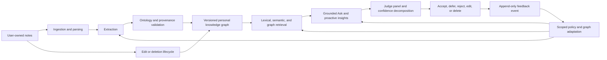

# BerryBrain: Projeto de pesquisa de TCC, protocolo de avaliação e plano de publicação

> **Título provisório:** BerryBrain: Arquitetura e avaliação experimental de um sistema adaptativo de gestão do conhecimento pessoal baseado em grafos semânticos, GraphRAG e feedback humano
>
> **Instituição:** Centro Universitário do Norte do Espírito Santo, Universidade Federal do Espírito Santo (CEUNES/UFES)
>
> **Estudante:** Mateus Almeida de Souza
>
> **Orientador:** Leonardo José Silvestre
>
> **Autoria do artigo JBCS:** Mateus Almeida de Souza (primeiro autor e contato correspondente) e Leonardo José Silvestre (segundo autor e orientador)
>
> **Curso:** [Confirmar Ciência da Computação ou Engenharia da Computação]
>
> **Status do documento:** Plano de pesquisa, protocolo e estratégia de publicação. Não é um TCC concluído e não é uma alegação de validação conclusiva.
>
> **Preparado em:** 25 de agosto de 2026
>
> **Linha de base de evidências do BerryBrain:** Versão 1.4.8; instantâneo de evidências internas gerado em 14 de agosto de 2026
>
> **Idioma do documento:** Português brasileiro

---

## 1. Como usar este documento

Este arquivo é o documento mestre de pesquisa para converter o BerryBrain de um projeto de software em um trabalho de conclusão de curso defensável e um ou mais artigos científicos. Combina:

1. uma definição precisa do artefato;
2. um problema científico e uma lacuna de investigação;
3. questões de investigação e hipóteses falsificáveis;
4. protocolo de mapeamento sistemático da literatura;
5. um desenho experimental com ablações internas, linhas de base externas, estudos de usuários e validação longitudinal;
6. métricas exatas, métodos estatísticos, regras de gestão de dados e requisitos de reprodutibilidade;
7. as medições reais atualmente disponíveis no repositório;
8. um registo claro das provas que ainda não foram recolhidas;
9. Postos de fiscalização de conformidade UFES/CEUNES;
10. um plano de seleção e publicação de periódicos.

As palavras de status têm significados estritos ao longo deste documento:

| Estado | Significado |
| --- | --- |
| **Implementado** | A capacidade existe no repositório atual. Isto não implica eficácia científica. |
| **Medido** | Um experimento gravado produziu um resultado em um ambiente declarado. |
| **Exploratório** | O resultado é útil para a engenharia, mas carece de pelo menos um requisito de evidência confirmatória. |
| **Planejado** | O procedimento foi especificado, mas não foi executado. |
| **Validação pendente** | A capacidade existe, mas faltam evidências representativas ou humanas. |
| **Não suportado** | As evidências disponíveis são insuficientes para a alegação proposta. |

Nenhum espaço reservado, alvo proposto, rótulo sintético, veredicto do LLM ou teste de engenharia pode ser apresentado como resultado de pesquisa em humanos. Os campos entre colchetes devem ser resolvidos com o orientador antes do envio.

---

## 2. Resumo Executivo

BerryBrain é um sistema de conhecimento pessoal local no qual as notas Markdown de propriedade do usuário são transformadas em um grafo de conhecimento pessoal vinculado a evidências. O grafo suporta recuperação híbrida, expansão do grafo, resposta a perguntas fundamentadas, insights e descoberta de lacunas de pesquisa, inspeção de proveniência e correção controlada pelo usuário. Uma ontologia operacional restringe os significados dos nós e das arestas. Agentes automatizados enriquecem e revisam artefatos. Um painel configurável de Judges do modelo de linguagem avalia a relevância e o suporte, enquanto as ações do usuário, como aceitar, rejeitar, editar ou excluir artefatos, tornam-se eventos de feedback auditáveis que podem alterar o comportamento não paramétrico futuro.

A descrição cientificamente defensável é **adaptação contínua não paramétrica**, e não retreinamento autônomo dos pesos do modelo. BerryBrain altera seu grafo, política de recuperação, regras de supressão, antecedentes contextuais e histórico de decisões. A menos que um pipeline de treinamento separado seja implementado e comprovado, ele não deve alegar que o modelo básico aprende novos pesos com o comportamento do usuário.

O TCC proposto estuda se este projeto integrado melhora a recuperação de conhecimento pessoal e a criação de sentido sem sacrificar a recuperação factual, proveniência, controlabilidade, privacidade ou desempenho aceitável do sistema. A comparação central não é uma referência única contra um único concorrente. Uma avaliação rigorosa tem três camadas complementares:

1. **Ablação dentro do sistema:** desative um recurso do BerryBrain por vez para determinar o que causa uma melhoria ou regressão.
2. **Comparação algorítmica externa:** execute métodos de referência lexicais, densos, híbridos e baseados em grafos nos mesmos corpora públicos e com curadoria sob condições controladas de computação e modelo.
3. **Comparação de tarefas humanas:** compare pesquisa convencional, RAG não grafo e BerryBrain completo usando interfaces equivalentes, tarefas contrabalançadas, medidas de conclusão objetivas e instrumentos subjetivos validados.

As evidências atuais do repositório demonstram que a infraestrutura de benchmark funciona e que a expansão do grafo pode resolver o caso de teste multi-hop projetado. Ainda não estabelece a eficácia geral, a confiança calibrada, a validade do julgamento em relação aos seres humanos, a aprendizagem por feedback a longo prazo ou a prontidão madura para a produção. O TCC deve coletar as formas de evidência que faltam.

---

## 3. Títulos de candidatos

### 3.1 Título recomendado

**BerryBrain: Arquitetura e avaliação experimental de um sistema adaptativo de gestão do conhecimento pessoal baseado em grafos semânticos, GraphRAG e feedback humano**

Este é o título recomendado do TCC porque identifica o artefato, o tipo de contribuição, o método experimental, o mecanismo técnico central e o mecanismo de adaptação humana sem alegar que os pesos do modelo são retreinados.

### 3.2 Título focado em auditabilidade

**BerryBrain: um grafo de conhecimento pessoal local auditável com GraphRAG, julgamento multiagente e adaptação baseada em feedback**

### 3.3 Título focado na recuperação

**Avaliando recuperação aumentada por grafo para gestão do conhecimento pessoal auditável**

### 3.4 Título de engenharia do conhecimento

**Uma ontologia operacional e ciclo de vida de evidências para grafos de conhecimento pessoal continuamente adaptados**

### 3.5 Título centrado no ser humano

**Adaptação contínua controlada por humanos em um sistema de conhecimento pessoal assistido por IA**

### 3.6 Título orientado ao artigo

**BerryBrain: GraphRAG com reconhecimento de evidências para bases de conhecimento pessoais de propriedade do usuário**

O título final deve seguir a contribuição dominante apoiada por evidências completas. Se os estudos humanos e longitudinais não puderem ser concluídos, use o título focado na recuperação ou na engenharia do conhecimento, em vez de reivindicar uma adaptação contínua centrada no ser humano.

---

## 4. Resumo proposto

> As ferramentas de gestão do conhecimento pessoal oferecem aos usuários controle durável sobre as notas, mas geralmente dependem de links criados manualmente e de recuperação simples. A geração de recuperação aumentada pode melhorar o acesso ao conhecimento armazenado, mas a recuperação vetorial convencional pode perder relacionamentos que abrangem documentos, enquanto as respostas geradas podem obscurecer a proveniência e a incerteza. Este trabalho apresenta o BerryBrain, um sistema de conhecimento pessoal local que transforma notas Markdown de propriedade do usuário em um grafo de conhecimento pessoal operacional. O sistema combina recuperação lexical e semântica, expansão do grafo restrita por ontologia, geração vinculada a evidências, um painel configurável de Judges de modelo de linguagem, invalidação do ciclo de vida do artefato e adaptação reversível orientada por feedback. A pesquisa segue uma metodologia Design Science Research (DSR) e avalia o artefato por meio de ablações controladas, benchmarks de recuperação públicos e com curadoria, anotação de qualidade do grafo, análise de calibração, testes de desempenho e falhas e um estudo contrabalançado com usuários. A avaliação distingue grafos não paramétricos e adaptação de políticas do treinamento dos pesos do modelo e trata os Judges automatizados como medições que exigem calibração humana, e não como referências-ouro. As contribuições esperadas incluem uma arquitetura auditável para GraphRAG pessoal, um modelo de ciclo de vida para edições e exclusões, um protocolo para medir a adaptação de feedback com escopo definido e evidências reproduzíveis sobre as compensações entre qualidade de recuperação, fundamentação, latência, usabilidade e controle do usuário. Os resultados numéricos finais e as conclusões substituirão esta frase somente após a conclusão dos estudos pré-registrados.

### Palavras-chave

grafo de conhecimento pessoal; gestão do conhecimento pessoal; geração aumentada por recuperação; GraphRAG; recuperação de informações; representação do conhecimento; proveniência; LLM como Judge; adaptação contínua; inteligência artificial com participação humana; software com prioridade local.

---

## 5. Definição de artefato

### 5.1 Definição de uma frase

BerryBrain é um sistema inteligente de gestão do conhecimento pessoal auto-hospedado que transforma notas não estruturadas em um grafo semântico governado, usa GraphRAG para recuperação e geração de respostas fundamentadas e incorpora validação multiagente, estimativas de confiança baseadas em evidências e feedback humano para melhorar a organização e a relevância contextual do conhecimento ao longo do tempo.

O mecanismo de melhoria não é paramétrico: altera o estado do grafo, a política de recuperação, as preferências contextuais, as decisões de supressão e os artefatos derivados. Isso não implica treinamento com pesos de modelo básico, a menos que um pipeline de treinamento separado seja implementado e validado.

### 5.2 O que significa "com prioridade local"

Para este TCC, com prioridade local significa:

- o conhecimento canônico de autoria do usuário permanece em arquivos controlados pelo usuário;
- o cofre permanece utilizável e exportável sem um formato proprietário de dados em nuvem;
- artefatos derivados do grafo podem ser reconstruídos a partir de notas canônicas e decisões registradas;
- a inferência local é suportada onde configurada;
- a inferência na nuvem é opcional e seu limite de dados deve ser divulgado;
- a falha do provedor não deve corromper as notas canônicas;
- a exclusão e a edição devem invalidar os artefatos derivados afetados.

com prioridade local **não** significa que todos os experimentos estão offline, que os provedores de nuvem são proibidos ou que todo o estado derivado é armazenado apenas no Markdown. Cada experimento deve indicar se o processamento foi local, remoto ou híbrido.

### 5.3 O que significa "grafo de conhecimento pessoal"

Balog e Kenter definem grafos de conhecimento pessoal em torno de entidades pessoalmente relevantes para um indivíduo. A última pesquisa sobre o ecossistema enfatiza a propriedade individual e os serviços personalizados. BerryBrain se enquadra nesta família porque as notas, entidades, conceitos, tópicos, insights e decisões de um usuário formam o corpus e grafo gerenciado. O grafo não é um modelo de mundo universal.

### 5.4 O que "ontologia" significa no BerryBrain

BerryBrain atualmente usa uma **ontologia de aplicação operacional**: um conjunto controlado de classes, relações, restrições de validação, regras de ciclo de vida e requisitos de proveniência usados pelo software. É mais forte do que um grafo de visualização irrestrita, mas não deve ser descrito como uma ontologia de domínio formal completa.

Esta distinção é importante. O W3C afirma que o SKOS não é em si uma linguagem formal de representação de conhecimento. RDF fornece triplos, SHACL valida restrições do grafo e PROV-O representa proveniência. BerryBrain pode reivindicar verdadeiramente o comportamento do grafo orientado por ontologia e validado por SHACL quando essas exportações e validações são exercidas. Deve reivindicar um raciocínio ontológico formal completo apenas se axiomas explícitos, semântica de implicação, comportamento consistente e validação de questões de competência forem implementados e avaliados.

### 5.5 O que significa "aprendizado"

Atualmente, espera-se que o aprendizado do BerryBrain mude:

- topologia do grafo e estado do artefato ativo;
- recursos de recuperação e classificação;
- supressão de escopo ou regras de preferência;
- antecedentes de aceitação de insights;
- avaliar estimativas de roteamento e confiança;
- instruções ou políticas futuras de extração e enriquecimento;
- recomendações contextuais.

Isso não implica atualizações de gradiente ou alterações de peso do modelo de base. Cada registro de aprendizagem deve relatar explicitamente `model_weights_updated=false`, a menos que um procedimento de treinamento validado independentemente altere esse fato.

### 5.6 Fora do escopo

O TCC não tenta provar que BerryBrain:

- reproduz a memória ou cognição humana;
- descobre a verdade objetiva a partir de notas;
- elimina alucinações;
- fornece probabilidades calibradas sem dados de calibração rotulados;
- é uma ontologia universal ou grafo de conhecimento de uso geral;
- aprende os pesos do modelo a partir de cada interação do usuário;
- é clínica, legal ou financeiramente confiável;
- escalável para cargas de trabalho empresariais multilocatárias;
- é superior a todos os sistemas de anotações ou RAG.

---

## 6. Declaração do problema

As notas pessoais são frequentemente armazenadas como documentos isolados ou vinculados manualmente. À medida que uma coleção cresce, o usuário deve lembrar o vocabulário, as localizações e os relacionamentos ocultos entre documentos. A recuperação semântica ajuda quando o texto da consulta e da nota difere, mas a recuperação simples pode ter dificuldades com questões multi-hop, temas em nível de corpus, evidências contraditórias e relacionamentos que exigem vários documentos. A extração de grafos pode melhorar essas tarefas, mas a extração fraca também pode criar nós irrelevantes e links sem sentido. As interfaces generativas acrescentam outro risco: uma resposta fluente pode ocultar evidências ausentes, artefatos obsoletos, falhas do provedor e preconceito do avaliador.

O problema da engenharia não é, portanto, apenas criar ligações. É manter um grafo derivado baseado em evidências sob criação, edição, exclusão, correção do usuário, variabilidade do provedor e processamento assíncrono contínuos, preservando o controle do usuário.

O problema científico é determinar se a arquitectura integrada proporciona benefícios mensuráveis em relação a alternativas mais simples, quais os componentes que produzem esses benefícios, que custos acrescentam, quão fiáveis são os seus sinais de confiança e de julgamento, e se o feedback do utilizador melhora o comportamento futuro sem suprimir o conhecimento válido não relacionado.

### 6.1 Problema central de pesquisa

Até que ponto a combinação de um grafo semântico, geração de recuperação aumentada, validação baseada em agente e feedback do usuário melhora a relevância da recuperação, a rastreabilidade das evidências, a coerência do grafo e a qualidade da resposta em comparação com a pesquisa de texto convencional e o RAG somente vetorial?

Os RQs detalhados na Seção 8 decompõem esta questão central em resultados de recuperação, fundamentação, qualidade do grafo, confiança, validade do Judge, desempenho, usabilidade, adaptação e resiliência.

### 6.2 Objetivo geral

Projete, implemente e avalie experimentalmente uma arquitetura adaptativa que converte notas pessoais em conhecimento estruturado, consultável e rastreável.

### 6.3 Objetivos específicos

1. Extraia conceitos, entidades, tópicos, evidências e relacionamentos semanticamente significativos de notas de propriedade do usuário.
2. Construir um grafo semântico com classes de nós governados, arestas tipadas, proveniência e restrições de ciclo de vida.
3. Integrar recuperação lexical, vetorial e estrutural por meio de um pipeline GraphRAG controlado.
4. Aplicar Judges configuráveis e agentes de software especializados para validar, enriquecer, mesclar, suprimir e eliminar o conhecimento derivado.
5. Estimar a confiança a partir de evidências observáveis, diversidade de fontes, validade, atualidade e sinais de revisão calibrados, em vez de valores fixos.
6. Incorporar ações explícitas do usuário como sinais auditáveis para adaptação com escopo definido, reversível e não paramétrica.
7. Avalie a qualidade da recuperação e da resposta, coerência do grafo, fundamentação, confiança, desempenho, resiliência, usabilidade e maturidade arquitetônica.

---

## 7. Lacuna de pesquisa e posição de novidade

### 7.1 O que trabalhos anteriores já estabelecem

Trabalhos anteriores já mostram que:

- RAG pode combinar geração paramétrica com memória não paramétrica e expor oportunidades de proveniência;
- a recuperação baseada em grafos pode melhorar a criação de sentido do corpus global e a integração multi-hop em alguns ambientes;
- os grafos de conhecimento pessoal são uma área de pesquisa estabelecida;
- foram propostas e implementadas conexões semânticas automáticas entre notas pessoais;
- IA local, incorporações, indexação vetorial e RAG foram integrados em sistemas de notas;
- Os Judges LLM podem correlacionar-se com julgamentos humanos, mas apresentam preconceito, instabilidade e dependência do design do avaliador;
- as métricas RAG sem referência podem acelerar a avaliação, mas não substituem a validação humana.

Portanto, “um aplicativo de notas com embeddings, RAG ou links criados automaticamente” não é uma alegação de novidade suficiente.

### 7.2 Lacuna defensável

Uma lacuna defensável é a falta de sistemas de conhecimento pessoal integrados e avaliados de forma reprodutível que combinem todos os seguintes:

1. notas canônicas de propriedade do usuário;
2. artefatos do grafo restritos por ontologia com arestas tipadas;
3. proveniência desde a fonte até a recuperação e geração;
4. invalidação de edição e exclusão em vizinhanças de grafos dependentes;
5. resposta a perguntas com base em grafos e conteúdo;
6. julgamento multimodelo configurável tratado como uma medida incerta;
7. decomposição de confiança e testes de calibração;
8. adaptação reversível e de escopo limitado ao feedback do usuário;
9. propostas automáticas de insights e lacunas que exigem decisões responsáveis sobre o ciclo de vida;
10. sistema, recuperação, grafo, Judge, avaliação humana e longitudinal em um protocolo.

A contribuição do TCC é principalmente uma **contribuição de integração e avaliação de artefatos**. Qualquer novidade algorítmica deve ser isolada, descrita formalmente e comparada de forma independente.

### 7.3 Contribuições propostas

| ID | Contribuição | Provas necessárias |
| --- | --- | --- |
| C1 | Uma arquitetura local para transformar notas em um grafo de conhecimento pessoal auditável | Rastreamento de arquitetura, implementação, teste de reconstrução, auditoria de proveniência |
| C2 | Uma ontologia operacional e contrato de relacionamento para artefatos de Nota, Conceito, Entidade, Tópico, Insight e ResearchGap | Questões de competência, conformidade SHACL, estudo de anotação |
| C3 | Um ciclo de vida com reconhecimento de dependência para edições e exclusões de notas/nó | Testes de mutação, taxa de artefato obsoleto, rastreamento de recomputação de vizinhança afetada |
| C4 | Um contrato de confiança que separa apoio, consenso, atualização e validade | Etiquetas douradas, grafos de confiabilidade, Brier/ECE, ablação |
| C5 | Um painel de Judges configurável com isolamento de falhas e calibração humana | Rótulos humanos cegos, concordância, preconceito, custo, testes de falha |
| C6 | Um modelo de feedback reversível e com escopo definido para adaptação contínua não paramétrica | Métricas de experiência longitudinal ou de repetição, recorrência e repercussão |
| C7 | Um conjunto de benchmark reproduzível que conecta recuperação, geração, grafo, sistema e resultados do usuário | Manifestos públicos, resultados brutos, scripts, reexecução independente |

---

## 8. Questões de pesquisa

### RQ1: Eficácia de recuperação

A expansão do grafo melhora a recuperação multi-hop e a criação de sentido em nível de corpus em relação à recuperação híbrida lexical, densa e padrão, sem degradar materialmente a recuperação factual?

### RQ2: Fundamentação e proveniência

As restrições da ontologia, a proveniência e o controle do Judge reduzem as afirmações não comprovadas e as evidências obsoletas nas respostas e insights gerados?

### RQ3: Qualidade do grafo

As regras automatizadas de extração, enriquecimento, remoção e ciclo de vida produzem nós semanticamente significativos e relacionamentos tipados na criação, edição, exclusão e conteúdo contraditório de notas?

### RQ4: Validade da confiança

Os valores de confiança do BerryBrain correspondem à correção observada ou às frequências de suporte, e quais componentes causam excesso ou falta de confiança?

### RQ5: Validade do Judge

Até que ponto os Judges individuais e um painel de Judges diversificado concordam com os revisores humanos cegos, e como a posição, a família modelo, a falha do fornecedor e a sobreposição do Judge gerador afetam a validade?

### RQ6: Desempenho do sistema

Que custos de latência, taxa de transferência, fila, memória, carga útil, armazenamento e front-end são introduzidos pela expansão, enriquecimento, julgamento e proveniência do grafo em tamanhos crescentes de cofres?

### RQ7: Desempenho de tarefa humana

Em comparação com a pesquisa convencional e o RAG não grafo, o BerryBrain completo melhora a precisão da tarefa, o tempo de conclusão, a recuperação de evidências, a carga de trabalho, a usabilidade e a confiança calibrada?

### RQ8: Adaptação baseada em feedback

A aceitação, rejeição, edição e exclusão do usuário reduzem a recorrência de artefatos rejeitados e melhoram a relevância futura sem suprimir nós, arestas ou insights válidos não relacionados?

### RQ9: Resiliência operacional

O sistema preserva dados canônicos, explica o estado do processamento e se recupera corretamente em caso de interrupções do provedor, trabalhos inválidos, invalidação de cache, reinicializações e recomputação parcial?

---

## 9. Hipóteses

### 9.1 Hipótese central

A arquitetura BerryBrain completa superará a pesquisa de texto convencional e o RAG somente vetorial na recuperação de relacionamento entre notas, contextualização de respostas, rastreabilidade de evidências, insights válidos e descoberta de lacunas de pesquisa, coerência do grafo e adaptação a decisões explícitas do usuário, preservando a recuperação factual dentro de uma margem de não inferioridade pré-registrada e mantendo um custo de sistema aceitável.

Esta afirmação é uma hipótese a ser testada, não um resultado atual. As hipóteses componentes abaixo definem as condições mensuráveis sob as quais ela é apoiada ou rejeitada.

| ID | Hipótese | Resultado primário | Condição de falsificação |
| --- | --- | --- | --- |
| H1 | A recuperação híbrida de grafo melhora o Recall@10 multi-hop em relação à recuperação híbrida padrão | Diferença Recall@10 emparelhada | O intervalo de confiança inclui zero ou falhas de não inferioridade factual |
| H2 | Proveniência e controle de Judge reduzem taxa de afirmações não fundamentadas | taxa de afirmações não fundamentadas | Nenhuma redução ou utilidade de resposta diminui além da margem pré-registrada |
| H3 | A validação de ontologia reduz atribuições inválidas de arestas e nós | Taxa de violação de ontologia | Nenhuma redução nas anotações cegas |
| H4 | A recomputação com reconhecimento de dependência evita artefatos obsoletos após edição/exclusão | Taxa de artefato obsoleto | As provas eliminadas ou invalidadas permanecem activas após a convergência |
| H5 | O painel de Judges concorda com os humanos de forma mais confiável do que qualquer Judge configurado | Concordância ponderada e taxas de erro | Painel não melhora concordância ou aumenta falsas aceitações críticas |
| H6 | A confiança reportada é preditiva da correção do suporte observado | Pontuação de Brier, ECE, inclinação de calibração | A confiança permanece indistinguível ou pior do que as linhas de base ingênuas |
| H7 | Full BerryBrain melhora o sucesso de tarefas baseadas em evidências em relação à pesquisa convencional e RAG não grafo | Conclusão correta da tarefa | Nenhuma melhoria praticamente significativa dentro da disciplina |
| H8 | Adaptação de feedback reduz repetidas propostas rejeitadas no mesmo contexto | Taxa de recorrência contextual | Nenhuma redução, aumento de reversões ou aumento de supressão não relacionada |
| H9 | As capacidades de grafo e julgamento acrescentam custos mensuráveis que permanecem dentro dos orçamentos de serviço declarados | latência p95, idade da fila, RSS | Orçamentos pré-registrados de desempenho ou confiabilidade falham |

Hipóteses e margens de equivalência ou não inferioridade devem ser congeladas antes das execuções confirmatórias. Os limites de engenharia no repositório atual são candidatos, e não pontos de corte automaticamente válidos para pesquisa.

---

## 10. Modelo Conceitual



As setas representam dependências do sistema, não provas causais. A causalidade deve ser testada através de ablação e intervenção controlada.

---

## 11. Ontologia Operacional

### 11.1 Classes de nós principais

| Classe | Significado operacional | Critério de inclusão | Exemplos de exclusão |
| --- | --- | --- | --- |
| `Note` | Documento canônico ou versionado de autoria do usuário | Identificador de nota rastreável e conteúdo de origem | Frase extraída arbitrariamente |
| `Entity` | Pessoa, organização, local, produto, evento, trabalho ou outra referência identificável | Pode ser distinguido de outros referentes no contexto | Stopword, ação genérica, token não suportado |
| `Concept` | Idéia ou significado abstrato usado para organizar ou raciocinar sobre o conteúdo | Significado conceitual estável suportado por extensões de origem | Mera palavra coocorrente, nomeada indivíduo |
| `Topic` | Assunto mais grosseiro usado para agrupar notas e conceitos | Assunto recorrente e útil com evidências em todo o conteúdo | Palavra única sem utilitário de agrupamento |
| `Insight` | Nova síntese baseada em evidências derivada de um ou mais artefatos | Derivação explícita, fontes, incerteza e estado de revisão | Sentença fonte reformulada ou especulação não fundamentada |
| `ResearchGap` | Área ausente, conflitante ou subdesenvolvida com base em evidências | Critério de lacuna explicável e evidências afetadas | Pergunta genérica não relacionada ao vault |

### 11.2 Principais tipos de relacionamento

| Relacionamento | Domínio -> intervalo | Significado | Evidência mínima |
| --- | --- | --- | --- |
| `mentions` | Nota -> Entidade/Conceito | A nota de origem refere-se explicitamente ao objeto | Extensão de origem |
| `defines` | Nota -> Conceito/Entidade | A nota fornece uma definição ou descrição identificadora | Extensão de definição |
| `hasTopic` | Nota -> Tópico | O tema caracteriza materialmente a nota | Pontuação do tópico mais extensões de suporte |
| `supports` | Artefato -> alegação/Insight | Evidências aumentam apoio à meta | Citação e justificativa |
| `contradicts` | Artefato -> alegação/Insight | A evidência é semanticamente incompatível com o alvo no contexto declarado | Evidência emparelhada e lógica de contradição |
| `derivedFrom` | Insight/Gap -> Artefato | O artefato derivado depende da fonte | Cadeia de proveniência |
| `identifies` | ResearchGap -> Artefato/Tópico | A lacuna diz respeito à meta | Critério e fundamentação da lacuna |
| `relatedTo` | Artefato -> Artefato | Associação simétrica não capturada por um predicado mais forte | Justificativa tipada explícita; nunca apenas sobreposição de tokens |

`relatedTo` deve ser um relacionamento de último recurso. Não pode ser justificado apenas por um conceito fraco partilhado, como uma correspondência acidental de palavras. Esta regra aborda diretamente associações falsas entre notas não relacionadas.

### 11.3 Invariante de artefato ativo

Uma aresta só pode estar ativa se:

1. ambos os endpoints estão ativos;
2. todas as evidências exigidas são atuais;
3. a relação passa por validação de esquema e semântica;
4. nenhuma rejeição ou exclusão de usuário aplicável a suprime;
5. suas versões originais correspondem às versões atuais das notas canônicas;
6. O seu estado de qualidade permite a recuperação e exibição.

### 11.4 Semântica visual

A codificação visual não deve substituir campos semânticos:

- shape representa a classe do nó;
- a cor do cluster representa o agrupamento contextual;
- a nota pai usa o vermelho primário BerryBrain `#CC4168`;
- O Insight usa um formato retangular distinto e tratamento de realce;
- o estilo da aresta representa o tipo e o estado do relacionamento;
- a confiança são metadados numéricos, não codificados apenas por cores;
- estados obsoletos, pendentes, rejeitados e excluídos não devem aparecer como conhecimento ativo.

### 11.5 Alinhamento de padrões

| Preocupação com BerryBrain | Alinhamento padrão | Utilização em investigação |
| --- | --- | --- |
| representação do grafo | RDF 1.1 | Exportação e interoperabilidade |
| Conceitos e temas | SKOS | Rótulos e organização mais ampla/restrita/relacionada |
| Validação de restrições | SHACL | Relatórios de conformidade de nós/arestas |
| Proveniência | PROV-O | Registros de origem, geração, revisão, invalidação e agente |
| Axiomas formais mais fortes | OWL 2, se implementado | Semântica formal opcional e implicação |

### 11.6 Questões de competência em ontologia

A ontologia deve responder pelo menos estas questões usando dados grafos, não codificação específica da UI:

1. Quais notas mencionam determinada entidade?
2. Quais conceitos são definidos por uma nota?
3. Que evidências apoiam ou contradizem uma ideia?
4. Qual insight ativo depende de uma versão de nota excluída?
5. Quais tópicos conectam duas notas e por qual caminho tipado?
6. Quais relações não têm proveniência atual?
7. Quais conceitos são apelidos ou duplicatas?
8. Que lacunas de investigação dizem respeito a um tema com evidências insuficientes ou contraditórias?
9. Qual evento de feedback do usuário fez com que um artefato fosse suprimido ou restaurado?
10. Quais declarações de resposta geradas são rastreáveis até extensões de origem ativas?

Os testes de aprovação/reprovação para essas questões tornam-se parte da avaliação da ontologia.

---

## 12. Ciclo de vida e modelo de feedback

### 12.1 Criação de notas

1. Salve o conteúdo canônico.
2. Atribua uma identidade de nota estável e uma versão de conteúdo imutável.
3. Enfileirar análise, extração, enriquecimento, atualização de grafo e julgar trabalhos.
4. Expor o estágio de processamento, evidências de progresso, tempo decorrido e um intervalo estimado somente quando baseado em trabalhos medidos recentemente.
5. Ative artefatos derivados somente após a validação necessária.

### 12.2 Edição de notas

A edição deve criar uma nova versão do conteúdo. O sistema então calcula a vizinhança de dependência afetada, invalida artefatos derivados obsoletos, extrai novamente regiões alteradas, reavalia arestas e insights dependentes e preserva um registro de auditoria do estado anterior. Artefatos inalterados podem ser retidos somente quando sua impressão digital de origem e conjunto de dependências permanecerem válidos.

### 12.3 Exclusão de notas

A exclusão de uma nota deve:

- remover ou marcar a nota canônica de acordo com a política do produto;
- invalidar nós e arestas derivadas que não tenham nenhuma evidência atual restante;
- recalcular artefatos compartilhados usando fontes sobreviventes;
- reavaliar insights dependentes e lacunas de pesquisa;
- atualizar clusters apenas na vizinhança afetada, a menos que uma invariante global exija um trabalho mais amplo;
- remover evidências excluídas da recuperação;
- exibir o estado de processamento para o usuário;
- reter apenas os metadados de auditoria mínimos permitidos pela política de privacidade e retenção.

### 12.4 Exclusão de nó

A exclusão de um nó de usuário é uma ação de feedback semântico, não apenas uma ocultação visual. A exclusão deve criar um evento de feedback com escopo definido, invalidar arestas de incidentes, identificar artefatos dependentes, acionar o recálculo da vizinhança afetada e evitar a ressurreição de evidências idênticas e inalteradas, a menos que o usuário reverta a decisão ou o contexto mude materialmente.

### 12.5 Esquema de evento de feedback

Cada evento deve registrar:

| Campo | Finalidade |
| --- | --- |
| `event_id` | Identidade de auditoria imutável |
| `actor_id` | Usuário pseudônimo ou agente de software |
| `action` | Aceitar, rejeitar, editar, excluir, restaurar, mesclar, dividir ou adiar |
| `artifact_id` e versão | Alvo exato |
| `context_fingerprint` | Âmbito da decisão |
| `source_ids` e versões | Provas envolvidas |
| `reason_code` | Justificativa estruturada, quando disponível |
| `free_text_reason` | Explicação opcional do usuário |
| `timestamp` | Pedido e atualidade |
| `policy_effect` | Que comportamento futuro mudou |
| `reversible` | Se e como a ação pode ser desfeita |
| `model_weights_updated` | Deve ser falso para a adaptação não paramétrica atual |

### 12.6 Regra de escopo

O feedback se aplica apenas onde a sobreposição de fontes, o contexto semântico, o tipo de artefato e a lógica da decisão justificam a transferência. A última decisão válida e explícita do usuário tem precedência sobre propostas automatizadas no mesmo contexto. A transferência para contextos não relacionados é um erro mensurável denominado **repercussão de feedback**.

---

## 13. Contrato de Confiança

### 13.1 Interpretação necessária

A confiança do BerryBrain deve ser documentada como uma pontuação de suporte de evidências ou limite inferior. Não é automaticamente a probabilidade de uma afirmação ser verdadeira.

### 13.2 Decomposição de candidatos

Para o artefato (a), registre os componentes separadamente antes da agregação:

\[
q(a) = f(E_a, D_a, J_a, O_a, F_a, S_a, C_a)
\]

onde:

- (E_a): cobertura de evidências e suporte de fonte;
- (D_a): diversidade e independência de fontes;
- (J_a): concordância calibrada do Judge;
- (O_a): validade de ontologia e esquema;
- (F_a): atualização e validade da versão fonte;
- (S_a): relevância semântica para o contexto;
- (C_a): penalidade de conflito ou contradição.

A implementação deve emitir esta decomposição. Um `100%` exibido sem tamanho de amostra, componentes, incerteza e evidências de calibração não é cientificamente significativo.

### 13.3 Opção de limite inferior

Quando a confiança deriva de revisões repetidas do tipo Bernoulli, um limite de confiança inferior de Wilson pode substituir uma proporção bruta:

\[
LB = \frac{\hat{p}+\frac{z^2}{2n}-z\sqrt{\frac{\hat{p}(1-\hat{p})}{n}+\frac{z^2}{4n^2}}}{1+\frac{z^2}{n}}
\]

Isto evita relatar uma observação positiva como certeza. Os votos ponderados ou dependentes exigem um tamanho de amostra efetivo explicitamente justificado; eles não podem ser inseridos nesta equação como se fossem independentes.

### 13.4 Avaliação de calibração

Use rótulos humanos retidos para calcular:

- diagramas de confiabilidade;
- Pontuação de Brier;
- Erro de calibração esperado (ECE) com análise de sensibilidade do compartimento;
- interceptação e inclinação de calibração;
- excesso de confiança e falta de confiança por tipo de artefato;
- precisão selectiva e cobertura dos limiares de abstenção.

Qualquer calibrador deve ser instalado em uma divisão de calibração e avaliado uma vez em uma divisão de teste separada. A temperatura ou a escala isotônica podem ser comparadas, mas nenhum calibrador deve ser escolhido no conjunto de teste.

---

## 14. Protocolo de Revisão de Literatura

### 14.1 Tipo de revisão

Conduza um estudo de mapeamento sistemático seguido de uma revisão crítica focada. Relate o processo de busca e seleção com informações de fluxo do PRISMA 2020. PRISMA é um guia de relatórios e não um substituto para a avaliação da qualidade do estudo.

As fontes coletadas para este documento são um reconhecimento inicial do escopo, e não uma revisão sistemática completa. As contagens finais do PRISMA devem provir de pesquisas reproduzíveis em bancos de dados.

### 14.2 Bancos de dados

Pesquise no mínimo:

- Biblioteca Digital ACM;
- IEEE Explorar;
- Scopus;
- Web of Science;
- Ciência Direta;
- SpringerLink;
- Antologia ACL;
- SBC OpenLib/SOL;
- Portal de Periódicos CAPES através do acesso UFES;
- arXiv para trabalhos emergentes, claramente rotulados como não revisados por pares;
- Google Scholar apenas para avanço/retrocesso e descoberta.

### 14.3 Janela de tempo

- Janela principal de tecnologia: janeiro de 2019 até a data final da pesquisa em 2026.
- Incluir trabalhos básicos mais antigos para recuperação de informações, grafos de conhecimento, gestão do conhecimento pessoal, calibração, usabilidade e metodologia de pesquisa.
- Registre a data final exata da pesquisa por banco de dados.

### 14.4 Sequências de pesquisa

Use a sintaxe específica do banco de dados derivada destas consultas principais:

```text
("personal knowledge graph" OR "personal knowledge management" OR "networked notes")
AND (retrieval OR "semantic link" OR "automatic connection" OR ontology)
```

```text
("retrieval augmented generation" OR RAG)
AND (graph OR "knowledge graph" OR multi-hop OR provenance)
AND (evaluation OR benchmark OR calibration)
```

```text
("LLM as a judge" OR "language model judge" OR "model jury")
AND (bias OR calibration OR agreement OR reliability OR human)
```

```text
("continual learning" OR "continual adaptation" OR feedback OR "human in the loop")
AND ("knowledge graph" OR RAG OR "personal knowledge")
```

```text
("local first" OR "data ownership" OR privacy)
AND (notes OR "personal knowledge" OR RAG)
```

### 14.5 Critérios de inclusão

Incluir uma obra quando ela:

- define, implementa ou avalia um método relevante de PKM, PKG, RAG, GraphRAG, Judge, proveniência, ontologia ou feedback;
- relata detalhes suficientes do método para extrair uma comparação significativa;
- seja revisado por pares, seja um padrão reconhecido, um documento oficial de conjunto de dados ou uma pré-impressão de alta relevância claramente identificada;
- está disponível num idioma que a equipa de revisão possa avaliar de forma fiável;
- aborda conhecimento individual, coleções de documentos, recuperação multi-hop, avaliação ou confiabilidade do sistema.

### 14.6 Critérios de exclusão

Excluir:

- páginas de marketing sem comprovação técnica;
- versões duplicadas, mantendo a versão mais completa;
- artigos que apenas mencionem RAG ou grafos de conhecimento sem método ou avaliação relevante;
- fontes inacessíveis para as quais o método e os resultados não podem ser verificados;
- locais predatórios ou não verificáveis;
- aplicações puramente biomédicas, legais ou industriais sem método transferível, a menos que incluídas para uma referência específica ou lição de segurança.

### 14.7 Procedimento de triagem

1. Exporte todos os registros com banco de dados e identificadores de consulta.
2. Desduplicar por DOI, título e relacionamento entre pré-impressão e publicação.
3. Teste os critérios em pelo menos 30 registros.
4. Dois revisores selecionam independentemente o título e o resumo sempre que possível.
5. Recuperar e avaliar de forma independente o texto completo dos registros retidos.
6. Resolva divergências por meio de discussão ou de um avaliador conselheiro.
7. Registre os motivos da exclusão do texto completo.
8. Faça bolas de neve para frente e para trás nos papéis sementes.
9. Publique o log de pesquisa, a regra de desduplicação e o diagrama PRISMA.

### 14.8 Formulário de extração de dados

Para cada estudo incluído, registre:

- citação e identificador persistente;
- status e local da publicação;
- problema de pesquisa;
- corpus e domínio;
- representação do grafo;
- método de recuperação;
- modelo de geração;
- mecanismo de atualização ou adaptação;
- suporte a ontologias e proveniências;
- controle humano;
- configurações de linha de base;
- métricas e testes estatísticos;
- informações sobre hardware, modelo e custos;
- disponibilidade de dados e códigos;
- ameaças à validade;
- relevância para um ou mais RQs BerryBrain.

### 14.9 Avaliação da qualidade

Pontue cada estudo empírico em uma rubrica documentada:

| Critério | 0 | 1 | 2 |
| --- | --- | --- | --- |
| Reprodutibilidade | Nenhum detalhe utilizável | Configuração parcial | Código/dados/configuração disponíveis |
| Equidade de base | Desaparecido | Controlos parciais | Mesmo corpus, orçamento e gerador controlado |
| Validade do conjunto de dados | Não está claro | Justificação limitada | Representativo e documentado |
| Validade métrica | Fraco ou opaco | Somente métricas padrão | Métricas mais validação humana ou diagnóstica |
| Rigor estatístico | Nenhum | Estimativas pontuais | Tamanhos de efeito, incerteza e controle de multiplicidade |
| Relatórios de ameaças | Desaparecido | Breve | Substantivo e específico |

Não exclua apenas por pontuação, a menos que seja pré-registrado; usar qualidade em síntese e análise de sensibilidade.

---

## 15. Mapa inicial de última geração

### 15.1 Comparação entre estudo de sementes

| Trabalho | Contribuição principal | Função do grafo | Atualização contínua | Ênfase na avaliação | Relacionamento com BerryBrain |
| --- | --- | --- | --- | --- | --- |
| Lewis et al. (2020), RAG | Geração paramétrica mais recuperação não paramétrica | Não é necessário | Índice externo pode mudar | Tarefas de PNL com uso intensivo de conhecimento | Fundação para memória não paramétrica fundamentada |
| Balog e Kenter (2019) | Agenda de pesquisa de grafo de conhecimento pessoal | Entidades e relações pessoais | Conceitual | Agenda de investigação | Define família de problemas PKG |
| Skjaeveland et al. (2024) | Ecossistema e roteiro PKG | População, gestão, utilização | Nível do ecossistema | Pesquisa | Propriedade de esquadrias e atendimento personalizado |
| Fraga et al. (2024) | Conexões automáticas para PKM usando NLP e KGs | Conceitos compartilhados conectam textos | Não é a contribuição central | Metodologia de conexão | Linha de base de link automático revisada por pares mais próxima |
| Edge et al. (2024), GraphRAG | Grafo de entidade, comunidades, resumos globais | Criação de sentido em todo o corpus | Construção de índice | Qualidade de consulta global | Abordagem forte de referência de consulta global |
| Gutiérrez et al. (2024), HippoRAG | KG mais PageRank personalizado | Recuperação associativa multi-hop | Indexação de nova experiência | Controle de qualidade multi-hop, custo, velocidade | Método de referência de recuperação de grafo |
| Guo et al. (2024), LightRAG | Recuperação de grafo/vetor de nível duplo | Recuperação de baixo/alto nível | Atualização incremental | Precisão e eficiência | Comparador grafo incremental-RAG |
| Gutiérrez et al. (2025), HippoRAG 2 | Memória contínua não paramétrica | Integração de passagem mais grafo | Memória contínua não paramétrica | Tarefas factuais, de criação de sentido e associativas | Comparação conceitual correta para “aprendizagem” |
| Correia-Gonçalves e Morgado (2026), SmartNote | Embeddings locais, FAISS, Ollama RAG, links semânticos | Links contextuais automáticos | Ingestão de notas locais | Viabilidade técnica | Artefato PKM local muito próximo; BerryBrain precisa de uma diferenciação de avaliação mais forte |
| NoteBar (pré-impressão de 2025) | Anotações assistidas por IA e conjunto de dados de notas anotadas | Estrutura conceitual | Ainda não revisado por pares | Conjunto de dados e sistema | Potencial conjunto de dados ou comparador de implementação |
| BerryBrain | Ontologia operacional, ciclo de vida da evidência, grafo/conteúdo Perguntas, Judges, confiança, feedback | PKG auditável de propriedade do usuário | Editar/excluir e adaptação de feedback | Protocolo multicamadas proposto aqui | Artefato integrado que requer validação confirmatória |

### 15.2 Literatura de avaliação RAG

- RAGAS separa relevância do contexto, fidelidade e qualidade da resposta e oferece suporte à avaliação rápida e sem referências.
- ARES usa treinamento sintético, além de um pequeno conjunto anotado por humanos e inferência baseada em predição.
- RAGChecker fornece recuperação refinada e diagnóstico de geração.
- BEIR fornece conjuntos de dados heterogêneos de recuperação zero-shot e demonstra que o BM25 continua sendo uma linha de base forte.
- HotpotQA fornece fatos de apoio para controle de qualidade explicável de vários saltos.
- MuSiQue foi explicitamente projetado para reduzir atalhos de salto único na avaliação multi-hop.

As métricas automatizadas de RAG devem ser relatadas como medidas secundárias ou de diagnóstico. A correção e o suporte rotulados por humanos continuam sendo necessários para as alegações de fundamentação central.

### 15.3 Julgar literatura

- G-Eval relata uma correlação humana mais forte do que as métricas automatizadas anteriores, mas identifica tendências em relação ao texto gerado pelo LLM.
- O Prometheus 2 oferece suporte a critérios personalizados e avaliação direta ou em pares com um modelo de avaliador aberto.
- O trabalho do painel de LLM relata que diversos Judges menores podem reduzir o viés intramodelo e o custo em relação a um Judge grande.
- Estudos posteriores documentam preconceitos de posição, clemência, preconceitos de seleção e autoinconsistência.
- Os preprints emergentes de 2026 alertam que erros correlacionados dos Judges podem fazer com que um grande painel seja equivalente a muito menos votos independentes.

A implicação é direta: a contagem de Judges não é prova de independência. BerryBrain deve relatar família modelo, provedor, prompt, pedido, estabilidade de repetição, correlação de pares e acordo com humanos.

### 15.4 Matriz de novidade

| Capacidade | Comum em RAG plano | Comum no GraphRAG | Comum em ferramentas PKM | Alvo do TCC BerryBrain |
| --- | ---: | ---: | ---: | ---: |
| Fonte canônica Markdown de propriedade do usuário | Às vezes | Raro | Comum | Sim |
| Ontologia operacional tipada | Raro | Às vezes | Raro | Sim |
| Proveniência da fonte | Às vezes | Às vezes | Raro | Sim |
| Editar/excluir invalidação de dependência | Raramente avaliado | Raramente avaliado | Específico do produto | Sim, avaliado explicitamente |
| Questões de grafo e conteúdo | Parcial | Comum | Emergentes | Sim |
| Ciclo de vida do insight proativo | Raro | Às vezes | Emergentes | Sim |
| Painel de Judges multimodelos | Emergentes | Emergentes | Raro | Sim, calibrado por humanos |
| Calibração de confiança | Raro | Raro | Raro | Sim |
| Feedback com escopo reversível | Raro | Raro | Raro | Sim |
| Validação de feedback longitudinal | Raro | Raro | Raro | Planejado |

---

## 16. Metodologia de Pesquisa

### 16.1 Abordagem geral

Use a Design Science Research Methodology (DSRM) como estrutura de pesquisa primária, complementada por experimentos controlados de recuperação de informações, avaliação de desempenho de software, interação humano-computador de métodos mistos e um estudo de campo longitudinal.

Peffers et al. definir seis atividades DSRM:

1. identificação e motivação do problema;
2. definição de objetivos para uma solução;
3. concepção e desenvolvimento;
4. demonstração;
5. avaliação;
6. comunicação.

BerryBrain é o artefato. Os seus princípios de design, ontologia operacional, ciclo de vida e protocolo de avaliação são contribuições de conhecimento apenas na medida em que as evidências os apoiam.

### 16.2 Mapeamento DSRM

| Atividade DSRM | Produto de trabalho BerryBrain |
| --- | --- |
| Identificação do problema | Notas fragmentadas, raciocínio fraco entre documentos, respostas infundadas, conhecimento derivado obsoleto |
| Objetivos | Propriedade do usuário, grafo significativo, recuperação fundamentada, auditabilidade, adaptação reversível, desempenho aceitável |
| Design e desenvolvimento | Implementação atual do BerryBrain e arquitetura documentada |
| Demonstração | Vaults controlados, corpora públicos, orientações de cenários |
| Avaliação | Estudos E1-E9 abaixo |
| Comunicação | TCC, pacote de artefato aberto, defesa, artigo(s) de periódico |

### 16.3 Fundamentação do método misto

As métricas do sistema podem mostrar a velocidade e a relevância da recuperação, mas não podem estabelecer a usabilidade, a confiança ou o sentido prático. As avaliações humanas podem mostrar utilidade percebida, mas podem ser distorcidas por novidades, diferenças de interface e resultados fluentes. A combinação de métricas controladas, anotação cega, desempenho de tarefas e entrevistas oferece suporte à triangulação.

### 16.4 Portfólio de estudo

| Estudo | Finalidade | QR primários | Estado |
| --- | --- | --- | --- |
| E1 | Mapeamento da literatura | Todos | Revisão formal planejada; escopo inicial concluído |
| E2 | Ablação de recuperação | RQ1 | Conjunto exploratório medido; estudo confirmatório pendente |
| E3 | Qualidade de grafo e ontologia | RQ3 | Planejado |
| E4 | Fundamentação e validação do Judge | RQ2, RQ5 | Regressão sintética medida; calibração humana pendente |
| E5 | Calibração de confiança | RQ4 | Planejado |
| E6 | Desempenho, escalonamento e injeção de falhas | RQ6, RQ9 | Perfil exploratório medido; execuções mais amplas pendentes |
| E7 | Estudo de tarefas do usuário | RQ7 | Planejado; aprovação ética obrigatória |
| E8 | Repetição de feedback e adaptação longitudinal | RQ8 | Planejado; aprovação ética obrigatória para usuários reais |
| E9 | Reprodutibilidade e reexecução independente | Todos | Planejado |

---

## 17. Estratégia de referência

### 17.1 Por que são necessárias três camadas de comparação

**Ablação interna** responde "qual componente do BerryBrain causou o resultado?" mas não pode demonstrar competitividade externa.

**Linhas de base de referência externa** respondem "como o método se compara com dados comuns?" mas não pode representar notas pessoais ou todo o fluxo de trabalho do produto.

**Comparação de tarefas humanas** responde "o artefato integrado ajuda os usuários?" mas tem custo mais elevado e maior risco de confusão.

O TCC deve usar todos os três. Comparar o BerryBrain apenas consigo mesmo é insuficiente para validade externa. Comparar apenas com outro produto também é insuficiente porque diferentes interfaces, modelos, corpora e opções de implementação ocultas impedem a interpretação causal.

### 17.2 Configurações de ablação interna

| ID | Recuperação | Grafo | Geração | Judge/proveniência | Comentários |
| --- | --- | --- | --- | --- | --- |
| A0 | Lexical tipo BM25 | Desativado | Desativado | Desativado | Desativado |
| A1 | Semântica densa | Desativado | Desativado | Desativado | Desativado |
| A2 | Híbrido lexical + denso | Desativado | Desativado | Desativado | Desativado |
| A3 | Híbrido | Ligado | Desativado | Desativado | Desativado |
| A4 | Híbrido | Ligado | Aterrado | Apenas proveniência | Desativado |
| A5 | Híbrido | Ligado | Aterrado | Painel de Judges + proveniência | Desativado |
| A6 | Híbrido | Ligado | Aterrado | Painel de Judges + proveniência | Feedback com escopo definido em |

Use os mesmos blocos, versões de corpus, modelo de incorporação, gerador, orçamento imediato e hardware sempre que a configuração permitir. Registre exceções.

### 17.3 Ablações do ciclo de vida do grafo

| ID | Validação de restrições | Proveniência | Invalidação | Feedback do usuário |
| --- | --- | --- | --- | --- |
| G0 | Desativado | Mínimo | Somente reconstrução completa | Desativado |
| G1 | Ligado | Mínimo | Somente reconstrução completa | Desativado |
| G2 | Ligado | Completo | Bairro afetado | Desativado |
| G3 | Ligado | Completo | Bairro afetado | Ligado |

### 17.4 Métodos de referência externa

Sujeito a viabilidade e licenciamento, compare:

- BM25 ou implementação lexical do repositório;
- um retriever denso preso;
- recuperação híbrida de fusão de classificação recíproca;
- um pipeline RAG plano padrão;
- uma implementação de referência GraphRAG reproduzível;
- LightRAG ou HippoRAG quando compatível com o corpus e hardware;
- o método de ligação automática de Fraga et al. quando os detalhes da reprodução permitirem.

A comparação deve utilizar a mesma divisão de corpus e gerador de respostas. Se uma implementação de referência exigir um gerador ou construtor de grafo diferente, relate uma "comparação de sistemas" separada em vez de atribuir a diferença apenas à recuperação.

### 17.5 Controles de comparação justa

- corpus de origem idêntico e pré-processamento permitido;
- divisão no nível da fonte antes da fragmentação;
- mesmo conjunto de consultas e rótulos de relevância;
- mesmo orçamento de token top-k e de contexto;
- mesmo gerador para comparações de qualidade de resposta;
- nome do modelo, revisão, quantização e ponto final registrados;
- configurações de temperatura e decodificação fixas;
- cache frio e quente reportados separadamente;
- tentativas e falhas do provedor são contadas, e não descartadas silenciosamente;
- custo medido por consulta bem-sucedida e por tentativa de consulta;
- consultas de desenvolvimento separadas das consultas de teste;
- sem ajuste nas etiquetas de teste públicas.

---

## 18. Conjuntos de dados e design de corpus

### 18.1 Matriz do conjunto de dados

| Conjunto de dados | Finalidade | Verdade fundamental | Risco principal |
| --- | --- | --- | --- |
| Cofre sintético controlado | Ciclo de vida exato, ontologia, contradição e casos de falha | Etiquetas totalmente de autoria | Baixa validade ecológica |
| Cofre de conhecimento pessoal com curadoria | Notas realistas e relações entre notas cruzadas | Anotação humana dupla | Custo de anotação e estreiteza de domínio |
| BEIR SciFact | Linha de base de recuperação externa de disparo zero | QRels públicos | As afirmações científicas diferem das notas pessoais |
| Subconjunto HotpotQA | Recuperação multi-hop com fatos de apoio | Fatos públicos de apoio | Wikipedia difere de um cofre |
| Subconjunto MuSiQue | Raciocínio multi-hop conectado e contrastes irrespondíveis | Etiquetas públicas | Adaptação em unidades de notas deve preservar a lógica da tarefa |
| Cofre adversário | Palavras compartilhadas irrelevantes, quase duplicadas, injeção imediata, contradições | Comportamento esperado de autoria | Pode se ajustar demais a casos de falha conhecidos |
| Fluxo de mutação | Criar/editar/excluir/restaurar e falhas de provedor | Estado esperado evento por evento | Rotulagem de dependência complexa |
| Cofre longitudinal dos participantes | Adaptação de feedback real | Decisões do usuário mais rótulos de revisores | Privacidade, ética e eventos esparsos |

### 18.2 Requisitos de cofre controlado

Incluir pelo menos:

- questões factuais de nota única;
- perguntas de dois, três e quatro saltos;
- notas semanticamente relacionadas e com baixa sobreposição lexical;
- notas lexicamente semelhantes, mas semanticamente não relacionadas;
- nomes de entidades ambíguos;
- conceitos e apelidos duplicados;
- apoio direto e contradição;
- evidência de origem excluída;
- provas editadas que alteram uma resposta;
- tentativas de regeneração de nós rejeitadas;
- insights válidos e candidatos a insights não suportados;
- lacunas de investigação válidas e inválidas;
- tempo limite do provedor, HTTP 404, carga útil inválida e cenários de nova tentativa.

### 18.3 Construção de cofre com curadoria

1. Defina de 4 a 6 domínios, como computação, literatura, projetos, notas de estudo e documentação técnica pública.
2. Use material legalmente distribuível ou notas criadas pelo autor.
3. Crie documentos de origem antes das perguntas para reduzir o vazamento de respostas.
4. Peça a uma equipe que crie perguntas e outra anote a relevância e as evidências.
5. Incluir consultas negativas e de abstenção.
6. Congele corpus, perguntas, qrels e grafos de rótulos dourados com hashes SHA-256.
7. Publique um cartão do conjunto de dados descrevendo composição, licença, exclusões e limitações.

### 18.4 Política de divisão

- Divida no nível do documento de origem ou do tópico de origem antes da fragmentação.
- Impedir que versões da mesma nota cruzem trem, calibração e divisões de teste.
- Mantenha um conjunto de teste cego inacessível para ajuste de prompt e limite.
- Use um conjunto de calibração separado para ajuste de limite de confiança e julgamento.
- Relatar verificações de contaminação para benchmarks públicos e rótulos gerados pelo LLM.

### 18.5 Protocolo de anotação

Dois revisores independentes devem rotular:

- notas e intervalos relevantes por consulta;
- resposta dourada e variantes aceitáveis;
- caminho de raciocínio necessário;
- classe de nó e rótulo normalizado;
- tipo de aresta e pontos finais;
- suporte e contradição da fonte;
- validade e novidade do insight;
- resultado de correção de confiança;
- se a abstenção é necessária.

As divergências são julgadas. Relate concordância bruta e kappa de Cohen para rótulos categóricos, além de prevalência específica de classe. O Kappa por si só pode ser enganoso sob desequilíbrio de classe, portanto inclua a matriz de confusão.

---

## 19. Métricas

### 19.1 Métricas de recuperação

Para consulta (q):

\[
Precisão@k = \frac{|Relevant_q \cap Recuperado_{q,k}|}{k}
\]

\[
Recall@k = \frac{|Relevant_q \cap Recuperado_{q,k}|}{|Relevant_q|}
\]

\[
MRR = \frac{1}{|Q|}\sum_{q \in Q}\frac{1}{rank_q}
\]

\[
DCG@k = \sum_{i=1}^{k}\frac{2^{rel_i}-1}{\log_2(i+1)}, \quad nDCG@k=\frac{DCG@k}{IDCG@k}
\]

Report Recall@5/10/20, MRR, nDCG@10, taxa de recuperação falsa de consulta negativa, taxa de recuperação de evidências obsoletas e cobertura de caminho para consultas multi-hop.

### 19.2 Métricas de resposta e fundamentação

- correspondência exata e token F1 quando apropriado;
- correção semântica da resposta sob uma rubrica cega;
- precisão de citação em nível de alegação;
- recuperação de citação em nível de alegação;
- taxa de afirmações não fundamentadas;
- taxa de afirmações contraditas;
- completude da resposta;
- correção da recusa para perguntas sem resposta;
- evidencia frescura;
- taxa de sucesso de resposta e taxa de insucesso do fornecedor;
- tokens, latência e custo monetário por tentativa e resposta bem-sucedida.

### 19.3 métricas do grafo

- precisão de extração de nós, recall e F1 por classe;
- precisão de aresta, recall e F1 por relação;
- taxa de atribuição de tipo inválida;
- taxa de violação de ontologia/SHACL;
- taxa de duplicatas e alias;
- taxa de nó órfão;
- completude da proveniência;
- aresta ativa com contagem de endpoints inativos;
- taxa de artefato obsoleto após mutação;
- pureza do cluster, informação mútua normalizada e classificação de coerência humana;
- sucesso caminho-resposta e minimalidade caminho;
- taxa de aceitação relação-racional.

### 19.4 Insights e métricas de lacunas

- precisão das propostas aceitas;
- recall em relação a propostas de referência-ouro de autoria ou identificadas retrospectivamente, quando viável;
- novidade além da atualização direta na fonte;
- completude das evidências;
- classificação de acionabilidade;
- taxa de proposta duplicada;
- taxa de consciência das contradições;
- tempo desde a atualização da fonte até a proposta válida;
- carga da proposta por artefato útil aceito.

### 19.5 Métricas do Judge

- precisão, macro F1 e confusão de classes contra rótulos humanos;
- kappa ponderado de Cohen para veredictos ordinais;
- Alfa de Krippendorff quando existem mais de dois avaliadores e avaliações faltantes;
- taxas de falsa aceitação e falsa rejeição;
- consistência da posição sob ordem de candidato trocada;
- repetir estabilidade em solicitações idênticas;
- viés gerador-família;
- correlação residual pareada entre Judges;
- contagem efetiva de votos do painel;
- custo, latência e taxa de falha do provedor.

### 19.6 Métricas de confiança

Para confiança prevista (p_i) e resultado binário (y_i):

\[
Brier = \frac{1}{N}\sum_{i=1}^{N}(p_i-y_i)^2
\]

\[
ECE = \sum_{m=1}^{M}\frac{|B_m|}{N}|acc(B_m)-conf(B_m)|
\]

Relate também diagramas de confiabilidade, inclinação/interceptação de calibração, erro máximo de calibração, área sob a curva de cobertura de risco e resultados por classe de nó/aresta/insight/resposta.

### 19.7 Métricas de feedback

\[
Recorrência = \frac{\text{artefatos rejeitados propostos novamente no mesmo contexto}}{\text{artefatos rejeitados elegíveis}}
\]

\[
Spillover = \frac{\text{artefatos válidos não relacionados suprimidos incorretamente}}{\text{artefatos válidos não relacionados avaliados}}
\]

Meça também a precisão de aceitação, a taxa de reversão, a distância de edição até o formulário aceito, o tempo de convergência, a precisão da transferência de contexto e a carga de correção do usuário.

### 19.8 Métricas do sistema

- latência ponta a ponta e componente p50, p95 e p99;
- rendimento em solicitações ou trabalhos por segundo;
- espera em fila, atendimento, drenagem e idade do cargo mais antigo;
- taxas de erros, novas tentativas, devoluções e reclamações duplicadas;
- CPU, RSS, memória GPU e crescimento de disco;
- tempo de bloqueio do banco de dados e taxa de falha de transação;
- escopo e duração da recomputação do grafo;
- bytes de carga útil e taxa de compressão;
- Pintura com maior conteúdo de front-end, interação com a próxima pintura, mudança cumulativa de layout, tarefas longas e crescimento de heap;
- taxa de acertos de cache e taxa de erros de cache obsoleto.

### 19.9 Resultados humanos

- conclusão correta da tarefa;
- tempo na tarefa;
- número de consultas e ações de navegação;
- precisão na recuperação de evidências;
- detecção bem-sucedida de contradições e lacunas;
- Escala de Usabilidade de Sistemas (SUS);
- Índice de Carga de Tarefas da NASA (NASA-TLX);
- confiança calibrada: confiança quando correta e rejeição quando incorreta;
- temas qualitativos provenientes de entrevistas.

---

## 20. Plano de Análise Estatística

### 20.1 Princípios gerais

- Relate o tamanho do efeito e a incerteza, não apenas os valores de p.
- Defina a unidade de análise antes de executar o estudo.
- Use análise pareada quando os sistemas respondem às mesmas perguntas ou os participantes usam cada condição.
- Manter separadas as análises exploratórias e confirmatórias.
- Publicar todos os resultados pré-registrados, incluindo resultados nulos e negativos.

### 20.2 Recuperação e experimentos grafos

- Use diferenças emparelhadas no nível da consulta.
- Calcular intervalos de confiança de bootstrap emparelhados com correção de polarização ou polarização com pelo menos 10.000 reamostras e uma semente registrada.
- Use um teste de randomização ou permutação pareado como análise de sensibilidade.
- Corrigir famílias de hipóteses relacionadas utilizando o procedimento sequencial de Holm.
- Relatar contagens de vitórias/empates/derrotas por consulta e resultados estratificados por domínio.
- Não trate execuções repetidas da mesma consulta determinística como amostras independentes.

### 20.3 Estudo humano

- Estimar o tamanho da amostra com uma análise de poder a priori baseada no menor efeito de interesse prático e variância piloto.
- Tratar o piloto como exploratório e excluí-lo da inferência confirmatória, a menos que o protocolo permita explicitamente o agrupamento.
- Use regressão de efeitos mistos com participante e tarefa como efeitos aleatórios quando as suposições e o tamanho da amostra permitirem.
- Caso contrário, utilize testes não paramétricos pareados com tamanhos de efeito e intervalos de confiança.
- Incluir ordem de condição, experiência anterior em PKM e familiaridade com o domínio como covariáveis pré-especificadas.
- Analise dados faltantes e retiradas de forma transparente.

### 20.4 Estudos de julgamento e anotação

- Use amostragem estratificada em classes e dificuldades de artefatos.
- Revisores cegos para modelar a identidade e a condição do sistema.
- Randomize a ordem dos candidatos.
- Relatar intervalos de bootstrap para concordância e taxas de erro.
- Compare cada Judge, voto majoritário, painel ponderado e linhas de base simples.
- Estimar correlação de erros pareados; um painel correlacionado não deve ser descrito como evidência independente.

### 20,5 famílias de multiplicidade

Defina famílias de correção separadas para:

1. recuperação de desfechos primários;
2. fundamentar os resultados primários;
3. resultados primários com qualidade do grafo;
4. resultados primários da tarefa humana;
5. resultados exploratórios secundários.

### 20.6 Outliers e falhas

- Não exclua os tempos limite do provedor ou as respostas com falha dos resultados de latência.
- Relate a latência da solicitação bem-sucedida e o resultado da tentativa de solicitação juntos.
- Definir critérios de interrupção de hardware, execução corrompida e falha da ferramenta de medição antes da execução.
- A winsorização não é permitida para percentis de latência primária.

---

## 21. Estudo E2: Procedimento de Ablação de Recuperação

1. Congele o commit do repositório e registre se a árvore está limpa.
2. Congelar corpus, divisão em nível de origem, qrels, tipos de consulta e hashes.
3. Versões de incorporação de pinos, reclassificação, gerador e construção de grafo.
4. Construa índices A0-A6 de forma independente.
5. Verifique se nenhum texto de consulta de teste foi inserido em prompts, rótulos de grafos ou dados de ajuste.
6. Execute cada consulta em ordem de configuração aleatória.
7. Separe os testes de cache frio e cache quente.
8. Persista resultados classificados, pontuações, caminhos, versões de origem, tempo e metadados de falha como JSONL.
9. Calcule métricas agregadas e por tipo.
10. Calcule diferenças pareadas e intervalos de bootstrap.
11. Conduza análises de erros em links lexicais falsos, aliases perdidos, desvio de grafo, expansão irrelevante e evidências obsoletas.
12. Reproduza a execução completa do manifesto publicado.

Comparação confirmatória primária: A3 versus A2 em Recall@10 multi-hop, com Recall@10 factual como resultado de não inferioridade.

---

## 22. Estudo E3: Qualidade de grafo e ontologia

### 22.1 Teste de extração estática

Anote nós e arestas nos vaults controlados e curados. Compare extração bruta, validação de ontologia, enriquecimento e estados finais do grafo ativo.

### 22.2 Teste de mutação

Para cada nota selecionada:

1. crie a nota;
2. aguardar o critério de convergência do processamento;
3. grafo de registro e estado de recuperação;
4. editar um fato comprovado;
5. verificar se os artefatos afetados são invalidados e recalculados;
6. exclua a nota;
7. verificar se os artefatos derivados não suportados desaparecem;
8. restaurá-lo ou recriá-lo;
9. verificar se a supressão explícita do usuário e as regras de contexto permanecem corretas;
10. reinicie os serviços e repita a verificação do estado final.

### 22.3 Teste de link semântico adversário

Construa pares de notas que compartilhem palavras irrelevantes, mas tenham significados não relacionados. O sistema não deve criar uma relação semântica forte a partir da sobreposição de tokens. Inclua palavras ambíguas, homônimos, clichês, termos de navegação, verbos de notas de lançamento e tokens de metadados comuns.

### 22.4 Avaliação de cluster

Avalie o comportamento do cluster independentemente do tipo de nó:

- coerência dos rótulos dos clusters;
- consistência de cores no mesmo contexto;
- separação de domínios não relacionados;
- estabilidade sob adição de uma nota;
- vizinhança afetada versus diferença de recomputação global;
- rótulos de "mesmo contexto" de pares humanos.

---

## 23. Estudo E4: Fundamento e Validação do Judge

### 23.1 Construção de conjunto de ouro

Experimente pelo menos estes estratos:

- resposta apoiada;
- resposta parcialmente apoiada;
- resposta fluente sem suporte;
- resposta contraditória;
- resposta com evidências obsoletas;
- abstenção correta;
- abstenção incorreta;
- visão válida;
- insights irrelevantes ou duplicados;
- relação do grafo válida e inválida.

Use dois revisores humanos cegos e julgamento. A atual barreira de engenharia de 30 análises humanas é uma barreira de fumaça mínima, não necessariamente uma amostra de pesquisa suficiente. Determine o tamanho final através da largura ou potência desejada do intervalo de confiança.

### 23.2 Condições do Judge

- cada Judge configurado sozinho;
- painel majoritário não ponderado;
- painel ponderado calibrado;
- painel sem família de modelos do gerador;
- painel com ordem de candidatos trocada;
- julgamentos idênticos repetidos;
- condições de provedor indisponível e painel parcial.

### 23.3 Controles necessários

- O Judge deve receber a rubrica e as provas relevantes, e não rótulos dourados ocultos.
- A identidade do gerador deve ser ocultada sempre que possível.
- Os prompts dos Judges e as revisões do modelo devem ser versionados.
- O quórum do painel não deve converter silenciosamente um fornecedor falido em acordo.
- Um modelo da mesma família do gerador é uma dependência potencial e não um voto independente.
- Os rótulos humanos continuam a ser a referência para validação.

### 23.4 Critérios de aprovação de engenharia propostos

Estes são os critérios candidatos atuais e devem ser revisadas com o orientador:

- pelo menos 100 artefatos avaliados;
- rótulos humanos suficientes para intervalos de confiança estreitos;
- kappa ponderado no mínimo 0,70;
- taxa de falsa aceitação de no máximo 5% em artefatos críticos não suportados;
- taxa de falsa rejeição no máximo 10%;
- consistência de posição reportada e aceitável sob um limite pré-registrado;
- nenhuma ativação automática quando o quorum do painel não estiver disponível.

---

## 24. Estudo E5: Calibração de Confiança

1. Congele a fórmula de confiança e todos os componentes.
2. Amostra de artefatos em decis de pontuação e classes de artefatos.
3. Colete rótulos cegos de correção/suporte.
4. Divida os dados em partições de calibração e teste por fonte para evitar vazamentos.
5. Compare a confiança bruta com as linhas de base de frequência ingênua e de taxa constante.
6. Coloque os calibradores candidatos somente na partição de calibração.
7. Avalie Brier, ECE, inclinação, interceptação, confiabilidade e cobertura de risco na partição de teste.
8. Repita por nó, aresta, insight, resposta, provedor e domínio.
9. Valores de auditoria iguais a 0 ou 1 e casos com pouca evidência.
10. Decida se a UI pode exibir uma porcentagem, um nível de suporte limitado ou um intervalo.

Se os rótulos forem insuficientes, a IU e o TCC devem usar “pontuação de suporte” em vez de “probabilidade de confiança”.

---

## 25. Estudo E6: Desempenho, Escalabilidade e Resiliência

### 25.1 Matriz de escala

Teste em vários tamanhos, dependendo da capacidade do hardware:

| Perfil | Notas | Nós grafos | arestas do grafo | Usuários/trabalhos simultâneos |
| --- | ---: | ---: | ---: | ---: |
| XS | 25 | 100 | 250 | 1 |
| S | 100 | 500 | 1.000 | 1-5 |
| M | 500 | 2.500 | 10.000 | 5-10 |
| eu | 1.000 | 5.000 | 20.000 | 10-25 |
| XL | 5.000+ | Medido | Medido | Orientado pela capacidade |

Não fabrique contagens do grafo para L/XL. Registre os valores naturais gerados por cada corpus.

### 25.2 Cargas de trabalho

- carga de solicitação de API leve e saudável;
- explosão de criação de notas;
- edite burst em notas altamente conectadas;
- exclusão de notas e nós;
- recuperação de grafos e recuperação plana;
- Pergunte a provedores locais e de nuvem medidos separadamente;
- enriquecimento automático e filas de Judges;
- serialização de grafos e carregamento de frontend;
- backup, reinicialização e recuperação.

### 25.3 Injeção de falha

Injetar:

- tempo limite do provedor;
- HTTP 404 e 429;
- identificador de modelo inválido;
- dados de trabalho malformados;
- rescisão do trabalhador durante uma reclamação;
- contenção de bloqueio de banco de dados;
- perda de rede;
- corrupção de cache ou chave de cache obsoleta;
- reinicialização do serviço durante recomputação do grafo;
- disponibilidade parcial do painel de Judges.

O comportamento esperado deve ser especificado antes da injeção. A integridade da nota canônica é o invariante de maior prioridade.

### 25.4 Decomposição de tempo

Meça de forma independente:

- fila de espera;
- análise;
- extração;
- incorporação;
- atualização do grafo;
- enriquecimento;
- julgar o tempo;
- recuperação;
- geração;
- busca e renderização de frontend.

Um indicador geral de "piloto automático de 98%" sem estágio, idade da fila ou rendimento recente não suporta uma estimativa significativa. A conclusão estimada deve ser calculada a partir dos tempos de serviço recentes empíricos e da posição da fila, com uma faixa de incerteza e um estado explícito de “estimativa indisponível” quando o modelo não for confiável.

### 25.5 Avaliação de front-end

Teste cada rota principal em viewports de desktop e dispositivos móveis sob navegação fria e quente. Registre Web Vitals, cascatas de rede, pedaços de pacotes, comportamento de acertos de cache, erros de renderização e verificações de acessibilidade. Verifique o projeto de acordo com os critérios `docs/planning/DESIGN.md` e WCAG 2.2 AA, não apenas com capturas de tela visuais.

---

## 26. Estudo E7: Avaliação de Tarefas Humanas

### 26.1 Aprovação ética

Não recrute participantes, registre o comportamento do usuário ou colete conteúdo identificável do cofre antes que o orientador e o Comitê de Ética em Pesquisa do CEUNES determinem o procedimento aplicável e a aprovação seja obtida quando necessário.

### 26.2 Projeto

Use um design dentro do assunto contrabalançado com três condições:

- C1: busca lexical convencional e navegação manual;
- C2: RAG híbrido não grafo com exibição de evidências;
- C3: BerryBrain completo com recuperação de grafo, proveniência e Ask.

Mantenha a apresentação visual e o corpus de origem disponível tão equivalentes quanto possível. Use uma ordem de quadrado latino para reduzir os efeitos de aprendizagem e fadiga.

### 26.3 Tarefas

1. Localize um fato em uma nota.
2. Responda a uma pergunta que exija duas ou mais notas.
3. Identifique por que duas notas estão ou não relacionadas.
4. Encontre evidências que contradigam uma afirmação proposta.
5. Sintetize um tópico no vault com citações.
6. Identifique uma lacuna de evidências.
7. Inspecione e corrija um nó ou relação inválida.
8. Edite ou exclua uma fonte e verifique o estado resultante.

### 26,4 Participantes

- Definir a população-alvo: estudantes universitários e trabalhadores do conhecimento que utilizam notas digitais.
- Registrar os critérios de inclusão/exclusão antes do recrutamento.
- Determinar o tamanho da amostra por análise de potência após um piloto.
- Um envelope de planejamento prático pode ter de 24 a 48 participantes concluídos, mas isso não substitui a análise de poder.
- Recrutar além apenas da equipe de desenvolvimento.

### 26,5 Medidas

Primário:

- preenchimento correto baseado em evidências;
- tempo de tarefa;
- precisão na recuperação de evidências.

Secundário:

- SUS;
- NASA-TLX;
- contagem de interações;
- decisões de confiança calibradas;
- temas de entrevistas qualitativas.

### 26.6 Controles de polarização

- randomizar a ordem das condições;
- usar dificuldade de tarefa equivalente em conjuntos contrabalançados;
- cegar os avaliadores de tarefas para condicionar;
- treinar os participantes igualmente em todas as condições;
- separar as falhas do sistema dos erros dos participantes;
- registrar familiaridade prévia com ferramentas de notas e assistentes de IA;
- não conduza os participantes a opiniões favoráveis.

---

## 27. Estudo E8: Feedback e Adaptação Longitudinal

### 27.1 Estudo de repetição controlada

Antes de um estudo de campo caro, reproduza um fluxo congelado de eventos de criação, edição, exclusão, rejeição, aceitação, mesclagem e restauração em:

- feedback desativado;
- apenas supressão de correspondência exata;
- feedback semântico com escopo definido;
- condição de estresse de supressão global excessivamente ampla.

Meça a recorrência, repercussões, reversão, precisão de aceitação e qualidade do grafo após cada evento.

### 27.2 Estudo de campo longitudinal

Sujeito à aprovação ética, realize um estudo opcional de 4 a 8 semanas. Os participantes usam um cofre de pesquisa dedicado ou um subconjunto explicitamente consentido. Colete apenas metadados de eventos necessários e conteúdo aprovado pelos participantes.

Medidas semanais:

- propostas úteis aceitas;
- repetidas propostas rejeitadas;
- edições e exclusões de usuários;
- tempo gasto na correção de artefatos;
- incidentes de supressão não relacionados;
- controle e confiança percebidos;
- falhas do sistema/provedor.

### 27.3 Opções de design causal

Opções preferidas, em ordem:

1. cruzamento aleatório de períodos de ativação/desativação de feedback com washout e cofres de pesquisa isolados;
2. ativação escalonada entre os participantes;
3. séries temporais interrompidas com instrumentação estável;
4. análise observacional antes/depois, claramente rotulada como a mais fraca para inferência causal.

### 27.4 Interpretação de sucesso

A evidência de adaptação requer uma recorrência reduzida no mesmo contexto, com baixas repercussões não relacionadas e uma carga aceitável para o utilizador. Uma contagem menor de propostas por si só não é um sucesso porque o sistema pode simplesmente parar de sugerir artefatos úteis.

---

## 28. Protocolo de Reprodutibilidade

### 28.1 Manifesto de experimento obrigatório

Cada corrida deve capturar:

- carimbo de data/hora UTC;
- Git commit e status sujo/limpo;
- Versão BerryBrain;
- sistema operacional e kernel;
- CPU, RAM, GPU, driver e armazenamento;
- versões de contêiner/tempo de execução;
- hashes de bloqueio de dependência;
- versão do esquema do banco de dados;
- provedor de modelo, identificador de modelo, revisão, quantização e classe de endpoint;
- prompts e hashes de configuração;
- corpus, consulta, qrel e hashes de anotação;
- sementes aleatórias;
- condição do cache;
- simultaneidade e repetições;
- localização de saída bruta;
- execute o proprietário e as notas.

### 28.2 Pacote de artefatos

Publique quando as licenças e a privacidade permitirem:

- commit de origem ou liberação arquivada;
- Definição de ambiente Docker ou equivalente;
- lista de materiais de software;
- modelos de configuração higienizados;
- conjuntos de dados e cartões de referência;
- listas classificadas brutas e rastreamentos de respostas;
- cadernos ou roteiros de análise;
- resultados e números estatísticos;
- desvios conhecidos;
- README com reprodução de um comando ou etapa mínima.

Use Zenodo para DOI e OSF versionados ou outro repositório para pré-registro e materiais de estudo. Dados humanos privados nunca devem ser colocados em um pacote de artefato público.

### 28.3 Comandos atuais do repositório

Os comandos exatos devem ser verificados em relação ao commit congelado antes da execução. A documentação atual identifica os seguintes pontos de entrada de benchmark:

```bash
cd apps/api
PYTHONPATH=src:. python -m benchmarks.retrieval_quality_benchmark \
  --evidence-root ../../reports/evidence

PYTHONPATH=src:. python -m benchmarks.full_evaluation \
  --repository-root ../.. \
  --output-root ../../reports/evaluation \
  --profile S

cd ../web
BENCHMARK_BASE_URL=http://127.0.0.1:3000 npm run benchmark:browser
```

Não apresente uma execução como certificado de liberação quando a árvore de trabalho estiver suja ou o manifesto estiver incompleto.

---

## 29. Evidências Preliminares Reais do Repositório

### 29.1 Status da evidência

Os valores a seguir foram transcritos de `docs/benchmark-results.md`, gerado em 14 de agosto de 2026 para BerryBrain 1.4.8. Eles são resultados reais medidos da execução de benchmark exploratório do repositório. Eles **não** são resultados finais do TCC porque a execução usou dados sintéticos de teste, a árvore de trabalho estava suja, a calibração humana estava ausente e a replicação independente não foi concluída.

### 29.2 Referência de recuperação interna

Design de corpus/consulta: 44 consultas, consistindo em 20 consultas factuais, 20 consultas multi-hop e 4 consultas negativas. Cinco configurações produziram 220 observações de configuração de consulta. Perfil S, semente `20260812`, cache frio.

| Configuração | Lembre-se@10 | RMR | nDCG | latência p50 (ms) | p95 (ms) | p99 (ms) |
| --- | ---: | ---: | ---: | ---: | ---: | ---: |
| Lexical | 0,050 | 0,017 | 0,025 | 7,72 | 10.22 | 12,59 |
| Denso | 0,500 | 0,500 | 0,500 | 8,34 | 10,85 | 14,57 |
| Híbrido padrão | 0,500 | 0,500 | 0,500 | 19h44 | 23,38 | 24,82 |
| Grafo lexical | 0,500 | 0,250 | 0,315 | 15,97 | 19,56 | 24,73 |
| Grafo híbrido | 1.000 | 0,750 | 0,815 | 22,69 | 31,47 | 34,95 |

Por estrato de consulta:

| Comparação | Recall factual@10 | Recall multi-hop@10 |
| --- | ---: | ---: |
| Híbrido padrão | 1.000 | 0,000 |
| Grafo híbrido | 1.000 | 1.000 |

O intervalo de bootstrap emparelhado para a diferença de recall multi-hop projetada foi `[1.000, 1.000]`. Este intervalo reflete um conjunto de teste construído deliberadamente para que os caminhos do grafo sejam necessários. Ele demonstra o comportamento da infraestrutura de teste, não o tamanho do efeito esperado no mundo real.

### 29.3 Referência lexical externa do BEIR SciFact

| Artigo | Valor |
| --- | ---: |
| Documentos | 5.183 |
| Consultas | 300 |
| Julgamentos de relevância | 339 |
| Lembre-se@10 | 0,7816 |
| RMR | 0,6386 |
| nDCG | 0,6644 |
| Tempo de índice/construção | 1.393,12ms |
| latência de consulta p50 | 309,78ms |
| latência de consulta p95 | 386,21ms |
| latência de consulta p99 | 406,30ms |

Esses valores do SciFact não devem ser comparados numericamente com a tabela interna do BerryBrain, como se compartilhassem um corpus, distribuição de consulta, densidade de relevância ou carga de trabalho. Seu propósito válido é verificar um caminho de linha de base lexical externo e ancorar futuras comparações entre o mesmo corpus.

### 29.4 Medições de tempo de execução

| Carga de trabalho | Escala | Resultado |
| --- | --- | --- |
| Carga de integridade HTTP | 100 solicitações, simultaneidade 10 | 76,12 solicitações/s; p50 119,26ms; p95 224,55ms; p99 257,96ms; 0 erros |
| Fila de trabalho | 100 empregos | 49,15 enfileiramento/s; 11,92 dreno/s; conclusão do p50 5.452,56 ms; p95 8.060,36ms; p99 8.326,85ms; sem alegações duplicadas |
| Grafo de disco | 500 nós, 1.000 arestas, 7 amostras | p50 188,62ms; p95 222,63ms |
| Grafo de liberação | 5.000 nós, 20.000 arestas, 7 amostras | p50 2.733,77ms; p95 2.824,20ms |
| Recuperação semântica | 100 notas, 45 consultas | p50 32,56ms; p95 64,33ms; 0 recuperações de evidências obsoletas |
| Carga útil do perfil S | Dispositivo elétrico medido | 864.092 bytes; 5,15% do orçamento de 16 MiB |
| Memória do perfil S | Dispositivo elétrico medido | 3.933.306 bytes; 0,73% do orçamento de 512 MiB |
| Carga útil no critério de liberação | Conjunto de teste grande | 14.153.919 bytes; 84,36% do orçamento de 16 MiB |
| Memória de liberação | Conjunto de teste grande | 63.961.535 bytes; 11,91% do orçamento de 512 MiB |
| Sobrecarga de instrumentação de métricas | Microbenchmark | 0,003884ms/op; 95% de inicialização CI `[0.003526, 0.004281]` |

O resultado da fila mostra a capacidade de serviço abaixo da capacidade de intermitência do enfileiramento neste cenário. Um futuro teste de carga sustentada deve determinar se a idade da fila se estabiliza ou aumenta.

### 29.5 Regressão do Judge

| Artigo | Valor |
| --- | ---: |
| Total de avaliações automatizadas | 100 |
| Etiquetas de referência sintéticas | 30 |
| Kappa ponderado | 0,9801 |
| Correspondências exatas | 29/30 |
| Aceitações incorretas no conjunto de teste | 0 |
| Rejeições incorretas no conjunto de teste | 0 |
| Avaliações humanas | 0 |
| Estado de calibração | `false` |
| Classificação das evidências | Evidência sintética apenas de regressão |

O alto kappa não pode ser relatado como alinhamento humano. Isso mostra que a implementação correspondeu ao seu dispositivo de regressão sintética.

### 29.6 Dispositivo de qualidade funcional

| Capacidade | Amostras | Resultado do jogo |
| --- | ---: | ---: |
| Extração de notas | 6 | Precisão 1,0; recall 1,0 |
| extração de conexões do grafo | 6 | Precisão 1,0; recall 1,0 |
| Insights fundamentados | 12 | Precisão 1,0; recall 1,0 |
| Contenção de falhas injetadas | 3 | 3/3 contido |
| Tempo máximo de contenção | 3 faltas | 9,59ms |

Estes são dispositivos de teste, não estimativas representativas do corpus.

### 29.7 Evidência de vencimento atual

A avaliação de maturidade do repositório reporta um nível mínimo de 0 e um nível mediano de 2 em todas as suas dimensões avaliadas. Captura/segurança e diversas dimensões de uso representativo carecem de evidências suficientes. O sistema não deve ser descrito como “100% maduro”.

### 29.8 Livro de evidências

| Área de reclamação | Situação atual | O que está faltando |
| --- | --- | --- |
| A infraestrutura de benchmark é executada | Medido | Repetição independente sobre lançamento limpo |
| O caminho multi-hop do grafo projetado funciona | Medição exploratória | Comparação do mesmo corpus público e com curadoria |
| Caminho de linha de base lexical externo funciona | Medição exploratória | Grafo e métodos densos no mesmo corpus público |
| Desempenho de fila e grafo | Medição exploratória | Execuções sustentadas, repetidas e com hardware diversificado |
| Correção da ontologia | Validação implementada/pendente | anotações do grafo cegas e testes de competência |
| Acordo Judge-humano | Não suportado | Rótulos humanos de referência-ouro |
| Calibração de confiança | Não suportado | Etiquetas de correção mantidas e análise de calibração |
| Benefício de produtividade do usuário | Não suportado | Estudo de usuário controlado e aprovado pela ética |
| Benefício de aprendizagem por feedback | Não suportado | Repetição e evidência longitudinal |
| Vantagem de privacidade | Parcialmente arquitetônico | Modelo de ameaças, testes, auditoria de dados de participantes |
| Maturidade da produção | Não suportado | Operações representativas e provas de segurança |

---

## 30. Segurança, privacidade e ética em pesquisa

### 30.1 Modelo de ameaça

No mínimo, avalie:

- conteúdo de nota malicioso ou acidental agindo como injeção imediata;
- vazamento de dados cruzados;
- divulgação do provedor de nuvem;
- acesso não autorizado ao cofre;
- falhas de origem, autenticação, sessão e CSRF;
- exposição secreta em logs, configurações ou versões;
- análise insegura de arquivos e passagem de caminho;
- compromisso do modelo e da dependência da cadeia de abastecimento;
- incorporação ou envenenamento grafo;
- modelo ilimitado ou consumo de recursos de fila;
- cache obsoleto expondo informações excluídas;
- backups que retêm dados além da política declarada.

Use o OWASP ASVS 5.0.0 para verificação de controle da web e o OWASP 2025 Top 10 para riscos LLM/GenAI para casos de ameaças específicas de IA.

### 30.2 Princípios da LGPD

O tratamento de dados de investigação deve aplicar limitação de finalidade, adequação, necessidade, acesso, qualidade, transparência, segurança, prevenção, não discriminação e responsabilização. Colete os dados mínimos necessários para cada RQ. Prefira identificadores anônimos ou pseudônimos e cofres de pesquisa dedicados aos cofres privados dos participantes.

### 30.3 Aprovação de sujeito humano

A UFES determina que os protocolos envolvendo participantes humanos devem ser submetidos por meio do sistema CEP/CONEP, utilizando a Plataforma Brasil. A Resolução CNS 510/2016 aplica-se às pesquisas humanas e sociais que utilizem informações obtidas diretamente ou identificáveis e determina que a pesquisa de graduação do TCC seja registrada sob responsabilidade do orientador.

O orientador e o Comitê de Ética em Pesquisa do CEUNES devem decidir a aplicabilidade e a documentação necessária antes do recrutamento. A telemetria de software vinculada a participantes identificáveis, entrevistas, gravações de tela e conteúdo de notas privadas deve ser tratada como dados de pesquisa humana.

### 30.4 Plano de gerenciamento de dados

| Classe de dados | Exemplo | Armazenamento | Publicação |
| --- | --- | --- | --- |
| Referência pública | SciFact, subconjunto HotpotQA | Armazenamento de pesquisa versionado | De acordo com a licença de origem |
| Sintético controlado | Notas e qrels de autoria | Repositório ou arquivo de dados | Público |
| Curadoria licenciada | Corpus de notas criado pela pesquisa | Arquivo versionado | Público se as licenças permitirem |
| Telemetria pseudônima | Tempo de tarefa, cliques, eventos de feedback | Armazenamento restrito criptografado | Somente agregados |
| Conteúdo da nota do participante | Trechos explicitamente consentidos | Armazenamento criptografado separado | Nunca público sem consentimento específico |
| Consentimento e identidade | Formulários/dados de contato assinados | Loja separada com acesso controlado | Nunca público |

Defina períodos de retenção, procedimento de exclusão, funções de acesso, escopo de backup, resposta a incidentes e tratamento de retirada de participantes no protocolo de ética.

---

## 31. Acessibilidade e avaliação de design

Cada página do BerryBrain deve ser avaliada em relação ao sistema de design do repositório e às WCAG 2.2. As tarefas de pesquisa devem incluir operação apenas com teclado, visibilidade de foco, nomes acessíveis, contraste, anúncios de status, texto responsivo, semântica sem cores e alternativas para interação apenas com arrastar.

Verificações importantes específicas do grafo:

- o texto do nó claro usa contraste escuro suficiente;
- os rótulos dos nós permanecem legíveis com quebra automática e reticências;
- as informações instantâneas também podem ser acessadas pelo teclado;
- as formas e relações dos grafos têm equivalentes textuais;
- a animação com zoom respeita as preferências de movimento reduzido;
- arrastar não aciona a navegação;
- o estado do processamento é anunciado sem a necessidade de pesquisa visual;
- a entrada de voz explica os requisitos de segurança do navegador e oferece um equivalente sem voz.

As ferramentas automatizadas de acessibilidade detectam apenas parte das WCAG. Adicione testes manuais de teclado, fumaça de leitor de tela, zoom e contraste.

---

## 32. Ameaças à validade

### 32.1 Validade de construção

- As métricas de recuperação podem não representar a criação de sentido.
- As métricas do LLM podem compartilhar preconceitos com o gerador avaliado.
- A confiança pode medir o apoio da evidência em vez da verdade.
- As classificações de coerência do grafo podem ser subjetivas.
- O SUS é uma medida global de usabilidade, não um diagnóstico de características individuais.

Mitigação: usar múltiplas medidas, rótulos de ouro humano, definições explícitas e resultados de tarefas.

### 32.2 Validade interna

- Diferentes modelos ou orçamentos de tokens podem confundir as comparações de recuperação.
- As diferenças de interface podem confundir as comparações humanas.
- Os participantes aprendem o corpus em todas as condições.
- O enriquecimento em segundo plano pode alterar o estado do grafo durante uma execução.
- A carga do cache e do provedor pode alterar o tempo.

Mitigação: modelos de pinos, interfaces de equalização, tarefas de contrapeso, versões de grafos instantâneos e temporização separada de frio/quente e de provedor.

### 32.3 Validade externa

Os cofres sintéticos exageram no desempenho limpo.
- A Wikipédia e as afirmações científicas diferem das notas pessoais.
- O vocabulário de um usuário não representa todos os usuários.
- Os estudantes participantes do CEUNES não poderão representar profissionais.
- O hardware local e as regiões de nuvem são diferentes.

Mitigação: use vários corpora, domínios, históricos de participantes, perfis de hardware e replicação independente.

### 32.4 Validade da conclusão

- Amostras pequenas produzem estimativas instáveis.
- Muitas métricas aumentam o risco de falsos positivos.
- As observações em nível de consulta podem depender da fonte ou do tópico.
- Os votos dos Judges podem ser correlacionados.

Mitigação: análise de poder, análise hierárquica ou agrupada, controle de multiplicidade, intervalos de confiança e resultados nulos transparentes.

### 32.5 Validade da reprodutibilidade

- Os modelos de nuvem mudam sem garantias de versão.
- A quantização do modelo local muda o comportamento.
- Árvores de trabalho sujas obscurecem o código avaliado.
- os conjuntos de teste do benchmark podem codificar acidentalmente as respostas esperadas.

Mitigação: arquivar saídas, identificadores de modelo, hashes, liberações limpas, prompts congelados, conjuntos de testes cegos e linhas de base reproduzíveis locais.

---

## 33. Regras de decisão propostas

O orientador deverá ratificá-los antes do pré-registro.

| Área | Regra proposta |
| --- | --- |
| Recuperação multi-hop | O grafo híbrido deve melhorar o multi-hop primário Recall@10 com um IC emparelhado de 95% acima de zero |
| Preservação factual | Factual Recall@10 deve permanecer dentro de uma margem de não inferioridade pré-registrada, sugerida em 5 pontos percentuais |
| Fundamentação | A taxa de afirmações não fundamentadas deve diminuir sem perda inaceitável de integralidade |
| Ciclo de vida | Nenhum artefacto activo pode depender exclusivamente de provas eliminadas ou obsoletas após a convergência |
| Ontologia | As violações críticas de domínio/intervalo e proveniência devem ser zero; intervalo de erro global comunicado |
| Judge | Acordo calibrado por humanos e limites críticos de falsa aceitação devem ser aprovados |
| Confiança | A pontuação calibrada deve superar um ingênuo preditor de taxa básica na pontuação de Brier mantida |
| Comentários | A recorrência no mesmo contexto deve cair enquanto as repercussões não relacionadas permanecem abaixo de um limite pré-registrado |
| Desempenho | p95, falha, idade da fila e orçamentos de recursos devem passar pelos perfis de escala declarados |
| Valor humano | O sucesso da tarefa primária deve mostrar um benefício praticamente significativo ou a conclusão não deve reportar nenhum benefício |

Nenhuma "pontuação BerryBrain" composta deve esconder falhas na fundamentação, recuperação factual, privacidade ou correção do ciclo de vida.

---

## 34. Conformidade Acadêmica CEUNES/UFES

### 34.1 Ambiguidade do programa que deve ser resolvida

O usuário identificou o CEUNES/UFES, mas não o programa de graduação ou a versão curricular. As páginas oficiais atualmente expõem legados e estruturas atuais potencialmente conflitantes:

- a página do TCC de Ciência da Computação descreve o TCC I e o TCC II, com carga horária de 60 horas cada, geralmente em semestres consecutivos;
- o documento curricular de Ciência da Computação 2023 descreve um TCC obrigatório de 60 horas em um único semestre;
- a página do TCC de Engenharia de Computação descreve o Projeto Final I e II, de 60 horas cada, podendo os documentos curriculares atuais diferir.

O requisito aplicável depende do programa, currículo de admissão e regras colegiais atuais. Antes de registrar o projeto, obtenha confirmação por escrito da secretaria ou orientador do curso. Não confie apenas em uma página da web mais antiga.

### 34.2 Referências atuais de normalização da UFES

A página de normalização da Biblioteca UFES, atualizada em 2026, identifica estes padrões atuais:

| Padrão | Finalidade |
| --- | --- |
| NBR 14724:2024 | Apresentação de trabalho acadêmico |
| NBR 10520:2023 | Citações |
| NBR 6022:2018 | Artigos de revistas científicas |
| NBR 6023:2025 | Referências |
| NBR 6027:2012 | Índice |
| NBR 6028:2021 | Resumos |

Utilize as normas completas através do UFES Target GEDWeb e do modelo de curso mais recente. Este projeto do Markdown não é a monografia final composta.

### 34.3 Lista de verificação institucional

- [ ] Confirmar programa de graduação e currículo aplicável.
- [ ] Confirmar orientador e coorientador opcional.
- [ ] Confirmar calendário do TCC/Projeto Final e prazos de submissão.
- [ ] Confirmar a estrutura necessária da proposta de projeto.
- [ ] Confirmar o requisito de revisão ética antes do recrutamento dos participantes.
- [ ] Confirmar capa oficial, folha de aprovação, repositório e regras de assinatura digital.
- [ ] Aplicar normas vigentes da ABNT através da biblioteca da UFES.
- [ ] Verificar se a divulgação de códigos/dados conflita com alguma restrição institucional ou de terceiros.
- [ ] Obter acordo de autoria antes da submissão do artigo.

---

## 35. Estrutura de capítulos do TCC

### Capítulo 1: Introdução

- contexto e motivação;
- declaração do problema;
- lacuna de investigação;
- RQs e hipóteses;
- objetivos;
- contribuições;
- escopo e estrutura do documento.

### Capítulo 2: Fundações

- gestão de conhecimento pessoal e PKGs;
- recuperação de informação e RAG;
- GraphRAG e raciocínio multi-hop;
- representação do conhecimento, SKOS, SHACL e proveniência;
- Judges LLM e incerteza;
- adaptação contínua com participação humana e não paramétrica.

### Capítulo 3: Trabalho Relacionado

- método de mapeamento sistemático;
- taxonomia e matriz de comparação;
- sistemas e métodos mais próximos;
- lacunas não resolvidas e posição de novidade.

### Capítulo 4: Método de Pesquisa

- DSRM;
- objetivos do artefato;
- conjuntos de dados e anotações;
- configurações experimentais;
- estudos humanos e longitudinais;
- métricas e estatísticas;
- ética e reprodutibilidade.

### Capítulo 5: Projeto e implementação do BerryBrain

- requisitos e princípios de design;
- arquitetura e fluxo de dados;
- ontologia e proveniência;
- ciclo de vida do grafo;
- recuperação e perguntar;
- Judges e confiança;
- feedback e adaptação;
- segurança e tratamento de falhas.

### Capítulo 6: Avaliação

- ambiente e manifestos;
- recuperação e resultados grafos;
- resultados de fundamentação, avaliação e calibração;
- desempenho e resiliência;
- resultados de usuários e longitudinais;
- análises estatísticas.

### Capítulo 7: Discussão

- respostas para cada RQ;
- interpretação causal das ablações;
- comparação com trabalhos anteriores;
- aulas de design;
- limitações e ameaças;
- implicações para PKM e GraphRAG.

### Capítulo 8: Conclusão

- contribuições apoiadas em evidências;
- resultados negativos ou nulos;
- recomendações práticas;
- trabalho futuro.

---

## 36. Plano de Trabalho

O cronograma abaixo suporta um projeto de dois semestres ou aproximadamente 12 meses. Comprimir somente após a confirmação do currículo CEUNES aplicável.

| Mês | Principais atividades | Entregáveis |
| ---: | --- | --- |
| 1 | Confirmar regras do programa, orientador, escopo, caminho ético | Proposta aprovada e lista de verificação de conformidade |
| 2 | Pesquisas formais em bases de dados e teste piloto | Log de pesquisa, protocolo, registros PRISMA iniciais |
| 3 | Mapeamento completo e congelamento de RQs/hipóteses | Matriz de trabalhos relacionados e minuta de pré-registro |
| 4 | Construir corpora com curadoria/controle e manual de anotação | Cartões de conjunto de dados, qrels piloto, treinamento de revisores |
| 5 | Congelar implementação de benchmark e linhas de base externas | Liberação e manifestos de pesquisa limpa |
| 6 | Execute experimentos de recuperação, grafo, ciclo de vida e falhas | Dados brutos E2/E3/E6 |
| 7 | Julgamento de rótulo humano e amostras de confiança | Conjunto de ouro, relatório de acordo, limites calibrados |
| 8 | Estudo piloto com utilizadores após aprovação | Relatório piloto e protocolo revisto |
| 9 | Execute um estudo confirmatório do usuário | Conjunto de dados e análise E7 |
| 10 | Execute a repetição de feedback e a fase longitudinal viável | Resultados E8 |
| 11 | Síntese estatística, ameaças, reprise independente | Tabelas de resultados e pacote de replicação |
| 12 | Redação final, defesa e adaptação do artigo | Monografia, slides, artefato arquivado, manuscrito |

### 36.1 Caminho crítico

1. Programa e decisão ética.
2. RQs congelados e manual de anotação dourada.
3. Liberação reproduzível limpa.
4. Rótulos humanos para Judge/confiança.
5. Experimentos confirmatórios.
6. Repetição independente.
7. TCC final e artigo.

### 36.2 TCC mínima viável se o recrutamento for atrasado

Um TCC técnico defensável pode se concentrar em E2-E6 e E9: ablação de recuperação, ontologia/qualidade do ciclo de vida, anotação de especialista humano de um corpus não participante, calibração de Judge, desempenho, resiliência e reprodutibilidade. Deve então restringir ou remover alegações sobre usabilidade e aprendizagem longitudinal do usuário.

---

## 37. Registro de Riscos

| Risco | Probabilidade | Impacto | Mitigação | Gatilho |
| --- | --- | --- | --- | --- |
| Atrasos na aprovação de ética | Médio | Alto | Envie com antecedência; manter reserva apenas técnica | Nenhuma decisão antes do recrutamento planeado |
| Mudanças no modelo de nuvem | Alto | Alto | Identificadores de pinos; arquivar saídas; manter a linha de base local | Provedor altera comportamento/versão |
| Rótulos humanos insuficientes | Médio | Alto | alegações primárias restritas; priorizar amostra estratificada | Amplos intervalos de concordância/calibração |
| A extração de grafos continua barulhenta | Alto | Alto | Ontologia rígida, abstenção, taxonomia de erros, alegações com escopo definido | Baixa precisão específica da classe |
| Estudo de feedback muito curto | Médio | Alto | Replay controlado mais alegações de viabilidade limitadas | Poucos contextos repetidos |
| Vazamento de referência | Médio | Alto | Divisão de fontes, teste cego, curador independente | Resultados perfeitos inesperados |
| Limites de hardware | Médio | Médio | Dimensionamento de perfil e separação nuvem/local | OOM ou fila instável |
| Publicação APC indisponível | Médio | Médio | Prefira rota de diamante ou assinatura | Sem renúncia ou financiamento |
| Expansão do escopo | Alto | Alto | Congelar RQs e não metas | Novos recursos não atendem RQs primários |
| Liberação suja ou execução irreproduzível | Médio | Alto | Critério de manifesto da CI e liberação arquivada | Incompatibilidade de hash ou dependência |
| Exposição de dados privados dos participantes | Baixo | Crítico | Cofres dedicados, minimização, criptografia, plano de incidentes | Qualquer conteúdo identificável não aprovado |

---

## 38. Estratégia de publicação

### 38.1 Princípio geral

Nenhuma revista “aceita” um artigo antecipadamente. A tabela identifica locais plausíveis cujo escopo corresponde a diferentes pacotes de evidências. Mudanças no escopo, taxas, indexação, modelos e políticas; todos foram verificados ou definidos em 19 de agosto de 2026 e devem ser verificados novamente imediatamente antes do envio.

### 38.2 Interpretação de métricas e regras de verificação

**Data de verificação:** 19 de agosto de 2026.

- Não existe uma lista de periódicos chamada “Qualis 2026”. O resultado mais recente em nível de periódico é o **Qualis Periódicos 2021-2024**, publicado pela CAPES em 2026. A CAPES afirma que se aplica exclusivamente aos artigos publicados nesse ciclo de quatro anos.
- A CAPES atribui uma classificação para cada periódico através de sua área-mãe de avaliação. Todas as classificações abaixo foram consultadas pelo ISSN exato no resultado oficial do Sucupira e têm **Ciência da Computação** como área-mãe, exceto ACM TOIS, que não foi listada.
- Um periódico ausente da lista 2021-2024 é relatado como **não listado**, não como estrato C e não como evidência de baixa qualidade. A lista contém periódicos utilizados pelos programas de pós-graduação brasileiros durante o ciclo avaliado.
- Para o período 2025-2028, a CAPES substituiu o Qualis em nível de periódico pela classificação em nível de artigo. Portanto, esses estratos são evidências históricas do ciclo concluído, e não uma previsão de como um artigo futuro do BerryBrain será avaliado.
- **JIF** significa apenas o fator de impacto do periódico Clarivate. Os valores abaixo são os valores JIF de 2025 divulgados no 2026 Journal Citation Reports. CiteScore, SJR, índice h5 do Google Scholar e pontuações definidas pelo editor não substituem o JIF.
- **Nenhum JIF verificado** significa que nenhum registro de periódico exato foi encontrado nos dados JCR de 2026 verificados. Isso não significa um JIF de zero.
- As taxas de publicação são os valores listados pelo editor na data de verificação. Impostos, taxas de câmbio, filiação à sociedade, isenções e acordos institucionais podem alterar o valor final e devem ser verificados novamente imediatamente antes do envio e novamente após a aceitação.

As fontes metodológicas primárias são o [esclarecimento da CAPES para o Qualis 2021-2024](https://www.gov.br/capes/pt-br/assuntos/noticias/sobre-o-qualis-periodicos-na-avaliacao-quadrienal-2021-2024), o [anúncio de classificação de artigos 2025-2028 da CAPES](https://www.gov.br/capes/pt-br/assuntos/noticias/avaliacao-da-producao-intelectual-e-ampliada), a [consulta oficial do periódico Sucupira](https://sucupira.capes.gov.br/avaliacao-quadrienal/qualis-periodico) e o [Aviso de lançamento do Clarivate 2026 JCR](https://clarivate.com/news/clarivate-releases-journal-citation-reports-2026/).

### 38.3 Qualis, fator de impacto e matriz de custos de publicação

| Periódico | ISSN consultado em Sucupira | Qualis Periódicos 2021-2024 | Último Clarivate JIF verificado | Modelo de publicação e encargos verificados em 19 de agosto de 2026 | Fontes |
| --- | --- | --- | --- | --- | --- |
| **Journal of the Brazilian Computer Society (JBCS)** | 1678-4804 | **A3**, área-mãe Ciência da Computação | Sem JIF 2025 verificado no JCR 2026 | Acesso aberto diamante; submissão e publicação APC: **R$ 0** | 48, 53, 58 |
| **Journal of Information and Data Management (JIDM)** | 2178-7107 | **A4**, área-mãe Ciência da Computação | Sem JIF 2025 verificado no JCR 2026 | Acesso aberto diamante; submissão e publicação APC: **R$ 0** | 48, 54 |
| **iSys: Brazilian Journal of Information Systems** | 1984-2902 | **A4**, área-mãe Ciência da Computação | Sem JIF 2025 verificado no JCR 2026 | Acesso aberto diamante; submissão e publicação APC: **R$ 0** | 48, 55 |
| **Journal on Interactive Systems (JIS)** | 2763-7719 | **A4**, área-mãe Ciência da Computação | Sem JIF 2025 verificado no JCR 2026 | Acesso aberto diamante; submissão e publicação APC: **R$ 0** | 48, 56, 59 |
| **RITA** | 2175-2745 | **B4**, área-mãe Ciência da Computação | Sem JIF 2025 verificado no JCR 2026 | Acesso aberto diamante; submissão e publicação APC: **R$ 0** | 48, 57, 60 |
| **Journal of Web Semantics** | 1570-8268 | **A3**, área-mãe Ciência da Computação | **3,2** (2025 JIF, 2026 JCR) | Acesso aberto dourado; APC obrigatório: **USD 1.700**, sem incluir impostos | 48, 52, 61 |
| **Semantic Web** | 1570-0844 | **A2**, área-mãe Ciência da Computação | **2,6** (2025 JIF, 2026 JCR) | Acesso aberto dourado; sem taxa de submissão; APC obrigatório após aceitação: **USD 2.250**, mais impostos aplicáveis; podem ser aplicadas isenções ou descontos institucionais | 48, 52, 62 |
| **Knowledge-Based Systems** | 0950-7051 | **A1**, área-mãe Ciência da Computação | **8,0** (2025 JIF, 2026 JCR) | Híbrido; publicação por assinatura: **sem taxa de publicação**; APC opcional de acesso aberto dourado: **USD 3.350**, sem incluir impostos | 48, 52, 63 |
| **Information Processing & Management** | 0306-4573 | **A1**, área-mãe Ciência da Computação | **8,1** (2025 JIF, 2026 JCR) | Híbrido; publicação por assinatura: **sem taxa de publicação**; APC opcional de acesso aberto dourado: **USD 3.720**, sem incluir impostos | 48, 52, 64 |
| **ACM Transactions on Intelligent Systems and Technology (TIST)** | 2157-6904 | **A1**, área-mãe Ciência da Computação | **10,7** (2025 JIF, 2026 JCR) | Totalmente OA em 2026; APC subsidiada para periódicos: **USD 1.450** para não-membros ou **USD 950** quando pelo menos um autor for membro da ACM ou SIG; **USD 0** para autores correspondentes elegíveis do ACM Open | 48, 52, 65-67 |
| **ACM Transactions on Information Systems (TOIS)** | 1046-8188 e 1558-2868 | **Não listado** no resultado da Sucupira 2021-2024; isso não equivale ao estrato C | **11,2** (2025 JIF, 2026 JCR) | Totalmente OA em 2026; APC subsidiada para periódicos: **USD 1.450** para não-membros ou **USD 950** quando pelo menos um autor for membro da ACM ou SIG; **USD 0** para autores correspondentes elegíveis do ACM Open | 48, 52, 65, 66, 68 |
| **SN Computer Science** | 2661-8907 | **A2**, área-mãe Ciência da Computação | Sem JIF 2025 verificado no JCR 2026 | Híbrido; publicação por assinatura: **sem APC**; APC opcional de acesso aberto dourado: **GBP 2.390 / USD 3.290 / EUR 2.690**, mais impostos aplicáveis| 48, 69, 70 |

A lista institucional do ACM Open deverá ser verificada no momento da aceitação. Esta pesquisa não encontrou evidências públicas suficientes para afirmar que a UFES atualmente cobre o ACM APC, portanto o orçamento não deve assumir uma rota de ACM de custo zero. Os valores em moedas diferentes são preços de tabela do editor e não estimativas convertidas.

### 38.4 Escopo e matriz de evidências

| periódico | Melhor ângulo BerryBrain | Ajuste | Provas exigidas antes da apresentação | Avaliação prática |
| --- | --- | --- | --- | --- |
| **Journal of the Brazilian Computer Society (JBCS)** | Sistema integrado de IA/IR/KG com forte contribuição empírica | Alto | Linhas de base públicas do mesmo corpus, estatísticas sólidas, artefato aberto, novidade clara | Primeiro alvo ambicioso após validação completa; SBC reportou aceitação de 11% em 2025 |
| **Journal of Information and Data Management (JIDM)** | Recuperação, gerenciamento de dados, proveniência, ciclo de vida do grafo | Muito alto | Forte E2-E6, contribuição de dados/proveniência, pacote reprodutível | Forte opção nacional |
| **iSys: Brazilian Journal of Information Systems** | Artefato DSRM, avaliação sociotécnica, adoção | Alto | Rastreamento de DSRM, avaliação de usuário ou organizacional, aulas de design | Bom se o TCC enfatizar sistemas de informação |
| **Journal on Interactive Systems (JIS)** | Controle humano, interação com o grafo, confiança, usabilidade | Alto para E7/E8 | Estudo aprovado pela ética, enquadramento de HCI, materiais e uma extensão substancial se baseado em procedimentos anteriores | Rota forte de HCI |
| **RITA** | Avaliação ampla de sistemas de software e IA aplicada | Alto | Avaliação técnica completa e contribuição clara | Rota realista de amplo escopo |
| **Journal of Web Semantics** | Ontologia, proveniência, ciclo de vida do KG, recuperação semântica | Muito alto para contribuição semântica | Forte contribuição de ontologia/SHACL/RDF, benchmark de grafo público, comparação com métodos KG | Excelente escopo; APC obrigatória requer financiamento |
| **Semantic Web** | Interoperabilidade, proveniência, personalização, confiança | Muito alto | Recursos abertos, contribuição semântica formal, análise de proveniência, prontidão para revisão transparente | Rota semântica forte mas exigente |
| **Knowledge-Based Systems** | Novo raciocínio baseado em conhecimento e método grafo adaptativo | Alto se existir novidade algorítmica | Novidade do método além da integração e amplos benchmarks externos | Alvo internacional ambicioso |
| **Information Processing & Management** | RI, organização do conhecimento, interação do usuário, avaliação de recuperação | Muito alto | Comparações públicas de RI, forte estudo de usuários, análise estatística rigorosa | Excelente para recuperação de evidências humanas |
| **Transações ACM sobre sistemas e tecnologia inteligentes** | Arquitetura de sistema inteligente e avaliação empírica de IA | Alto | Contribuição substancial do método de IA e avaliação ampla | Alvo internacional ambicioso |
| **ACM Transactions on Information Systems** | Método de recuperação e acesso à informação | Alta apenas com forte novidade de IR | Comparações de RI de última geração e análises profundas | Muito ambicioso; nenhuma inferência Qualis específica do ciclo é válida |
| **SN Computer Science** | Conexões automáticas de notas e sistema PKM aplicado | Alto | Avanço claro sobre Fraga et al. e SmartNote, avaliação reproduzível | Precedente tópico direto |

### 38.5 Ordem de local recomendada por evidência preenchida

**Pacote A: TCC de bacharelado técnico sem estudo de usuário concluído**

1. JIDM
2. RITA
3. iSys, se o DSRM for central
4. SN Computer Science

**Pacote B: Fortes benchmarks públicos, ontologia e artefato aberto**

1. Journal of Web Semantics
2. JBCS
3. Knowledge-Based Systems

**Pacote C: Fortes estudos de usuários controlados e longitudinais**

1. Information Processing & Management
2. JIS
3. iSys

### 38.6 Decomposição de artigos sem fatiar salame

Os artigos potenciais devem ter perguntas e evidências distintas:

1. **Artigo de sistema e recuperação:** arquitetura, A0-A6, linhas de base públicas, fundamentação, desempenho.
2. **Artigo sobre ontologia e ciclo de vida:** questões de competência, SHACL, mutação/exclusão, proveniência, qualidade do grafo.
3. **Artigo sobre adaptação humana:** estudo de tarefas do usuário, confiança, recorrência de feedback, comportamento longitudinal.

Não envie manuscritos sobrepostos simultaneamente. Cite versões anteriores, divulgue conjuntos de dados compartilhados e cumpra a política de extensão de cada periódico. O JIS exige explicitamente pelo menos 40% de conteúdo novo para um artigo estendido.

### 38.7 Caminho da conferência

Um artigo de conferência pode fornecer feedback anterior dos pares antes de uma extensão do periódico. As comunidades brasileiras candidatas incluem:

- SBBD para dados, grafos de conhecimento, proveniência e recuperação;
- BRACIS/ENIAC para IA, agentes e métodos de Judges;
- SBSI para DSRM e sistemas de informação;
- IHC para interação, confiança e estudos de usuários.

Verifique a política atual de chamadas e extensões a cada ano; não elabore o TCC em torno de um prazo presumido.

### 38.8 Lista de verificação para seleção do periódico

- [ ] O escopo corresponde explicitamente à contribuição primária final.
- [ ] Artigos recentes demonstram ajuste tópico.
- [ ] A indexação é verificada por meio do provedor do índice, não apenas pelas declarações do periódico.
- [ ] APC, renúncia e acordo institucional são verificados por escrito.
- [ ] Tipo e extensão do artigo adequados ao manuscrito.
- [ ] A política de dados/código pode ser atendida.
- [ ] As políticas de ética, uso de IA, autoria e pré-impressão são compreendidas.
- [ ] Não existe submissão simultânea.
- [ ] ORCID, ROR, CRediT, conflito, financiamento e declarações de dados estão prontos.
- [ ] Orientador aprova local e ordem dos autores.

---

## 39. Regras de redação e relatórios

### 39.1 Linguagem das alegações

Usar:

- "O jogo exploratório mostrou..."
- "No ambiente medido do Profile S..."
- "O sistema implementa..."
- "A validação humana permanece pendente..."
- "O resultado suporta/não suporta H1 neste corpus..."

Evite:

- "BerryBrain é 100% preciso."
- "A IA entende o usuário."
- "Os Judges garantem a verdade."
- “O sistema aprende continuamente” sem definir adaptação não paramétrica.
- “O grafo é ontológico” sem descrever o nível formal.
- “O resultado é estatisticamente significativo” sem efeito, intervalo, teste e correção.

### 39,2 Resultados negativos

Informar quando:

- a expansão do grafo prejudica a recuperação factual;
- a confiança não está calibrada;
- os Judges falham nas trocas de ordens;
- o feedback suprime artefatos não relacionados;
- a inferência local é muito lenta;
- os usuários preferem uma pesquisa mais simples;
- uma relação ontológica não pode ser extraída de forma confiável.

Essas descobertas melhoram o valor científico e as orientações de design.

### 39.3 Divulgação de assistência de IA

Seguir as políticas da UFES e dos periódicos-alvo. Documente edição de linguagem assistida por IA, geração de código ou análise quando necessário. Os autores permanecem responsáveis por cada afirmação, citação, resultado e artefato. Um modelo de linguagem não pode ser um autor.

---

## 40. Estrutura de Defesa

Defesa sugerida de 20 minutos:

| Tempo | Conteúdo |
| ---: | --- |
| 2 minutos | Problema e caso de falha motivador |
| 2 minutos | Lacuna de investigação e QR |
| 3 minutos | Artefato e ontologia operacional |
| 3 minutos | Ciclo de vida, Judges, confiança e semântica de feedback |
| 3 minutos | Desenho experimental e linhas de base |
| 4 minutos | Resultados primários com incerteza |
| 2 minutos | Ameaças, limitações e conclusões negativas |
| 1 minuto | Contribuições e trabalhos futuros |

As demonstrações devem usar um conjunto de dados locais congelados e um substituto gravado. Um provedor de nuvem ativo não deve ser um ponto único de falha para a defesa.

---

## 41. Definição de Pronto

O TCC estará completo somente quando:

- [ ] Os requisitos do programa e currículo são confirmados.
- [ ] O orientador aprova o escopo final, RQs e hipóteses.
- [ ] Os requisitos éticos são resolvidos antes da coleta de dados humanos.
- [ ] A pesquisa bibliográfica é reproduzível e as contagens PRISMA estão completas.
- [ ] Os sistemas relacionados mais próximos são comparados criticamente.
- [ ] Conjuntos de dados controlados e selecionados possuem cartões, licenças e hashes.
- [ ] As anotações Gold têm revisão independente e relatórios de acordo.
- [ ] A0-A6 e linhas de base externas obrigatórias são executadas nos mesmos corpora.
- [ ] Os testes de criação/edição/exclusão do ciclo de vida do grafo convergem corretamente.
- [ ] Judge afirma usar calibração humana.
- [ ] As alegações de confiança usam evidências de calibração mantidas.
- [ ] O desempenho inclui resultados frios/quentes, falhas, filas e recursos.
- [ ] As alegações humanas e longitudinais são evidenciadas ou removidas.
- [ ] Os resultados brutos e os scripts de análise reproduzem todas as tabelas.
- [ ] Um comunicado de pesquisa com tag limpa é arquivado.
- [ ] Ameaças, resultados nulos e limitações são explícitos.
- [ ] O manuscrito final segue as exigências vigentes da UFES e da ABNT.
- [ ] O artigo alvo é selecionado a partir das evidências efetivamente concluídas.

---

## 42. Próximas ações imediatas

1. Confirmar programa, versão curricular, orientador e semestres disponíveis.
2. Decida o ângulo principal do TCC: recuperação, ontologia/ciclo de vida ou adaptação humana.
3. Apresentar o protocolo de revisão da literatura e, se aplicável, materiais éticos.
4. Crie uma versão de pesquisa limpa a partir do código atual, sem alterações não relacionadas à árvore de trabalho.
5. Congele o vault controlado e o manual de anotações.
6. Execute novamente o benchmark exploratório atual em uma confirmação limpa.
7. Adicione baselines públicos densos, híbridos e baseados em grafos do mesmo corpus.
8. Colete os primeiros rótulos de Judge/confiança humanos cegos.
9. Execute traços de mutação e exclusão do grafo.
10. Pré-registrar hipóteses confirmatórias e regras de decisão antes das execuções finais.

---

## Apêndice A. Rastreabilidade das questões de pesquisa

| RQ | Mecanismo de artefato | Conjunto de dados/estudo | Métrica primária | Provas exigidas |
| --- | --- | --- | --- | --- |
| RQ1 | expansão do grafo e recuperação híbrida | E2 | Recall multi-hop@10 | Comparação pareada do mesmo corpus |
| RQ2 | Proveniência e controle do Judge | E4 | taxa de afirmações não fundamentadas | Etiquetas de alegações humanas |
| RQ3 | Ontologia, enriquecimento, ciclo de vida | E3 | Nó/aresta F1; taxa obsoleta | Anotação de grafo duplo e mutações |
| RQ4 | Decomposição da confiança | E5 | Brier/ECE | Resultados humanos mantidos |
| RQ5 | Judges multimodelos | E4 | Kappa, FAR, FRR | Conjunto de ouro humano cego |
| RQ6 | Fila, grafo, Ask, frontend | E6 | p95/p99, taxa de transferência, RSS | Perfis de escala repetidos |
| RQ7 | Fluxo de trabalho de usuário integrado | E7 | Conclusão e hora corretas | Estudo contrabalançado aprovado pela ética |
| RQ8 | Feedback com escopo definido | E8 | Recorrência e repercussões | Repetição mais evidência longitudinal |
| RQ9 | Tratamento de falhas | E3/E6 | Taxa de aprovação de integridade e recuperação | Injeção de falhas e rastreamento de reinicialização |

---

## Apêndice B. Rubrica de anotação

### B.1 Decisão do nó

Para cada nó candidato:

1. A extensão do texto é real e atual?
2. O candidato é útil além de um token bruto?
3. Qual classe operacional é mais adequada?
4. O rótulo está normalizado e compreensível?
5. É duplicado, alias ou distinto?
6. É necessário contexto para eliminar a ambiguidade?
7. Deve estar ativo, pendente, rejeitado ou excluído?

### B.2 Decisão de aresta

Para cada aresta candidata:

1. Ambos os endpoints existem e permanecem ativos?
2. O predicado de relacionamento corresponde ao significado original?
3. Existe um predicado mais forte que `relatedTo`?
4. A lógica é baseada na semântica e não em tokens compartilhados?
5. A extensão da fonte, a versão da nota e a atividade de geração são registradas?
6. Um revisor independente razoável aceitaria a mesma relação?

### B.3 Decisão de insight

Avalie em escalas de 0 a 2:

- suporte de origem;
- novidade;
- correção;
- completude;
- acionabilidade;
- divulgação de incerteza.

Um insight falhará se o suporte ou a correção da origem for 0.

---

## Apêndice C. Folha de execução do experimento

```text
Run ID:
UTC start/end:
Operator:
Git commit:
Dirty worktree: yes/no
BerryBrain version:
Database schema:
OS/kernel:
CPU/RAM/GPU/storage:
Provider and model revisions:
Embedding/reranker/generator/judges:
Prompt/config hashes:
Corpus/query/qrel hashes:
Seed:
Cache: cold/warm
Concurrency:
Repetitions:
Expected outputs:
Observed failures:
Raw evidence path:
Deviation from protocol:
```

---

## Apêndice D. Esboço da sessão de estudo do usuário

1. Verifique o consentimento e o código do participante.
2. Colete um questionário mínimo de antecedentes.
3. Fornecer treinamento padronizado para todas as condições.
4. Execute a tarefa prática excluída da análise primária.
5. Execute blocos de tarefas contrabalançados.
6. Registre eventos objetivos e falhas de condições.
7. Administre NASA-TLX após cada condição.
8. Administrar o SUS no nível de sistema/condição definido.
9. Execute decisões de confiança calibrada em resultados conhecidos corretos e incorretos.
10. Conduza uma breve entrevista semiestruturada.
11. Informe, explique o procedimento de retirada e verifique as permissões de dados.

---

## Apêndice E. Esboço do conteúdo do formulário de consentimento

Este esboço não é um formulário de consentimento aprovado. Deve ser adaptado junto ao orientador e comitê de ética.

- título do estudo e pesquisador responsável;
- finalidade e procedimentos;
- duração;
- critérios de inclusão;
- riscos previsíveis, incluindo exposição a notas privadas e a fornecedores de IA;
- benefícios esperados sem garantia;
- participação e retirada voluntária;
- dados recolhidos e porquê;
- detalhes de gravação e telemetria;
- limites de anonimização/pseudonimização;
- armazenamento, acesso, retenção e exclusão;
- dados públicos e política de cotações;
- compensação, se houver;
- contactos para investigadores e comissão de ética;
- declarações de consentimento e assinaturas.

---

## Apêndice F. Registro de Extração de Literatura

```text
Record ID:
Citation/DOI:
Database/query/date:
Peer-review status:
Problem:
Artifact/method:
Corpus/domain:
Graph representation:
Retrieval/generation:
Adaptation/update:
Ontology/provenance:
User control:
Baselines:
Metrics/statistics:
Main findings:
Limitations:
Code/data availability:
Quality score:
BerryBrain RQs:
Reviewer notes:
```

---

## Apêndice G. Lista de verificação do pacote de publicação

- fonte do manuscrito e PDF final;
- carta de apresentação explicando o ajuste do escopo e a contribuição;
- página de título, ORCID e ROR da instituição;
- Contribuições dos autores do CRediT;
- declaração de conflito de interesses;
- declaração de financiamento;
- aprovação ética e declaração de consentimento, quando aplicável;
- declaração de disponibilidade de dados e códigos;
- Divulgação de assistência de IA, quando necessário;
- DOI do repositório e link cego se a revisão for anônima;
- protocolo, instruções e rubricas complementares;
- listas de verificação de relatórios;
- modelo de resposta aos revisores;
- verificação de que não existe submissão simultânea.

---

## Apêndice H. Principais fontes e referências

### H.1 Conhecimento pessoal e conexões automáticas

1. Balog, K.; Kenter, T. **Personal Knowledge Graphs: A Research Agenda.** ICTIR, 2019, pp. 217-220. DOI: [10.1145/3341981.3344241](https://doi.org/10.1145/3341981.3344241).
2. Skjaeveland, M. G. et al. **An Ecosystem for Personal Knowledge Graphs: A Survey and Research Roadmap.** AI Open, v. 5, pp. 55-69, 2024. DOI: [10.1016/j.aiopen.2024.01.003](https://doi.org/10.1016/j.aiopen.2024.01.003).
3. Fraga, F. P. A. et al. **Creating Automatic Connections for Personal Knowledge Management.** SN Computer Science, v. 5, 2024. DOI: [10.1007/s42979-024-02876-4](https://doi.org/10.1007/s42979-024-02876-4).
4. Fraga, F. P. A. et al. **On the Automatic Generation of Knowledge Connections.** 2023. DOI: [10.5220/0011781100003467](https://doi.org/10.5220/0011781100003467).
5. Correia-Goncalves, D.; Morgado, L. **SmartNote: Overcoming the Limitations of Personal Knowledge Management Tools through Automatic Semantic Links and Local Artificial Intelligence.** UAb Computer Science Journal, v. 20, n. 2, 2025, published 2026. [Registro do periódico](https://journals.uab.pt/index.php/rcc/article/view/428).
6. Balog, K. et al. **Personal Knowledge Graphs: A Comprehensive Survey.** WIREs Data Mining and Knowledge Discovery, 2023. [Registro da editora](https://wires.onlinelibrary.wiley.com/doi/10.1002/widm.1513).

### H.2 RAG, GraphRAG e memória não paramétrica contínua

7. Lewis, P. et al. **Retrieval-Augmented Generation for Knowledge-Intensive NLP Tasks.** NeurIPS, 2020. [Anais](https://proceedings.neurips.cc/paper/2020/hash/6b493230-Abstract.html).
8. Edge, D. et al. **From Local to Global: A Graph RAG Approach to Query-Focused Summarization.** 2024. [arXiv:2404.16130](https://arxiv.org/abs/2404.16130).
9. Gutierrez, B. J. et al. **HippoRAG: Neurobiologically Inspired Long-Term Memory for Large Language Models.** NeurIPS, 2024. DOI: [10.52202/079017-1902](https://doi.org/10.52202/079017-1902).
10. Guo, Z. et al. **LightRAG: Simple and Fast Retrieval-Augmented Generation.** 2024. [arXiv:2410.05779](https://arxiv.org/abs/2410.05779).
11. Gutierrez, B. J. et al. **From RAG to Memory: Non-Parametric Continual Learning for Large Language Models.** 2025. [arXiv:2502.14802](https://arxiv.org/abs/2502.14802).
12. Ru, D. et al. **RAGChecker: A Fine-Grained Framework for Diagnosing Retrieval-Augmented Generation.** 2024. [arXiv:2408.08067](https://arxiv.org/abs/2408.08067).

### Conjuntos de dados de avaliação H.3 e métricas RAG

13. Thakur, N. et al. **BEIR: A Heterogeneous Benchmark for Zero-Shot Evaluation of Information Retrieval Models.** NeurIPS Datasets and Benchmarks, 2021. [OpenReview](https://openreview.net/forum?id=wCu6T5xFjeJ).
14. Yang, Z. et al. **HotpotQA: A Dataset for Diverse, Explainable Multi-hop Question Answering.** EMNLP, 2018. DOI: [10.18653/v1/D18-1259](https://doi.org/10.18653/v1/D18-1259).
15. Trivedi, H. et al. **MuSiQue: Multihop Questions via Single-hop Question Composition.** TACL, v. 10, pp. 539-554, 2022. DOI: [10.1162/tacl_a_00475](https://doi.org/10.1162/tacl_a_00475).
16. Es, S. et al. **RAGAs: Automated Evaluation of Retrieval Augmented Generation.** EACL, 2024. DOI: [10.18653/v1/2024.eacl-demo.16](https://doi.org/10.18653/v1/2024.eacl-demo.16).
17. Saad-Falcon, J. et al. **ARES: An Automated Evaluation Framework for Retrieval-Augmented Generation Systems.** NAACL, 2024. DOI: [10.18653/v1/2024.naacl-long.20](https://doi.org/10.18653/v1/2024.naacl-long.20).

### Judges H.4 LLM

18. Liu, Y. et al. **G-Eval: NLG Evaluation Using GPT-4 with Better Human Alignment.** EMNLP, 2023. DOI: [10.18653/v1/2023.emnlp-main.153](https://doi.org/10.18653/v1/2023.emnlp-main.153).
19. Kim, S. et al. **Prometheus 2: An Open Source Language Model Specialized in Evaluating Other Language Models.** EMNLP, 2024. DOI: [10.18653/v1/2024.emnlp-main.248](https://doi.org/10.18653/v1/2024.emnlp-main.248).
20. Verga, P. et al. **Replacing Judges with Juries: Evaluating LLM Generations with a Panel of Diverse Models.** 2024. [arXiv:2404.18796](https://arxiv.org/abs/2404.18796).
21. Shi, L. et al. **Judging the Judges: A Systematic Study of Position Bias in LLM-as-a-Judge.** IJCNLP-AACL, 2025. DOI: [10.18653/v1/2025.ijcnlp-long.18](https://doi.org/10.18653/v1/2025.ijcnlp-long.18).

### H.5 Ontologia e padrões de proveniência

22. W3C. **RDF 1.1 Concepts and Abstract Syntax.** [Recomendação](https://www.w3.org/TR/rdf11-concepts/).
23. W3C. **SKOS Simple Knowledge Organization System Reference.** [Recomendação](https://www.w3.org/TR/skos-reference/).
24. W3C. **Shapes Constraint Language (SHACL).** [Recomendação](https://www.w3.org/TR/shacl/).
25. W3C. **PROV-O: The PROV Ontology.** [Recomendação](https://www.w3.org/TR/prov-o/).
26. W3C. **OWL 2 Web Ontology Language Document Overview.** [Recomendação](https://www.w3.org/TR/owl2-overview/).

### H.6 Método, estatística, calibração e usabilidade

27. Hevner, A. R. et al. **Design Science in Information Systems Research.** MIS Quarterly, v. 28, n. 1, pp. 75-105, 2004. [Registro no JSTOR](https://www.jstor.org/stable/25148625).
28. Peffers, K. et al. **A Design Science Research Methodology for Information Systems Research.** Journal of Management Information Systems, v. 24, n. 3, pp. 45-77, 2007. DOI: [10.2753/MIS0742-1222240302](https://doi.org/10.2753/MIS0742-1222240302).
29. Page, M. J. et al. **The PRISMA 2020 Statement: An Updated Guideline for Reporting Systematic Reviews.** BMJ, 2021. [Recursos PRISMA 2020](https://www.prisma-statement.org/prisma-2020).
30. Guo, C. et al. **On Calibration of Modern Neural Networks.** ICML, PMLR 70, pp. 1321-1330, 2017. [Registro no PMLR](https://proceedings.mlr.press/v70/guo17a.html).
31. Brier, G. W. **Verification of Forecasts Expressed in Terms of Probability.** Monthly Weather Review, v. 78, n. 1, pp. 1-3, 1950.
32. Wilson, E. B. **Probable Inference, the Law of Succession, and Statistical Inference.** Journal of the American Statistical Association, v. 22, n. 158, pp. 209-212, 1927. DOI: [10.1080/01621459.1927.10502953](https://doi.org/10.1080/01621459.1927.10502953).
33. Efron, B.; Tibshirani, R. J. **An Introduction to the Bootstrap.** Chapman and Hall/CRC, 1993.
34. Holm, S. **A Simple Sequentially Rejective Multiple Test Procedure.** Scandinavian Journal of Statistics, v. 6, n. 2, pp. 65-70, 1979.
35. Brooke, J. **SUS: A Quick and Dirty Usability Scale.** In: Jordan, P. W. et al. (eds.). Usability Evaluation in Industry. London: Taylor and Francis, 1996, pp. 189-194.
36. Hart, S. G.; Staveland, L. E. **Development of NASA-TLX: Results of Empirical and Theoretical Research.** In: Hancock, P. A.; Meshkati, N. (eds.). Human Mental Workload. 1988. [Recursos do NASA-TLX](https://www.nasa.gov/human-systems-integration-division/nasa-task-load-index-tlx/).

### H.7 Qualidade, acessibilidade e segurança

37. ISO. **ISO/IEC 25010:2023 Systems and Software Quality Requirements and Evaluation - Product Quality Model.** [Registro oficial](https://www.iso.org/standard/78176.html).
38. W3C. **Web Content Accessibility Guidelines (WCAG) 2.2.** [Recomendação](https://www.w3.org/TR/WCAG22/).
39. OWASP. **Application Security Verification Standard 5.0.0.** [Página do projeto](https://owasp.org/www-project-application-security-verification-standard/).
40. OWASP GenAI Security Project. **2025 Top 10 Risk and Mitigations for LLMs and Generative AI Apps.** [Recurso oficial](https://genai.owasp.org/llm-top-10/).

### H.8 Fontes jurídicas e institucionais brasileiras

41. Brazil. **Law 13,709/2018, General Personal Data Protection Law, consolidated text.** [Texto oficial](https://www.planalto.gov.br/ccivil_03/_ato2015-2018/2018/lei/l13709compilado.htm).
42. Brazilian National Health Council. **Resolution 510 of 7 April 2016.** [Registro oficial](https://www.gov.br/conselho-nacional-de-saude/pt-br/atos-normativos/resolucoes/2016/resolucao-no-510.pdf/view).
43. UFES Research and Graduate Studies Office. **Research Involving Human Participants.** [Página oficial](https://prppg.ufes.br/em-pesquisa-com-seres-humanos).
44. UFES Integrated Library System. **Academic Normalization.** [Página oficial](https://biblioteca.ufes.br/normalizacao).
45. CEUNES Computer Science. **Final Undergraduate Work.** [Página oficial](https://cienciadacomputacao.saomateus.ufes.br/trabalho-de-conclusao-de-curso).
46. CEUNES Computer Science. **2023 Pedagogical Program.** [Página oficial](https://cienciadacomputacao.saomateus.ufes.br/ppc).
47. CEUNES Computer Engineering. **Final Undergraduate Project.** [Página oficial](https://engenhariadecomputacao.saomateus.ufes.br/trabalho-de-conclusao-de-curso).

### H.9 Locais de publicação

48. CAPES. **Clarification on Qualis Periodicos in the 2021-2024 quadrennial evaluation.** Published 20 January 2026. [Comunicado oficial](https://www.gov.br/capes/pt-br/assuntos/noticias/sobre-o-qualis-periodicos-na-avaliacao-quadrienal-2021-2024) and [consulta oficial na Sucupira](https://sucupira.capes.gov.br/avaliacao-quadrienal/qualis-periodico).
49. CAPES. **Expansion of intellectual-production evaluation: article-level classification for 2025-2028.** [Comunicado oficial](https://www.gov.br/capes/pt-br/assuntos/noticias/avaliacao-da-producao-intelectual-e-ampliada).
50. CAPES. **Computer Science evaluation-area documents.** [Página oficial da área](https://www.gov.br/capes/pt-br/acesso-a-informacao/acoes-e-programas/avaliacao/sobre-a-avaliacao/areas-avaliacao/sobre-as-areas-de-avaliacao/colegio-de-ciencias-exatas-tecnologicas-e-multidisciplinar/ciencias-exatas-e-da-terra/ciencia-da-computacao).
51. Clarivate. **Clarivate releases Journal Citation Reports 2026.** Published 17 June 2026. [Comunicado oficial](https://clarivate.com/news/clarivate-releases-journal-citation-reports-2026/).
52. Journal Citation Reports. **2026 JCR journal table containing 2025 JIF values.** Used for exact-title/eISSN verification of the reported JIF values. [Exportação arquivada](https://www.niic.nsc.ru/phocadownload/publications/2025/JCR_JournalImpactFactor_2026.pdf).
53. Miguilim/IBICT. **Journal of the Brazilian Computer Society record.** Qualis, access model, and fee metadata. [Registro oficial](https://miguilim.ibict.br/handle/miguilim/3670).
54. Miguilim/IBICT. **Journal of Information and Data Management record.** Qualis, access model, and fee metadata. [Registro oficial](https://miguilim.ibict.br/handle/miguilim/8554).
55. Miguilim/IBICT. **iSys: Brazilian Journal of Information Systems record.** Qualis, access model, and fee metadata. [Registro oficial](https://miguilim.ibict.br/handle/miguilim/4704).
56. Miguilim/IBICT. **Journal on Interactive Systems record.** Qualis, access model, and fee metadata. [Registro oficial](https://miguilim.ibict.br/handle/miguilim/5566).
57. Miguilim/IBICT. **RITA record.** Qualis, access model, and fee metadata. [Registro oficial](https://miguilim.ibict.br/handle/miguilim/4895).
58. Brazilian Computing Society. **JBCS 2025 submission and publication report.** Diamond access and acceptance statistics. [Relatório oficial](https://www.sbc.org.br/jbcs-tem-recorde-de-submissoes-e-publicacoes-em-2025/).
59. Journal on Interactive Systems. **Submission guidelines.** [Página oficial](https://journals-sol.sbc.org.br/index.php/jis/about/submissions).
60. RITA. **About the journal.** [Página oficial](https://seer.ufrgs.br/index.php/rita/index).
61. Elsevier. **Journal of Web Semantics insights and open-access charge.** [Página oficial](https://www.sciencedirect.com/journal/journal-of-web-semantics/about/insights).
62. Sage. **Semantic Web author instructions and article-processing charge.** [Página oficial](https://journals.sagepub.com/author-instructions/swj).
63. Elsevier. **Knowledge-Based Systems journal and open-access options.** [Página oficial](https://www.sciencedirect.com/journal/knowledge-based-systems).
64. Elsevier. **Information Processing & Management open-access options.** [Página oficial](https://www.sciencedirect.com/journal/information-processing-and-management/publish/open-access-options).
65. ACM. **ACM Open for authors.** Institutional coverage and author workflow. [Página oficial](https://prod-authors.acm.bloomreach.cloud/open-access/acm-open-for-authors-home).
66. ACM. **Article processing charges and 2026 subsidized pricing.** [Tabela oficial de preços](https://prod-libraries.acm.bloomreach.cloud/acmopen/apc-list-pricing) and [FAQ oficial](https://prod-libraries.acm.bloomreach.cloud/acmopen/acmopen-faq).
67. ACM. **Transactions on Intelligent Systems and Technology.** [Página oficial do periódico](https://dl.acm.org/journal/tist).
68. ACM. **Transactions on Information Systems.** [Página oficial do periódico](https://dl.acm.org/journal/tois).
69. Springer Nature. **SN Computer Science journal information.** [Página oficial do periódico](https://link.springer.com/journal/42979).
70. Springer Nature. **SN Computer Science publishing options and APC.** [Página oficial](https://link.springer.com/journal/42979/how-to-publish-with-us).

---

## Apêndice I. Modelo de Tabela de Evidências Final

Substitua este modelo apenas pelas saídas geradas pelo protocolo de confirmação congelado.

| RQ | Comparação de configuração | Conjunto de dados | N | Efeito primário | IC 95% | Valor p corrigido | Decisão prática | Arquivo de prova |
| --- | --- | --- | ---: | ---: | --- | ---: | --- | --- |
| RQ1 | A3 - A2 | [Conjunto de dados] | [N consultas] | [Diferença] | [Inferior, superior] | [Valor] | [Aprovado/reprovado/inconclusivo] | [Caminho/hash] |
| RQ2 | A5 - A4 | [Conjunto de dados] | [N alegações] | [Diferença] | [Inferior, superior] | [Valor] | [Decisão] | [Caminho/hash] |
| RQ3 | G3 - G0 | [Conjunto de dados] | [N artefatos] | [Diferença] | [Inferior, superior] | [Valor] | [Decisão] | [Caminho/hash] |
| RQ4 | Calibrado - bruto | [Conjunto de ouro] | [N] | [Diferença de Brier] | [Inferior, superior] | [Valor] | [Decisão] | [Caminho/hash] |
| RQ5 | Painel – melhor single | [Conjunto de ouro] | [N] | [diferença Kappa] | [Inferior, superior] | [Valor] | [Decisão] | [Caminho/hash] |
| RQ7 | C3 - C2 | [Estudo do usuário] | [N participantes] | [Sucesso da tarefa] | [Inferior, superior] | [Valor] | [Decisão] | [Caminho/hash] |
| RQ8 | Feedback - desativado | [Repetição/campo] | [N eventos] | [Diferença de recorrência] | [Inferior, superior] | [Valor] | [Decisão] | [Caminho/hash] |

---

## Encerramento da posição de pesquisa

O BerryBrain já é um artefato de engenharia substancial, mas sua oportunidade científica mais forte não é reivindicar autonomia completa ou inteligência perfeita. Sua oportunidade é mostrar, com evidências controladas e reproduzíveis, como um grafo de conhecimento pessoal auditável pode combinar propriedade do usuário, semântica tipada, GraphRAG, proveniência, julgamento automatizado incerto e feedback reversível.

O TCC tem sucesso mesmo que algumas hipóteses falhem, desde que a avaliação seja justa, as evidências sejam reprodutíveis e as conclusões permaneçam dentro do que foi medido. O padrão científico central não é, portanto, “tudo funciona a 100%”. É que toda afirmação importante do sistema tem um significado definido, um teste falsificável, uma trilha de evidências inspecionáveis e um limite honesto.
