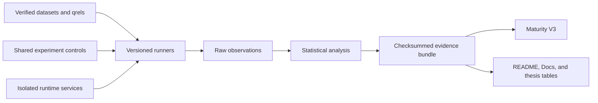

# BerryBrain Architecture

BerryBrain is a local-first knowledge system with four runtime services:

- `web`: Next.js user interface.
- `api`: FastAPI application, persistence, graph projection, search, and RAG orchestration.
- `worker`: asynchronous extraction, enrichment, insight, and maintenance jobs.
- `hipporag`: graph-aware retrieval sidecar.

## Data Ownership

Markdown files in the vault are user-owned source records. SQLite stores indexed state, generated metadata, graph records, jobs, notifications, and settings. Generated fields never overwrite user-authored content without an explicit write action.

## Graph Contract

Nodes use canonical English ontology types. Edges are directed, named relationships with validated endpoint domains and ranges. Confidence is system-calculated from evidence and provenance; clients cannot write it.

### User-decision feedback

`GraphWriteService` is the mutation boundary for graph decisions. Confirm, ignore, correct,
restore, and delete actions write an append-oriented `graph_feedback` record keyed by canonical
artifact identity and source-note context. Generated upserts consult the latest active decision.
A negative decision quarantines a matching candidate instead of making it visible or available to
RAG. Matching accepts an exact source scope or an overlapping source scope so a regenerated
candidate cannot evade a deletion only because extraction later adds or removes one source.

This is online policy adaptation, not model-weight training. It changes artifact admission and
confidence provenance while preserving an auditable human decision.

### Node-deletion invalidation

Before deleting a non-note node, the API captures its incident edges, source notes, neighbors,
semantic cluster, dependent insight nodes/records, and indirect derived relationships that cite the
artifact. The transaction expires dependent insights, quarantines cited note-to-note relationships,
deletes graph projections, removes incident edges and owned semantic profiles/assignments, records
deletion feedback, and deletes the target. It then queues four observable repairs:

| Job | Scope |
| --- | --- |
| `UPDATE_GRAPH_STATS` | Aggregate graph health only |
| `UPDATE_GRAPH_CLUSTERS` | Former cluster neighborhood; never implicit full graph |
| `GENERATE_GRAPH_INSIGHTS` | Affected source notes and surviving neighborhood |
| `SYNC_HIPPORAG_GRAPH` | Canonical active graph projection |

The web client persists returned job IDs across navigation, shows a working/failure/completion
state, and performs a full graph reload when the bounded repair completes. Graph pages, deltas,
search, and retrieval expose only active, non-ignored artifacts.

## Judge Architecture

The Judge supports deterministic, single-model, and committee execution. Provider validation first
discovers the live model catalog, then sends bounded structured-response probes through the exact
provider route used at runtime. Only models that satisfy that contract can enter a default
committee. Catalog presence alone is insufficient because listed models can still return `404`,
time out, or reject the chat schema. The default roles are faithfulness, relevance, and
contradiction; source quality and ontology consistency are available for committees of four or
five. Every slot's provider, model, role, and focus is persisted and editable in Settings.

The active generator is excluded, as are model names that indicate embedding, reranking,
moderation, guard, speech, audio, or image capabilities. A committee requires at least two distinct
valid verdicts. Failed calls remain as provenance rows but are excluded from voting and score
aggregation. High-impact automatic `JUDGE_ARTIFACT` jobs use committee execution when configured;
otherwise the selected mode remains explicit and no hidden ensemble is invoked.

Cloud probes run with bounded parallelism and preserve provider order after capability ranking.
Local Ollama probes are sequential to avoid exhausting a workstation. The probe response is never
used as knowledge or calibration evidence; it establishes transport and schema compatibility only.

## Runtime Contract

System UI, API messages, prompts, generated metadata, and generated answers are English. User input and quoted source excerpts retain their original language. Production runtime contains no seeded or mock records.

## Agent Runtime

Worker heartbeats schedule due graph enrichment, insight and gap discovery, Judge evaluation, and semantic clustering. Enrichment jobs capture the current evidence fingerprint, discard stale or already-completed work before a model call, and apply a cooldown after provider dead letters to prevent retry storms.

Semantic clustering uses node profiles, lexical evidence, and active validated edges. Global jobs
omit `scope_node_ids`; scoped jobs send an explicit list that expands to all current members of the
affected clusters. Cluster identity is reused by membership overlap so local changes do not rotate
colors unnecessarily. Weakly connected assignments are split, color and cluster state are committed
together, and the previous valid color remains visible while enrichment is pending.

## Feedback Adaptation Architecture

Knowledge-affecting user actions are written to an append-only learning-event ledger. Graph
decisions also maintain one active feedback policy per canonical artifact and source context. Ask,
graph inference, every Worker AI job, and Judge evaluation resolve the applicable policy from global
or overlapping source-note context. The newest scoped signal for an actor and target wins.

The policy is bounded and passed as untrusted data. It can suppress a rejected pattern, preserve a
correction, or provide annotation context, but cannot bypass evidence, ontology, or quality checks.
Model weights are not updated. This mechanism is policy adaptation with provenance and rollback,
not online fine-tuning. See [Feedback-Driven Learning](learning-and-feedback.md).

## Evaluation Architecture

Production runtime never imports benchmark fixtures. Executable runners live under
`apps/api/benchmarks`; declarations, schemas, dataset manifests, and workloads live under
`benchmarks`; immutable outputs live under `reports`. Every evidence bundle records revision, dirty
state, environment, seed, dataset checksum, configuration, raw observations, and file checksums.

HTTP middleware emits a safe correlation identifier and `Server-Timing`, then stores bounded
method/route latency and error aggregates. Routes are framework templates, not user-controlled URLs.
Prompts, note titles, note bodies, secrets, and tokens are prohibited from metric labels.

Maturity V3 consumes current artifacts rather than feature claims. Deterministic synthetic evidence
can award engineering evidence only; representative, independent, and field levels require their
respective real artifacts.

## Active Specifications

- [Version 1.4.0](planning/v1-4-0.md)
- [Version 1.4.2 graph interaction and confidence](planning/v1-4-2-graph-interaction-confidence.md)
- [Version 1.4.3 Ask and agent workspace](planning/v1-4-3-ask-agent-workspace.md)
- [Version 1.4.7 graph feedback validation](planning/v1-4-7-graph-feedback-validation-plan.md)
- [Version 1.4.7 Judge and deletion invalidation](planning/v1-4-7-judge-committee-deletion-invalidation.md)
- [Version 1.4.8 whole-system coherence plan](planning/v1-4-8.md)
- [Feedback-driven learning](learning-and-feedback.md)
- [Graph ontology and visual semantics](ontology.md)
- [Security model](planning/SECURITY_MODEL.md)
- [Recovery](planning/RECOVERY.md)
