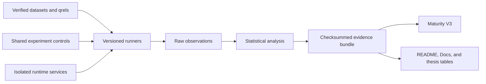

# BerryBrain Architecture

BerryBrain is a local-first knowledge system with four runtime services:

- `web`: Next.js user interface.
- `api`: FastAPI application, persistence, graph projection, search, and RAG orchestration.
- `worker`: asynchronous extraction, enrichment, insight, and maintenance jobs.
- `hipporag`: graph-aware retrieval sidecar.

## Data Ownership

Markdown files in the vault are user-owned source records. SQLite stores indexed state, generated metadata, graph records, jobs, notifications, and settings. Generated fields never overwrite user-authored content without an explicit write action.

## Graph Contract

Nodes use canonical English ontology types. Edges are directed, named relationships with validated endpoint domains and ranges. Confidence is system-calculated from evidence and provenance; clients cannot write it.

## Runtime Contract

System UI, API messages, prompts, generated metadata, and generated answers are English. User input and quoted source excerpts retain their original language. Production runtime contains no seeded or mock records.

## Agent Runtime

Worker heartbeats schedule due graph enrichment, insight and gap discovery, Judge evaluation, and semantic clustering. Enrichment jobs capture the current evidence fingerprint, discard stale or already-completed work before a model call, and apply a cooldown after provider dead letters to prevent retry storms.

## Evaluation Architecture

Production runtime never imports benchmark fixtures. Executable runners live under
`apps/api/benchmarks`; declarations, schemas, dataset manifests, and workloads live under
`benchmarks`; immutable outputs live under `reports`. Every evidence bundle records revision, dirty
state, environment, seed, dataset checksum, configuration, raw observations, and file checksums.

HTTP middleware emits a safe correlation identifier and `Server-Timing`, then stores bounded
method/route latency and error aggregates. Routes are framework templates, not user-controlled URLs.
Prompts, note titles, note bodies, secrets, and tokens are prohibited from metric labels.

Maturity V3 consumes current artifacts rather than feature claims. Deterministic synthetic evidence
can award engineering evidence only; representative, independent, and field levels require their
respective real artifacts.

## Active Specifications

- [Version 1.4.0](planning/v1-4-0.md)
- [Version 1.4.2 graph interaction and confidence](planning/v1-4-2-graph-interaction-confidence.md)
- [Version 1.4.3 Ask and agent workspace](planning/v1-4-3-ask-agent-workspace.md)
- [Security model](planning/SECURITY_MODEL.md)
- [Recovery](planning/RECOVERY.md)
