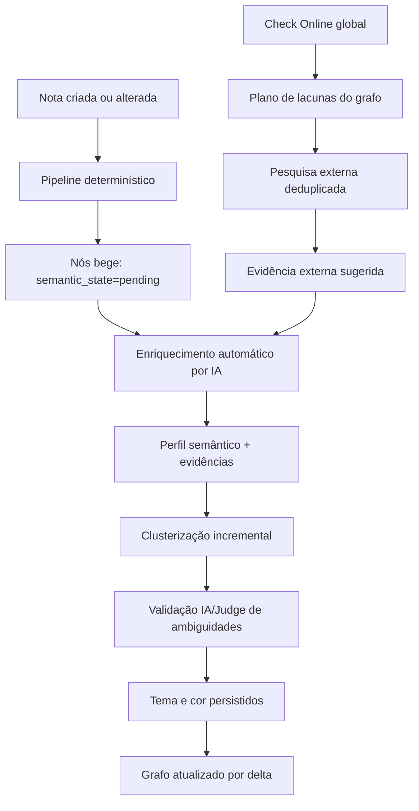
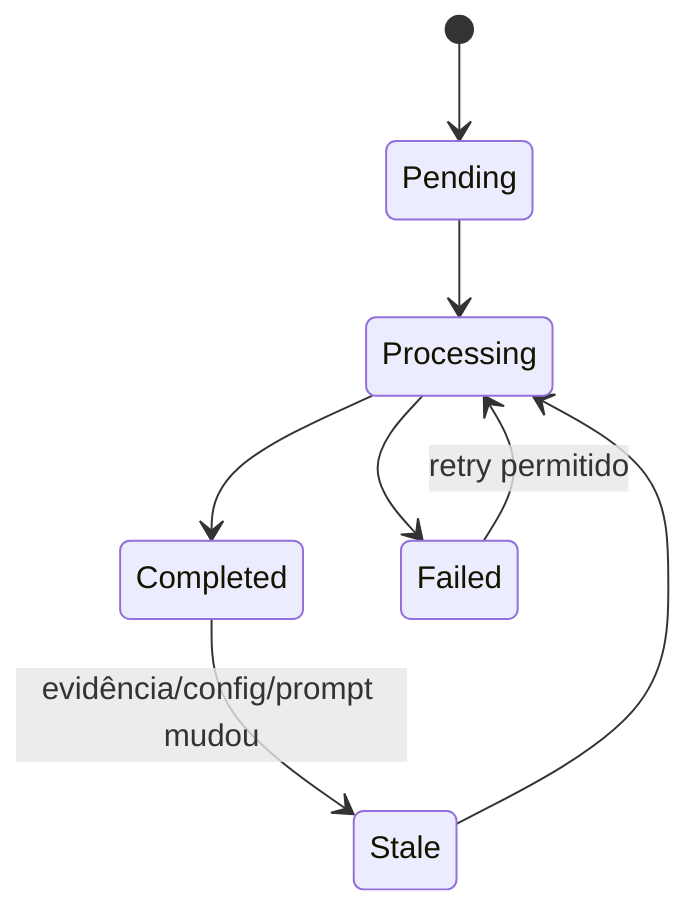

# Planejamento mestre — BerryBrain

## Correções de confiabilidade, configuração obrigatória, desempenho, Flow, enriquecimento automático, Check Online global e cores semânticas do grafo

**Repositório-base:** [imsouza/berrybrain](https://github.com/imsouza/berrybrain)  
**Branch de referência:** `main`  
**Data da inspeção:** 29 de julho de 2026  
**Tipo de documento:** plano técnico de implementação, validação, migração e release  
**Escopo:** Web (Next.js/React), API (FastAPI), Worker assíncrono, SQLite, Model Router, Knowledge Graph, Knowledge Base, Judge, HippoRAG, Monitor e pipeline de release

---

## 1. Objetivo executivo

Este plano consolida todos os requisitos levantados para a próxima correção do BerryBrain:

1. diagnosticar e corrigir a grande quantidade de erros de jobs que ocorre antes de chamadas reais aos modelos;
2. tornar a configuração de IA obrigatória, validada e coerente antes de liberar o sistema;
3. garantir exclusividade total entre modo Cloud e modo Local/Ollama;
4. habilitar e configurar obrigatoriamente Judge e HippoRAG;
5. reorganizar o Settings em uma arquitetura navegável, modular e performática;
6. transformar `What BerryBrain understands` em uma análise semântica realmente específica e baseada em evidências;
7. tornar `Improve with AI` parte automática do pipeline de criação e atualização de nós;
8. mover `Check Online` para o topo da tela do grafo e fazê-lo operar sobre o grafo completo;
9. criar o modo `Flow` no Ask para aprofundamento contextual contínuo;
10. auditar e corrigir a performance de todas as páginas e transições;
11. substituir a coloração fixa por tipo por uma coloração semântica automática, estável, acessível e validada por IA;
12. preservar vaults como uma categoria visual exclusiva, sem reutilizar suas cores nos demais nós;
13. migrar dados e configurações antigas sem apagar histórico, notas, provenance ou decisões do usuário;
14. validar tudo com testes unitários, integração, end-to-end, carga, benchmarks semânticos e uma release observável.

O resultado esperado é um BerryBrain fluido, coerente e explicável: a interface responde rapidamente, os jobs chegam de fato ao modelo quando necessário, cada nó recebe uma análise útil, as cores revelam temas reais e todas as decisões cognitivas permanecem auditáveis.

---

## 2. Decisões obrigatórias e invariantes

Estas decisões não são sugestões. Elas devem ser protegidas por schema, backend, frontend, worker e testes de arquitetura.

### 2.1 Cloud XOR Local/Ollama

Em cada instalação existe exatamente um modo ativo:

- `cloud`; ou
- `local`.

Nunca podem coexistir chamadas Cloud e Ollama na mesma configuração ativa. A regra vale para:

- geração principal;
- análise de notas;
- extração de conceitos;
- embeddings;
- enriquecimento de nós;
- Judge;
- HippoRAG;
- Ask e Flow;
- criação de insights;
- agrupamento e validação semântica de cores;
- análise de resultados do Check Online;
- qualquer agente atual ou futuro.

Não haverá fallback silencioso entre Cloud e Ollama. Se o modo ativo falhar, o job falha com causa explícita e possibilidade controlada de retry.

### 2.2 Configuração obrigatória

Uma instalação sem configuração válida não acessa o workspace. O modal obrigatório:

- não fecha por `X`, `Esc`, backdrop, navegação lateral ou manipulação de rota;
- valida provider, credenciais, endpoint e modelos;
- exige modelo principal, Judge, HippoRAG e embeddings quando aplicável;
- só conclui após testes reais de compatibilidade;
- reaparece se a configuração se tornar inválida;
- não reaparece quando a configuração persistida continua válida.

### 2.3 Enriquecimento automático

`Improve with AI` deixa de ser requisito manual. Todo nó elegível:

- nasce bege e com estado semântico pendente;
- recebe enriquecimento automaticamente via job;
- recebe análise, evidências, confidence e classificação temática;
- conserva o histórico das versões anteriores;
- só é reprocessado quando suas evidências, configuração ou versão do prompt mudarem.

### 2.4 Check Online global

`Check Online`:

- sai da sidebar do nó;
- entra na toolbar superior do grafo;
- funciona sem nó selecionado;
- planeja uma verificação do grafo completo;
- pesquisa somente lacunas justificadas;
- agrupa consultas e evita duplicações;
- registra fontes externas como evidência não confiável até revisão.

### 2.5 Cor representa tema; forma e borda representam tipo

Para nós não-vault:

- **cor de preenchimento:** tema/cluster semântico;
- **forma, ícone, borda ou badge:** tipo do nó (`note`, `concept`, `entity`, `insight`, `gap` etc.);
- **opacidade ou padrão:** estado (`pending`, `stale`, `failed`, `suggested`, `confirmed`);
- **halo:** seleção/destaque.

Isso evita o conflito entre “cor por tipo” e “cor por assunto”. Um insight sobre Docker e uma nota sobre Docker podem compartilhar a cor temática, mas continuam visualmente distinguíveis pela forma e pelo badge.

### 2.6 Vaults têm namespace visual exclusivo

Vaults nunca reutilizam cores dos clusters semânticos. Cada vault possui:

- uma cor estável própria, escolhida em uma paleta reservada;
- contraste adequado nos temas claro e escuro;
- identificador visual adicional, para não depender apenas de cor;
- persistência por `vault_id`, sem alteração arbitrária a cada reprocessamento.

### 2.7 Desempenho é um gate de release

“Parece mais rápido” não é critério de aceite. Toda página e transição terá:

- baseline reproduzível;
- orçamento de performance;
- teste automatizado;
- comparação antes/depois;
- bloqueio de regressão no CI.

---

## 3. Base técnica encontrada na `main`

### 3.1 Arquitetura existente que deve ser preservada

A `main` atual já possui:

- Web em Next.js/React;
- API FastAPI;
- Worker Python assíncrono;
- SQLite e caminhos opcionais para stores vetoriais;
- fila persistida com retry, lease, heartbeat e dead letter;
- grafo com nós, arestas, evidence, confidence e provenance;
- Model Router;
- Judge;
- HippoRAG sidecar;
- prompts versionados;
- testes de API, Worker e navegador;
- configuração server-side com segredo mascarado;
- PWA que não deve cachear conteúdo privado de API.

Referências principais:

- [README — arquitetura, pipeline e contratos](https://github.com/imsouza/berrybrain/blob/main/README.md)
- [API](https://github.com/imsouza/berrybrain/tree/main/apps/api/src/berrybrain_api)
- [Worker](https://github.com/imsouza/berrybrain/blob/main/apps/worker/src/berrybrain_worker/main.py)
- [Web](https://github.com/imsouza/berrybrain/tree/main/apps/web/src)
- [Prompts](https://github.com/imsouza/berrybrain/tree/main/prompts)

### 3.2 Divergências confirmadas entre o estado atual e o estado desejado

| Área | Estado observado na `main` | Estado obrigatório |
|---|---|---|
| Judge | admite fallback para geração principal ou modo determinístico | ativo, configurado e sem fallback silencioso |
| HippoRAG | opcional e desabilitado por padrão | ativo por padrão e configuração obrigatória |
| Settings | componente extenso, com opções Cloud/Local independentes em subseções | abas/menu, fonte única e modo global exclusivo |
| `Improve with AI` | ação manual por nó, embora exista `cognitive_enrich_on_save` | enriquecimento automático e obrigatório no pipeline |
| `Check Online` | ação `validate-node-web` vinculada ao nó selecionado | ação global na toolbar do grafo |
| Cores | tabela fixa `COLORS` por tipo | cluster semântico dinâmico com vaults reservados |
| Grafo | `GET /api/v1/graph` retorna o conjunto completo | resumo rápido + carregamento progressivo/delta |
| Render do grafo | canvas redesenhado continuamente com `requestAnimationFrame` | render sob demanda e animação somente quando necessária |
| Arestas no canvas | busca de nós por `find` dentro do loop de arestas | mapas indexados O(1) |
| Shell | importa Graph, Settings, Monitor e outros painéis estaticamente | divisão de bundle e carregamento sob demanda |
| Entrada `/brain` | chamadas sequenciais de setup e sessão no cliente | gate server-side ou bootstrap consolidado |

### 3.3 Arquivos prioritários já identificados

| Arquivo/componente | Responsabilidade atual | Intervenção esperada |
|---|---|---|
| `apps/web/src/components/graph-screen.tsx` | tela, sidebar, Ask e ações do grafo | decomposição, toolbar global, Flow e estados |
| `apps/web/src/components/graph-view.tsx` | canvas, cores e layout | renderer performático e cores semânticas |
| `apps/web/src/components/settings-panel.tsx` | todas as configurações | abas, lazy rendering e validação transacional |
| `apps/web/src/components/onboarding-modal.tsx` | onboarding/configuração | modal realmente obrigatório e por etapas |
| `apps/web/src/components/note-workspace.tsx` | shell do workspace | dynamic imports e preservação do shell |
| `apps/web/src/contexts/workspace-context.tsx` | estado e chamadas globais | cache, deduplicação e redução de rerenders |
| `apps/web/src/app/brain/page.tsx` | gate inicial | bootstrap consolidado/server-side |
| `apps/api/src/berrybrain_api/jobs.py` | criação e transição de jobs | schema versionado, idempotência e métricas |
| `apps/api/src/berrybrain_api/models.py` | entidades persistidas | clusters, assignments, sessões Flow e execuções globais |
| `apps/api/src/berrybrain_api/database.py` | migrations/bootstrap | novas tabelas, índices e backfill |
| `apps/api/src/berrybrain_api/settings_store.py` | settings persistidos | schema único e migrations |
| `apps/api/src/berrybrain_api/routers/graph.py` | APIs do grafo | endpoints globais, progressivos e semânticos |
| `apps/api/src/berrybrain_api/routers/settings.py` | leitura/escrita de settings | transação, validação e teste de configuração |
| `apps/api/src/berrybrain_api/routers/judge.py` | Judge | configuração obrigatória e estados reais |
| `apps/api/src/berrybrain_api/routers/hipporag.py` | HippoRAG | configuração obrigatória e health/capability |
| `apps/api/src/berrybrain_api/ai_gateway.py` | chamadas de IA | modo global e telemetria completa |
| `apps/worker/src/berrybrain_worker/main.py` | execução dos jobs | handlers novos e separação modular |
| `prompts/enrich-node.v1.md` | enriquecimento por nó | versão nova com fatos/inferências/incertezas |
| `prompts/node-summary.v1.md` | resumo inteligente | unificação de contrato semântico |

Antes da implementação, a equipe deve congelar o SHA exato da `main` e registrar esse SHA no epic e no relatório final. A inspeção deste documento usou a `main` publicada em 29/07/2026; nenhuma implementação deve começar sobre uma revisão não identificada.

---

## 4. Arquitetura-alvo



### 4.1 Separação de responsabilidades

| Camada | Deve decidir | Não deve decidir |
|---|---|---|
| Frontend | apresentação, interação, progresso e acessibilidade | provider real, cluster, retry ou verdade semântica |
| API | contratos, validação, persistência, idempotência e autorização | execução pesada no request síncrono |
| Worker | jobs pesados, chamadas ao modelo, embeddings e clusterização | regras visuais efêmeras do navegador |
| Model Router | provider/modelo efetivos e telemetria | fallback Cloud/Local |
| IA | interpretar evidências, nomear temas e arbitrar casos ambíguos | escolher hexadecimal diretamente ou sobrescrever evidências |
| Algoritmo de cluster | formar grupos reproduzíveis e medir similaridade | resolver sozinho homônimos ambíguos |
| Judge | avaliar qualidade e aderência à evidência | inventar nova evidência |
| Renderer | desenhar cor/forma já resolvidas pela API | inferir tema durante cada frame |

---

## 5. Workstream A — Diagnóstico e correção da fila

### 5.1 Problema a reproduzir

O estado relatado apresenta:

- Worker em execução;
- 8 itens processados;
- 116 erros;
- 0 chamadas de modelo;
- `JUDGE_ARTIFACT` repetido até dead letter;
- payload inválido ou não suportado;
- `GENERATE_GRAPH_INSIGHTS` em dead letter;
- métricas divergentes entre total, concluído, pendente e falho;
- Ollama offline mesmo quando Cloud é o modo desejado.

A hipótese prioritária é falha pré-provider. Entretanto, a implementação deve confirmar, e não presumir, a causa.

### 5.2 Instrumentação mínima do ciclo de job

Cada tentativa precisa registrar:

- `job_id`;
- `job_type`;
- `payload_schema_version`;
- `run_id`;
- `dependency_ids`;
- `note_id`, `note_version` e `content_hash`;
- `artifact_id` e `artifact_version`, quando aplicável;
- `active_ai_mode`;
- `resolved_provider`;
- `resolved_model`;
- `stage`;
- `attempt`;
- `started_at`, `finished_at`, `duration_ms`;
- `model_call_started`;
- `model_call_id`;
- `error_class`;
- `error_code`;
- `retryability`;
- `dead_letter_reason`;
- correlação com activity e model reliability.

Stages padronizados:

1. `claimed`;
2. `payload_validating`;
3. `dependencies_checking`;
4. `context_loading`;
5. `provider_resolving`;
6. `model_calling`;
7. `response_validating`;
8. `artifact_persisting`;
9. `judge_evaluating`;
10. `completed`.

Assim, “116 erros e 0 chamadas” passa a revelar exatamente em qual stage os jobs pararam.

### 5.3 Schema versionado e validação

Criar registry central:

```text
JOB_TYPE -> payload schema -> current version -> migrations suportadas
```

Regras:

- validar antes de enfileirar;
- validar novamente ao claim;
- converter versão antiga apenas por migration explícita;
- erro permanente não recebe retry;
- dependência ainda não concluída retorna estado de espera, não erro;
- referência inexistente retorna `artifact_missing`;
- referência de versão antiga retorna `artifact_stale`;
- payload desconhecido vai para quarentena auditável;
- nenhuma exceção genérica deve ser convertida automaticamente em “provider failure”.

### 5.4 `JUDGE_ARTIFACT`

Auditar:

- quem cria o job;
- em qual momento;
- qual artifact ID é enviado;
- se o artifact já foi commitado;
- se o schema esperado mudou;
- se o job é criado para artefato determinístico que não exige Judge;
- se a transação confirma artifact e job atomicamente;
- se o Judge é disparado novamente após atualização;
- se o mesmo artifact recebe jobs duplicados.

Correção-alvo:

- artifact persistido antes do Judge;
- chave de idempotência `judge:{artifact_type}:{artifact_id}:{artifact_version}:{judge_config_version}`;
- contrato tipado por tipo de artefato;
- máximo de uma avaliação ativa para a mesma chave;
- failure permanente sem três retries inúteis;
- reprocessamento explícito quando o artifact mudar.

### 5.5 Métricas consistentes

Definir uma fonte canônica: tabela de jobs + tabela de attempts.

Contadores devem ser derivados por consultas documentadas:

- `total_jobs`;
- `pending`;
- `active`;
- `completed`;
- `failed_retryable`;
- `failed_permanent`;
- `dead_letter`;
- `cancelled`;
- `attempt_errors`;
- `model_calls`.

Não misturar “número de jobs” com “número de tentativas”. O provável `116 errors` deve ser rotulado como tentativas se essa for sua semântica real.

### 5.6 Reparo de dados

Criar uma manutenção idempotente:

1. dry-run;
2. relatório dos jobs legados;
3. classificação em migrável, reprocessável, irrecuperável;
4. confirmação;
5. execução em lotes;
6. histórico e audit event;
7. rollback lógico quando possível.

Nunca apagar silently dead letters ou artefatos.

---

## 6. Workstream B — Configuração obrigatória e Settings

### 6.1 Novo contrato de configuração

Objeto canônico:

```json
{
  "schema_version": 2,
  "mode": "cloud",
  "main": {"provider_id": "...", "model_id": "..."},
  "embedding": {"provider_id": "...", "model_id": "..."},
  "judge": {"enabled": true, "provider_id": "...", "model_id": "...", "mode": "single_model"},
  "hipporag": {"enabled": true, "provider_id": "...", "model_id": "..."},
  "validated_at": "...",
  "capability_snapshot": {},
  "configuration_fingerprint": "..."
}
```

Validações:

- provider de todos os slots pertence ao modo global;
- modelo existe ou foi explicitamente aceito como custom;
- endpoint responde;
- credencial funciona;
- modelo suporta a capability necessária;
- embeddings não usam um modelo de chat sem endpoint compatível;
- HippoRAG health e dependências estão disponíveis;
- Judge não é `deterministic` por ausência de config;
- generator e Judge não violam regras de independência de avaliação quando aplicáveis.

### 6.2 Modal obrigatório

Etapas:

1. modo;
2. provider;
3. modelo principal;
4. embeddings;
5. Judge;
6. HippoRAG;
7. testes;
8. resumo;
9. commit transacional.

O backend deve expor `configuration_gate` no bootstrap da aplicação. Não confiar apenas em estado local do modal.

### 6.3 Reorganização do Settings

Menu proposto:

1. Geral;
2. IA e modo de execução;
3. Provider principal;
4. Agentes;
5. Judge;
6. HippoRAG;
7. Embeddings e Knowledge Base;
8. Knowledge Graph;
9. Jobs e Worker;
10. Armazenamento e Vaults;
11. Performance;
12. Monitoramento;
13. Segurança e dados;
14. Manutenção.

Requisitos de implementação:

- route/section state endereçável;
- renderização lazy por aba;
- busca por setting;
- dirty state por seção;
- salvar transacional;
- confirmação antes de descartar;
- teste de conexão por provider;
- dropdown dependente de provider;
- cache temporário da lista de modelos;
- segredo mascarado;
- backend nunca devolve chave completa;
- compatibilidade mobile;
- acessibilidade por teclado.

### 6.4 Migração

Converter:

- `graph_provider`;
- `kb_embedding_provider`;
- `judge_provider`;
- `hipporag_provider`;
- campos Cloud/Ollama antigos;
- toggles de enriquecimento.

Se existir mistura Cloud/Local:

- não escolher automaticamente;
- abrir modal;
- explicar quais campos conflitantes foram encontrados;
- preservar valores até o usuário escolher;
- só ativar jobs cognitivos após configuração válida.

---

## 7. Workstream C — `What BerryBrain understands`

### 7.1 Contrato semântico

Substituir texto genérico por:

```json
{
  "meaning_in_context": "...",
  "use_in_notes": "...",
  "why_it_matters_here": "...",
  "supported_findings": [],
  "inferences": [],
  "uncertainties": [],
  "evidence": [],
  "connection_assessments": [],
  "confidence": {
    "concept_detection": 0.0,
    "semantic_interpretation": 0.0,
    "evidence_coverage": 0.0
  },
  "provider": "...",
  "model": "...",
  "prompt_version": "...",
  "source_fingerprint": "..."
}
```

### 7.2 Regras de geração

- usar notas fonte e trechos;
- não responder apenas com conhecimento geral;
- separar fato, inferência e incerteza;
- explicar relações semanticamente fortes;
- marcar coocorrência como coocorrência;
- evitar texto que serviria para qualquer conceito;
- detectar pouca evidência e reduzir confiança;
- acompanhar o idioma predominante;
- preservar referências internas;
- não persistir mensagem de loading como conteúdo cognitivo.

### 7.3 Estados

- `pending`;
- `processing`;
- `completed`;
- `failed`;
- `stale`;
- `needs_review`;
- `not_configured`.

Nós `pending`, `processing`, `failed`, `stale` e `not_configured` permanecem bege ou recebem variação de bege/padrão, sem fingir que um tema foi validado.

### 7.4 Reprocessamento de templates antigos

Detectar hashes/padrões conhecidos, marcar como `stale` e agendar em lotes. Preservar conteúdo antigo no histórico.

---

## 8. Workstream D — `Improve with AI` automático

### 8.1 Alteração de produto

Remover `Improve with AI` como ação primária da sidebar. Manter, quando necessário:

- `Retry AI analysis`;
- `Regenerate AI analysis`;
- `Update stale analysis`.

### 8.2 Pipeline



Chave de idempotência:

```text
node-enrichment:{node_id}:{source_fingerprint}:{prompt_version}:{model_config_fingerprint}
```

### 8.3 Backpressure

- lote configurável;
- concorrência por provider;
- token budget;
- prioridade para nós visíveis/centrais sem bloquear os demais;
- limite de retries;
- pausa se configuração for invalidada;
- progresso no Monitor;
- nenhuma chamada no request de carregamento do grafo.

---

## 9. Workstream E — `Check Online` global

### 9.1 Comportamento atual confirmado

Hoje a interface:

- oferece `Check online` dentro das ações do nó;
- exige nó selecionado;
- chama `POST /api/v1/graph/nodes/{recordId}/validate-web`;
- depende de `Research Mode`;
- atualiza o resumo daquele nó.

Esse comportamento será substituído.

### 9.2 Nova execução global

Novo fluxo:

1. usuário aciona toolbar;
2. API cria `graph_research_run`;
3. Worker carrega snapshot do grafo;
4. planejador identifica lacunas;
5. consultas semelhantes são agrupadas;
6. cache é consultado;
7. pesquisas são executadas com rate limit;
8. fontes são normalizadas e deduplicadas;
9. evidências externas são persistidas como suggested;
10. nós afetados ficam `stale`;
11. enriquecimento e Judge processam apenas o delta;
12. UI recebe progresso por SSE/WebSocket ou polling leve.

### 9.3 Endpoints propostos

- `POST /api/v1/graph/research-runs`;
- `GET /api/v1/graph/research-runs/{id}`;
- `POST /api/v1/graph/research-runs/{id}/cancel`;
- `GET /api/v1/graph/research-runs/{id}/results`;
- manter endpoint antigo temporariamente como deprecated, sem UI;
- remover endpoint antigo em versão posterior após telemetria de uso.

### 9.4 Segurança

- conteúdo web é dado não confiável;
- defesa contra prompt injection;
- allow/deny policy de schemes e endereços;
- proteção SSRF;
- timeout;
- limite de download;
- sanitização;
- sem execução de scripts;
- URLs e hashes registrados;
- conteúdo externo nunca recebe status confirmed automaticamente.

---

## 10. Workstream F — Flow no Ask

### 10.1 UX

- resposta concluída revela botão `Flow`;
- ativação torna o botão Ask roxo;
- indicador persistente de Flow;
- opção `Exit Flow`;
- nova conversa cria novo contexto;
- erro não apaga histórico;
- envio duplicado é bloqueado;
- cancelamento é suportado.

### 10.2 Modelo de dados

`ask_sessions`:

- `id`;
- `mode`;
- `title`;
- `created_at`;
- `updated_at`;
- `active`;
- `configuration_fingerprint`.

`ask_turns`:

- `session_id`;
- `sequence`;
- `role`;
- `content`;
- `context_summary`;
- `evidence_ids`;
- `provider`;
- `model`;
- `token_usage`;
- `latency`;
- `status`.

### 10.3 Controle de contexto

- histórico recente integral;
- resumo progressivo de turnos antigos;
- evidências fixadas;
- orçamento de tokens por modelo;
- deduplicação de trechos;
- isolamento server-side por sessão;
- nenhum `localStorage` como fonte canônica;
- restauração segura após refresh.

---

## 11. Workstream G — Auditoria e correção de performance

### 11.1 Inventário obrigatório de superfícies

Medir:

- landing pública;
- login;
- signup/setup;
- welcome/onboarding;
- `/brain` bootstrap;
- Home;
- lista de vaults/notas;
- abertura de nota;
- editor;
- preview/split;
- painel direito;
- grafo;
- seleção de nó;
- Ask;
- Flow;
- Settings e cada aba;
- Monitor;
- Activity;
- Insights;
- Reviews;
- Notifications;
- account/admin;
- páginas de documentação/segurança/privacidade.

### 11.2 Métricas

Frontend:

- TTFB;
- FCP;
- LCP;
- INP;
- CLS;
- tempo clique → primeiro feedback;
- tempo clique → conteúdo útil;
- tamanho JS inicial;
- tamanho por chunk;
- hydration time;
- número de renders;
- duração dos commits React;
- long tasks;
- memória;
- FPS e frame time do grafo.

API:

- p50/p95/p99;
- tempo de query;
- número de queries;
- payload comprimido e não comprimido;
- filas de conexão;
- event loop lag;
- CPU/memória.

Worker:

- concorrência;
- atraso de claim;
- duração por job;
- chamadas ao provider;
- impacto de jobs pesados sobre API/SQLite;
- lock contention.

### 11.3 Orçamentos iniciais

Medidos em máquina de referência documentada, warm navigation e rede local:

| Ação | p50 | p95 |
|---|---:|---:|
| troca entre views já carregadas | ≤ 100 ms | ≤ 200 ms |
| feedback visual após clique | ≤ 50 ms | ≤ 100 ms |
| abertura de Settings | ≤ 150 ms | ≤ 300 ms |
| abertura de nota cacheada | ≤ 150 ms | ≤ 300 ms |
| abertura de nota não cacheada | ≤ 300 ms | ≤ 700 ms |
| Home útil | ≤ 400 ms | ≤ 900 ms |
| grafo até skeleton | ≤ 100 ms | ≤ 150 ms |
| grafo até primeira visualização | ≤ 800 ms | ≤ 1.500 ms |
| seleção de nó | ≤ 100 ms | ≤ 250 ms |
| endpoint comum da API | ≤ 100 ms | ≤ 300 ms |

Para cold load e deployments remotos, estabelecer orçamento separado após baseline real.

### 11.4 Correções do shell e navegação

O shell atual importa painéis pesados estaticamente. Planejar:

- `next/dynamic` para Graph, Settings, Monitor, Guide e Notifications;
- importar apenas quando aberto;
- prefetch em hover/focus/idle;
- manter sidebar e shell montados;
- evitar remount da árvore inteira ao trocar view;
- skeleton imediato;
- preservar estado da nota;
- boundaries por painel;
- suspense isolado;
- impedir que falha do Monitor derrube o editor.

### 11.5 Bootstrap

Substituir duas chamadas sequenciais no cliente (`setup/status` e `auth/me`) por:

- gate server-side, quando compatível; ou
- endpoint `GET /api/v1/bootstrap` que devolva sessão, gate de config, perfil mínimo e flags;
- cache privado e curto;
- redirects sem `window.location.href` quando navegação interna for suficiente;
- nenhuma tela “Checking secure session” por mais tempo que o necessário.

### 11.6 Estado e dados

- request deduplication;
- AbortController em troca de tela;
- cache stale-while-revalidate para dados não sensíveis;
- invalidação por evento;
- seletores de contexto para reduzir rerenders;
- separar contextos de notas, UI, jobs e grafo;
- paginação;
- virtualização de listas;
- debouncing de busca;
- optimistic UI segura;
- não refazer home/graph/settings completos após uma ação pequena;
- usar delta responses ou atualização localizada.

### 11.7 API e SQLite

- habilitar tracing de queries lentas;
- `EXPLAIN QUERY PLAN` nos endpoints críticos;
- índices compostos por status, tipo, note/version, updated_at e chaves de idempotência;
- evitar N+1;
- selecionar apenas colunas usadas;
- paginação por cursor;
- ETag/If-None-Match;
- compressão;
- endpoints summary;
- transações curtas;
- WAL e busy timeout validados;
- separar jobs pesados do request path;
- revisar contenção entre Worker e API.

### 11.8 Performance específica do grafo

Problemas concretos a corrigir:

1. o canvas mantém loop contínuo de `requestAnimationFrame`;
2. para cada aresta, usa busca linear de source/target nos nós;
3. a simulação de força percorre muitos pares;
4. o grafo é baixado integralmente;
5. layout pode reinicializar após reload;
6. seleção pode disparar fetches e reload global.

Plano:

- criar `Map<nodeId, layoutNode>` uma vez por versão;
- lookup O(1) por aresta;
- render on-demand;
- RAF somente durante animação, pan, zoom, pulse ou alteração;
- pausar quando aba estiver oculta;
- mover layout pesado para Web Worker;
- usar Barnes-Hut/quadtree ou algoritmo escalável;
- spatial index para hit testing;
- progressive graph endpoint;
- nível de detalhe por zoom;
- limitar labels fora do viewport;
- cache de text metrics;
- renderizar apenas elementos visíveis;
- persistir layout por graph/version;
- atualizar nós por delta;
- não recalcular clusters no browser;
- separar atualização de sidebar do reload do grafo;
- benchmark com 100, 1.000, 5.000 e 10.000 nós.

### 11.9 Performance do Settings

- dividir o arquivo em componentes por aba;
- lazy mount da aba;
- schema-driven fields;
- memoização;
- não renderizar todos os inputs ocultos;
- carregar lista de modelos apenas ao abrir provider;
- cache com TTL;
- cancelar discovery anterior;
- salvar somente delta;
- validação assíncrona fora da thread de render.

### 11.10 Performance percebida

- skeletons que preservam layout;
- feedback imediato;
- progressivo em vez de tela bloqueada;
- navegação prefetch;
- manter último conteúdo válido durante revalidação;
- nunca usar spinner fullscreen para ação localizada;
- mensagens claras para trabalho em background.

---

## 12. Workstream H — Cores semânticas automáticas

### 12.1 Objetivo

Nós com o mesmo assunto ou contexto semântico devem compartilhar a mesma cor ou uma variação perceptualmente próxima. Nós apenas lexicalmente iguais, mas semanticamente distintos, devem poder receber cores diferentes.

Exemplo obrigatório:

- Roberto Carlos cantor;
- Roberto Carlos jogador de futebol.

O nome igual não é suficiente para unir. O sistema deve usar todas as evidências disponíveis.

### 12.2 Estado inicial

Todo nó elegível começa com:

```text
semantic_color_state = pending
fill = bege padrão
```

O bege não significa “órfão”; significa “classificação temática ainda não concluída”. Órfão deve possuir badge/borda próprios.

### 12.3 Evidências para o perfil semântico

Para cada nó:

- label;
- aliases;
- tipo;
- título;
- resumo;
- `What BerryBrain understands`;
- trechos das notas;
- caminhos e vault;
- entidades próximas;
- tópicos;
- arestas confirmadas;
- arestas sugeridas;
- embeddings;
- contexto temporal;
- metadados;
- sources internas;
- evidência externa revisada;
- decisões do usuário.

### 12.4 Pipeline híbrido

A IA não escolhe hexadecimais. Ela valida significado. O algoritmo escolhe cores.

1. gerar perfil semântico;
2. gerar embedding;
3. criar candidatos por nearest neighbors;
4. calcular score híbrido;
5. construir grafo de similaridade;
6. detectar comunidades;
7. estimar número útil de temas;
8. enviar apenas ambiguidades para IA;
9. Judge verifica assignments de alto impacto;
10. nomear cluster;
11. estabilizar cluster ID;
12. gerar cor OKLCH;
13. persistir assignment;
14. publicar delta.

Score sugerido:

```text
similarity =
  w1 * embedding_similarity
  + w2 * confirmed_edge_strength
  + w3 * shared_context_score
  + w4 * entity_compatibility
  + w5 * topic_overlap
  - w6 * contradiction_score
  - w7 * homonym_conflict_score
```

Os pesos devem ser calibrados em benchmark, não fixados arbitrariamente.

### 12.5 Quantidade automática de cores

O número de cores deriva do número de clusters úteis, com:

- community detection (Leiden/Louvain) ou clustering apropriado;
- análise de estabilidade;
- silhouette/modularity;
- tamanho mínimo;
- merge de clusters redundantes;
- split de clusters incoerentes;
- limite visual configurável apenas como proteção;
- cluster `unresolved` bege quando confidence for baixa.

Não usar “uma cor por nó” nem “uma cor por tipo”.

### 12.6 Crossover de informação

Antes de confirmar assignment:

- comparar nó com centroid do cluster;
- comparar com exemplos centrais;
- comparar com vizinhos conectados;
- verificar entidades incompatíveis;
- verificar contexto da nota;
- procurar sinais de homônimo;
- comparar com clusters alternativos;
- exigir margem entre primeiro e segundo candidato;
- chamar IA quando a margem for pequena;
- chamar Judge quando mudança afetar muitos nós.

### 12.7 Desambiguação de Roberto Carlos

Teste de aceitação:

| Evidência | Resultado |
|---|---|
| “Roberto Carlos”, música, cantor, Jovem Guarda | cluster Música/Artistas |
| “Roberto Carlos”, lateral, seleção brasileira, Real Madrid | cluster Futebol/Jogadores |
| apenas “Roberto Carlos” sem contexto | bege/unresolved + needs review |

O sistema não deve fundir os dois perfis por label.

### 12.8 Paleta

Usar OKLCH/Lab para distância perceptual.

Regras:

- contraste mínimo para texto e borda;
- `deltaE` mínimo entre clusters vizinhos;
- variações dentro de macrotema mantêm proximidade;
- clusters diferentes não podem ficar indistinguíveis;
- paleta compatível com daltonismo;
- teste nos temas claro/escuro;
- cor não é o único canal;
- vault palette reservada;
- beige reservado para pending/unresolved;
- selected usa halo, sem sobrescrever a cor temática.

### 12.9 Vaults

Modelar `vault_id` explicitamente. Cada vault:

- recebe `vault_color_id`;
- usa paleta reservada fora do conjunto temático;
- mantém cor estável;
- mostra ícone/forma de vault;
- não participa da clusterização temática como nó comum;
- pode conter nós de muitas cores temáticas.

### 12.10 Estabilidade

Evitar “dança de cores”:

- cluster IDs persistentes;
- matching de clusters novos com antigos;
- hysteresis;
- assignment só muda acima de limiar;
- grandes mudanças exigem run versionado;
- preview antes de reclassificação global;
- histórico de `previous_cluster_id`;
- opção de pin manual pelo usuário;
- decisão do usuário tem prioridade.

### 12.11 Jobs novos

| Job | Finalidade |
|---|---|
| `BUILD_NODE_SEMANTIC_PROFILE` | consolidar evidências do nó |
| `GENERATE_NODE_EMBEDDING` | representação vetorial versionada |
| `FIND_CLUSTER_CANDIDATES` | nearest neighbors |
| `RECONCILE_TOPIC_CLUSTERS` | clusterização incremental/global |
| `VALIDATE_CLUSTER_ASSIGNMENT` | IA para ambiguidade |
| `JUDGE_CLUSTER_ASSIGNMENT` | revisão de alto impacto |
| `ASSIGN_CLUSTER_PALETTE` | cor determinística |
| `RECOLOR_GRAPH_DELTA` | publicar alterações |
| `BACKFILL_SEMANTIC_COLORS` | migração dos nós antigos |

### 12.12 Idempotência

Chaves incluem:

- graph version;
- node evidence fingerprint;
- embedding model/version;
- clustering algorithm/version;
- prompt version;
- model config fingerprint.

---

## 13. Modelo de dados proposto

### 13.1 Novas tabelas

`semantic_profiles`

- `node_id`;
- `source_fingerprint`;
- `profile_json`;
- `embedding_ref`;
- `status`;
- `provider`;
- `model`;
- `prompt_version`;
- timestamps.

`semantic_clusters`

- `id`;
- `stable_key`;
- `label`;
- `description`;
- `centroid_ref`;
- `parent_cluster_id`;
- `color_id`;
- `version`;
- `status`.

`semantic_cluster_assignments`

- `node_id`;
- `cluster_id`;
- `confidence`;
- `alternative_cluster_id`;
- `margin`;
- `reason`;
- `evidence_json`;
- `validated_by`;
- `pinned_by_user`;
- `version`.

`graph_palettes`

- `color_id`;
- `oklch`;
- `light_hex`;
- `dark_hex`;
- `border`;
- `text`;
- `namespace` (`semantic`, `vault`, `pending`);
- accessibility metadata.

`vault_visual_identities`

- `vault_id`;
- `color_id`;
- `icon`;
- `assigned_at`.

`node_enrichment_versions`

- histórico de análise e provenance.

`graph_research_runs` e `graph_research_results`

- execução global, progresso, fontes e resultados.

`ask_sessions`, `ask_turns`

- Flow persistente.

`model_calls`

- telemetria normalizada.

`job_attempts`

- tentativas separadas dos jobs.

### 13.2 Campos adicionados aos nós

- `semantic_state`;
- `semantic_profile_version`;
- `cluster_id`;
- `color_id`;
- `color_confidence`;
- `color_reason`;
- `color_updated_at`.

---

## 14. APIs propostas

### 14.1 Bootstrap/config

- `GET /api/v1/bootstrap`;
- `GET /api/v1/ai/configuration`;
- `PUT /api/v1/ai/configuration`;
- `POST /api/v1/ai/configuration/validate`;
- `GET /api/v1/ai/providers`;
- `GET /api/v1/ai/providers/{id}/models`.

### 14.2 Grafo

- `GET /api/v1/graph/summary`;
- `GET /api/v1/graph/nodes?cursor=&limit=&types=`;
- `GET /api/v1/graph/edges?cursor=&limit=&node_ids=`;
- `GET /api/v1/graph/delta?since_version=`;
- `GET /api/v1/graph/clusters`;
- `GET /api/v1/graph/palette`;
- `POST /api/v1/graph/recluster`;
- research run endpoints descritos anteriormente.

### 14.3 Enriquecimento

- `GET /api/v1/graph/nodes/{id}/semantic-analysis`;
- `POST /api/v1/graph/nodes/{id}/semantic-analysis/retry`;
- `POST /api/v1/graph/nodes/{id}/semantic-analysis/regenerate`.

### 14.4 Ask/Flow

- `POST /api/v1/ask/sessions`;
- `GET /api/v1/ask/sessions/{id}`;
- `POST /api/v1/ask/sessions/{id}/turns`;
- `POST /api/v1/ask/sessions/{id}/cancel`;
- `POST /api/v1/ask/sessions/{id}/close`.

### 14.5 Compatibilidade

Endpoints antigos devem:

- permanecer por uma janela de depreciação;
- retornar header deprecation;
- ser removidos da UI;
- ter telemetria;
- não impedir a nova arquitetura.

---

## 15. Migração

### 15.1 Pré-migração

- backup verificado;
- checksum;
- dry-run;
- contagem por tabela;
- snapshot de jobs;
- snapshot de settings;
- snapshot de cores atuais;
- rollback testado.

### 15.2 Configurações

- converter valores compatíveis;
- bloquear misturas;
- ativar Judge/HippoRAG no schema novo;
- abrir modal quando faltar dado;
- manter jobs cognitivos pausados até validação.

### 15.3 Nós

- todos os nós antigos recebem `semantic_state=stale`;
- não remover cor antiga imediatamente do histórico;
- UI usa bege até assignment novo;
- backfill em lotes;
- prioridade para nós ativos;
- sem duplicar nós/arestas.

### 15.4 Jobs

- migrar payloads suportados;
- quarentenar inválidos;
- reprocessar por decisão explícita;
- preservar dead letters;
- separar contador de attempts.

### 15.5 Rollback

- feature flags;
- leitura compatível com schema antigo por uma versão;
- escrita somente nova após cutover;
- rollback não pode perder enriquecimentos produzidos;
- release notes documentam irreversibilidades, se houver.

---

## 16. Estratégia de testes

### 16.1 Unitários

- validadores de config;
- exclusividade Cloud/Local;
- schemas de jobs;
- retry classifier;
- fingerprints;
- scores de similaridade;
- matching de clusters;
- paleta e contraste;
- desambiguação;
- context budget do Flow;
- reducers/selectors do frontend.

### 16.2 Integração

- nota → jobs → modelo → artefato → Judge;
- config → Worker;
- provider discovery;
- HippoRAG;
- embeddings;
- clusterização;
- research run;
- Flow multi-turn;
- migrations;
- métricas.

### 16.3 End-to-end

Cobrir no mínimo:

1. primeira inicialização;
2. modal não fechável;
3. Cloud completo;
4. Ollama completo;
5. tentativa de mistura;
6. Judge obrigatório;
7. HippoRAG obrigatório;
8. criação de nota;
9. enriquecimento automático;
10. nó bege → cor temática;
11. texto específico em `What BerryBrain understands`;
12. Check Online na toolbar;
13. ausência de Check Online na sidebar;
14. execução global;
15. Ask → Flow → múltiplos turnos;
16. refresh da sessão;
17. settings por abas;
18. navegação fluida;
19. Monitor coerente;
20. dead letter reparável.

### 16.4 Benchmark semântico

Dataset mínimo:

- Docker/containers/devops;
- ciência de dados;
- Python linguagem vs Python animal;
- Java linguagem vs ilha/café;
- Apple empresa vs fruta;
- Roberto Carlos cantor vs jogador;
- conceitos multilíngues;
- notas curtas;
- notas contraditórias;
- homônimos sem contexto;
- mesmos temas em vaults diferentes.

Métricas:

- purity;
- NMI/ARI quando houver ground truth;
- false merge rate;
- false split rate;
- assignment coverage;
- unresolved precision;
- stability entre runs;
- genericidade dos summaries;
- faithfulness às evidências.

### 16.5 Performance

Fixtures:

- vault pequeno: 100 nós;
- médio: 1.000;
- grande: 5.000;
- stress: 10.000+;
- attachments;
- jobs simultâneos;
- Cloud lento;
- Ollama offline.

Automação:

- Lighthouse CI;
- Playwright performance marks;
- bundle analyzer;
- React Profiler em cenários selecionados;
- API benchmark;
- query profiling;
- frame budget do canvas;
- memory leak test.

### 16.6 Segurança

- segredos;
- CSRF;
- SSRF;
- prompt injection web;
- autorização de runs;
- isolamento Flow;
- payload grande;
- URLs internas;
- logs redigidos;
- cancelamento;
- race conditions.

### 16.7 Acessibilidade

- teclado;
- foco;
- modal;
- abas;
- contraste;
- daltonismo;
- screen reader;
- prefers-reduced-motion;
- legenda do grafo;
- cor acompanhada de forma/texto.

---

## 17. Fases de implementação

### Fase 0 — Congelamento e baseline

Entregáveis:

- SHA da `main`;
- ambiente reproduzível;
- backup;
- dataset de teste;
- gravação do problema;
- métricas iniciais;
- relatório dos 116 erros;
- baseline por página;
- baseline do grafo.

Gate:

- nenhuma correção antes de reproduzir pelo menos o problema de jobs e a lentidão principal.

### Fase 1 — Observabilidade e contratos

- `job_attempts`;
- model calls;
- stages;
- correlation IDs;
- schema registry;
- contadores canônicos;
- traces de API/query.

Gate:

- cada erro possui stage e classe.

### Fase 2 — Modo de IA e modal

- schema v2;
- modal obrigatório;
- provider dropdown;
- model dropdown;
- Judge/HippoRAG;
- migrations;
- Worker fail-closed.

Gate:

- nenhuma combinação híbrida passa.

### Fase 3 — Correção da fila

- `JUDGE_ARTIFACT`;
- dependências;
- retries;
- dead letters;
- repairs;
- metrics.

Gate:

- nova nota conclui pipeline.

### Fase 4 — Performance estrutural

- dynamic imports;
- bootstrap;
- cache/dedupe;
- API indexes/pagination;
- Settings lazy;
- virtualização.

Gate:

- budgets comuns atendidos.

### Fase 5 — Renderer do grafo

- maps O(1);
- RAF sob demanda;
- layout Worker;
- viewport culling;
- delta endpoint;
- benchmarks grandes.

Gate:

- FPS e interação dentro do orçamento.

### Fase 6 — Enriquecimento automático

- prompt v2;
- estados;
- idempotência;
- backfill;
- UI.

Gate:

- Docker recebe análise específica sem clique.

### Fase 7 — Clusters e cores

- data model;
- jobs;
- algoritmo;
- IA/Judge;
- paleta;
- vault identity;
- legenda.

Gate:

- testes de homônimos e estabilidade passam.

### Fase 8 — Check Online global

- toolbar;
- research run;
- segurança;
- progresso;
- delta re-enrichment.

Gate:

- ação funciona sem seleção.

### Fase 9 — Flow

- sessões;
- turns;
- UI roxa;
- context budget;
- refresh/cancel.

Gate:

- contexto preservado e sessões isoladas.

### Fase 10 — Hardening

- carga;
- segurança;
- acessibilidade;
- migrations;
- rollback;
- browsers;
- dispositivos.

### Fase 11 — Release candidate

- changelog;
- documentação;
- screenshots;
- before/after;
- release notes;
- SBOM;
- scans;
- smoke tests.

### Fase 12 — Publicação e observação

- tag;
- release;
- artifacts;
- deploy controlado;
- métricas;
- rollback window;
- relatório final.

---

## 18. Matriz de critérios de aceite

| Requisito | Evidência |
|---|---|
| 0 chamadas não coexistem com erro “de provider” falso | attempts mostram stage real |
| contadores consistentes | consulta canônica + teste |
| Cloud XOR Local | arquitetura + E2E |
| modal obrigatório | E2E de fechamento e bypass |
| Judge ativo | config + chamada rastreada |
| HippoRAG ativo | health + config |
| Settings organizado | abas + lazy chunks |
| Improve automático | nota nova produz analysis |
| resposta não genérica | benchmark semântico |
| Check Online global | toolbar + run |
| Flow | sessão multi-turn |
| navegação fluida | budgets p95 |
| grafo performático | FPS/frame/payload |
| nós similares com mesma cor | cluster benchmark |
| homônimos separados | Roberto Carlos |
| pending bege | E2E visual |
| vaults exclusivos | paleta namespace |
| estabilidade de cor | teste entre runs |
| provenance | registros completos |
| release publicada | tag + URL + CI green |

---

## 19. Riscos e mitigação

| Risco | Mitigação |
|---|---|
| custo alto de IA por nó | fingerprint, batching, cache e IA só em ambiguidades |
| cor mudar demais | stable cluster ID, hysteresis e pin |
| excesso de cores | hierarquia de macrotemas e limite perceptual |
| clusters incorretos | benchmark, unresolved e review |
| Worker bloquear SQLite | transações curtas, WAL, lotes e concorrência |
| Check Online lento | run async, cache, planner e cancelamento |
| bundle continuar grande | CI de bundle budget |
| regressão em PWA | manter API privada fora do cache |
| migration longa | batches, checkpoint e resume |
| Cloud/Local legado misto | gate obrigatório |
| HippoRAG indisponível | sistema bloqueia configuração, não finge sucesso |
| Judge avaliar próprio output | política por capability/model identity |
| prompt injection externa | isolamento e sanitização |
| cores inacessíveis | OKLCH, contraste e canais visuais redundantes |

---

## 20. Melhorias adicionais recomendadas

### 20.1 SSE/WebSocket para progresso

Substituir polling agressivo de jobs, research runs e enriquecimentos por stream autenticado ou polling adaptativo.

### 20.2 Capability registry

Provider/model deve declarar:

- chat;
- embeddings;
- structured output;
- tool use;
- context length;
- streaming;
- multimodal;
- health.

O modal impede escolher modelo incompatível.

### 20.3 Prompt registry e avaliações

- versão;
- hash;
- dataset;
- métricas;
- rollback;
- comparação A/B offline;
- nenhuma alteração de prompt sem benchmark.

### 20.4 Graph versioning

Cada mutação relevante incrementa `graph_version`. Frontend consome delta e clusters são ligados a uma versão.

### 20.5 Explainability da cor

Sidebar mostra:

- tema;
- cor;
- confidence;
- evidências;
- alternativas;
- motivo;
- última validação;
- botão de review/pin.

### 20.6 Painel de saúde cognitiva

Separar:

- jobs;
- model calls;
- enrichment coverage;
- color coverage;
- unresolved;
- Judge calibration;
- HippoRAG health;
- research evidence.

### 20.7 Limites operacionais

Configurar:

- concurrency;
- requests/min;
- tokens/run;
- nós/run;
- fontes/run;
- timeout;
- orçamento diário opcional.

---

## 21. Checklist de release

### Código

- [x] lint;
- [x] typecheck;
- [x] build;
- [x] API tests;
- [x] Worker tests;
- [x] E2E;
- [x] migrations;
- [x] architecture tests;
- [x] semantic benchmark;
- [x] performance budgets;
- [x] accessibility;
- [x] security scan;
- [x] container scan;
- [x] SBOM.

### Dados

- [x] backup;
- [x] restore test;
- [x] dry-run;
- [x] backfill;
- [x] jobs antigos;
- [x] templates genéricos;
- [x] cores antigas;
- [x] settings mistos.

### Produto

- [x] modal obrigatório;
- [x] abas do Settings;
- [x] Flow;
- [x] Check Online global;
- [x] Improve automático;
- [x] cores semânticas;
- [x] vault colors;
- [x] legendas;
- [x] Monitor coerente.

### Performance

- [x] todas as páginas medidas;
- [x] navegações p95;
- [x] bundle budget;
- [x] payload graph;
- [x] 1k/5k/10k nodes;
- [x] memory;
- [x] mobile;
- [x] cold/warm.

### Publicação

- [x] versão;
- [x] changelog;
- [x] commit;
- [ ] tag;
- [x] release notes;
- [x] artifacts;
- [ ] assinatura;
- [x] deploy local;
- [x] smoke local;
- [x] rollback;
- [x] relatório final.

> `tag`, assinatura e release remota aguardam autorização explícita do mantenedor.

---

## 22. Relatório final obrigatório

O encerramento deve conter:

1. SHA base e SHA final;
2. causa-raiz dos erros;
3. contadores antes/depois;
4. modelo/provider chamados;
5. migrations;
6. arquitetura da configuração;
7. screenshots do modal e Settings;
8. before/after de `What BerryBrain understands`;
9. execução automática do enriquecimento;
10. Check Online antes/depois;
11. Flow demonstrado;
12. métricas de todas as páginas;
13. benchmark do grafo;
14. clusters descobertos;
15. caso Roberto Carlos;
16. paleta e acessibilidade;
17. vaults;
18. testes;
19. riscos restantes;
20. commit, tag, versão e link da release.

---

## 23. Definition of Done

O trabalho só está concluído quando:

- uma nota nova percorre todo o pipeline;
- qualquer falha mostra causa real;
- as chamadas ao modelo aparecem nas métricas;
- Judge e HippoRAG estão configurados e ativos;
- não existe mistura Cloud/Ollama;
- o sistema bloqueia configuração incompleta;
- `What BerryBrain understands` é específico;
- enriquecimento ocorre automaticamente;
- `Check Online` é global;
- Flow mantém contexto;
- todas as páginas atendem aos budgets definidos;
- o grafo permanece fluido em escala;
- nós semanticamente similares compartilham cor;
- homônimos são separados quando a evidência exigir;
- nós pendentes são bege;
- vaults possuem identidade exclusiva;
- toda cor é explicável, estável e acessível;
- migrations preservam histórico;
- CI está verde;
- a release está publicada e verificada.
